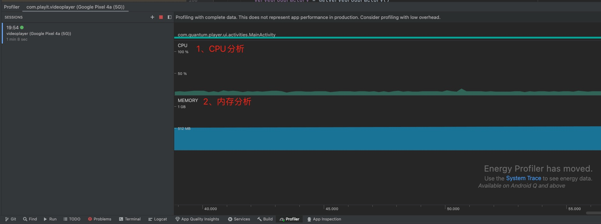
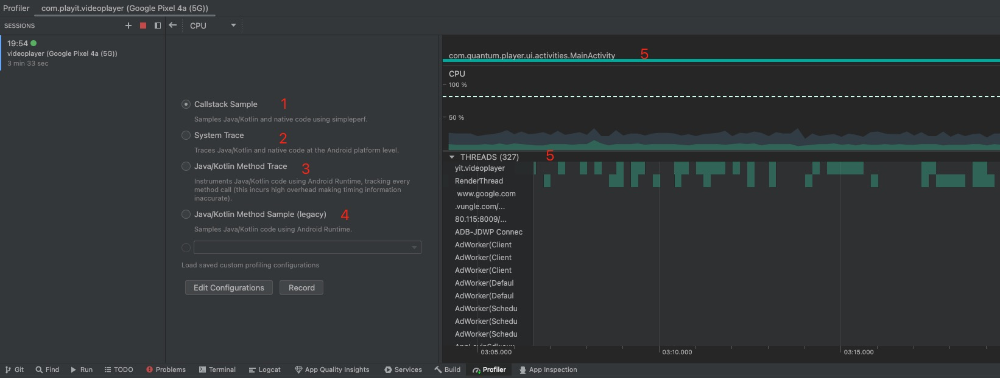
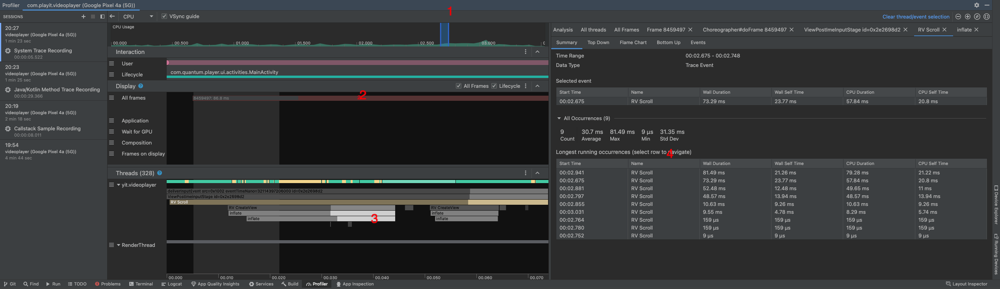

一、打开Profiler界面，attach进程后，看到两个分析界面。CPU 和 MEMORY

    

二、进入CPU分析

    

1、什么是[simpleperf](https://android.googlesource.com/platform/prebuilts/simpleperf/+/refs/heads/ndk-r13-release/README.md)

2、选中System Trace，点击Record分析Android层的代码，然后点击Stop结束分析并得到分析数据

    

