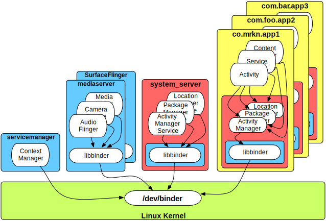
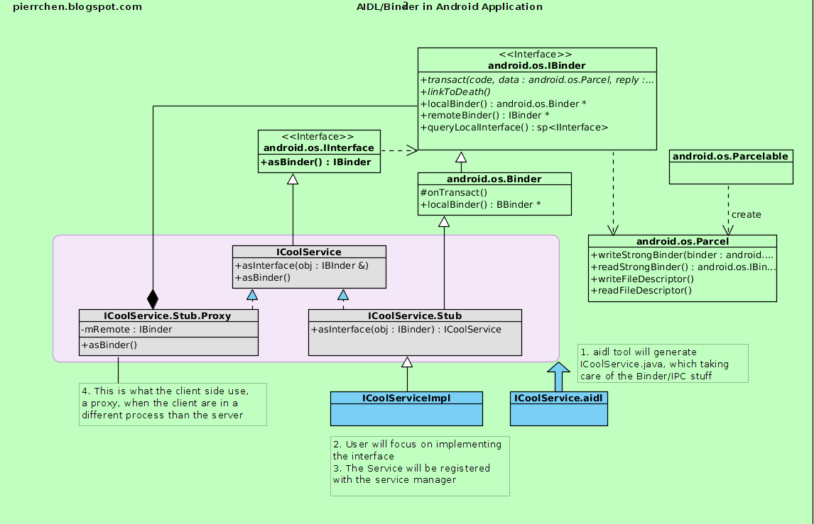

---
title: Android Binder
tags: Android
-------------

一、Binder是什么

    

+ An IPC/component system for developing object-oriented OS services
 - Not yet another object-oriented kernel
 - Instead an object-oriented operating system environment that works on traditional kernels, like Linux!

+ Essential to Android!
+ Comes from OpenBinder
 - Started at Be, Inc. as a key part of the "next generation BeOS" (~ 2001)
 - Acquired by PalmSource
 - First implementation used in Palm Cobalt (micro-kernel based OS)
 - Palm switched to Linux, so Binder ported to Linux, open-sourced (~ 2005)
 - Google hired Dianne Hackborn, a key OpenBinder engineer, to join the Android team
 - Used as-is for the initial bring-up of Android, but then completely rewritten (~ 2008)
 - OpenBinder no longer maintained - long live Binder!

+ Focused on scalability, stability, flexibility, low-latency/overhead, easy programming model

二、IPC

+ Inter-process communication (IPC) is a framework for the exchange of signals and data across multiple processes
+ Used for message passing, synchronization, shared memory, and remote procedure calls (RPC)
+ Enables information sharing, computational speedup, modularity, convenience, privilege separation, data isolation, stability
 - Each process has its own (sandboxed) address space, typically running under a unique system ID
+ Many IPC options
 - Files (including memory mapped)
 - Signals
 - Sockets (UNIX domain, TCP/IP)
 - Pipes (including named pipes)
 - Semaphores
 - Shared memory
 - Message passing (including queues, message bus)
 - Intents, ContentProviders, Messenger
 - Binder!

三、为什么使用Binder

    

