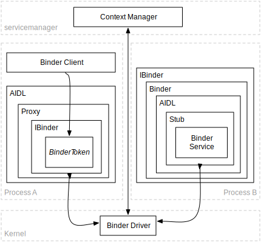
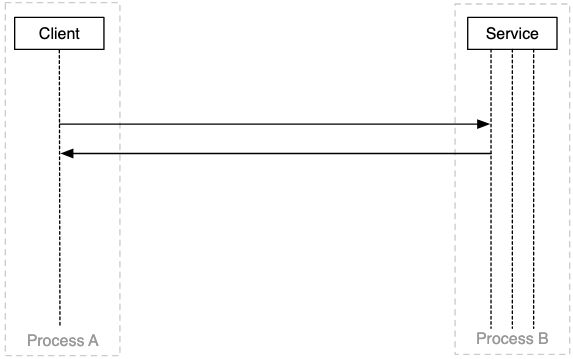
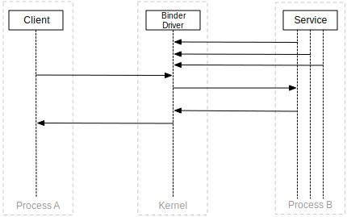
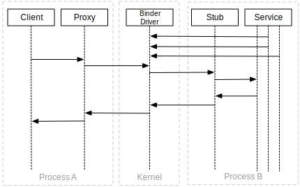
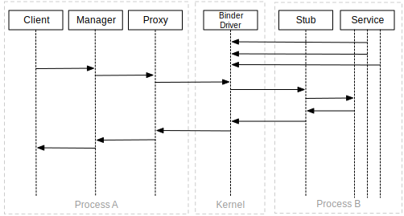
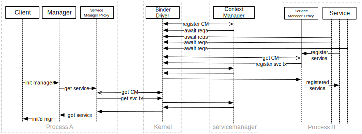
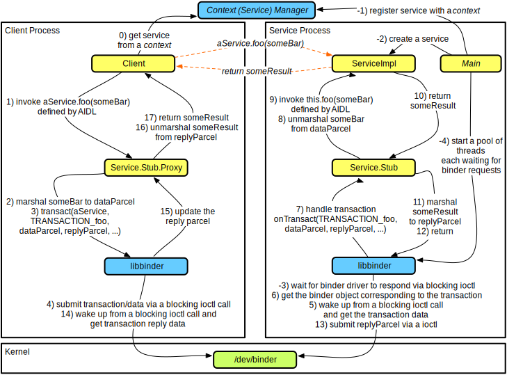
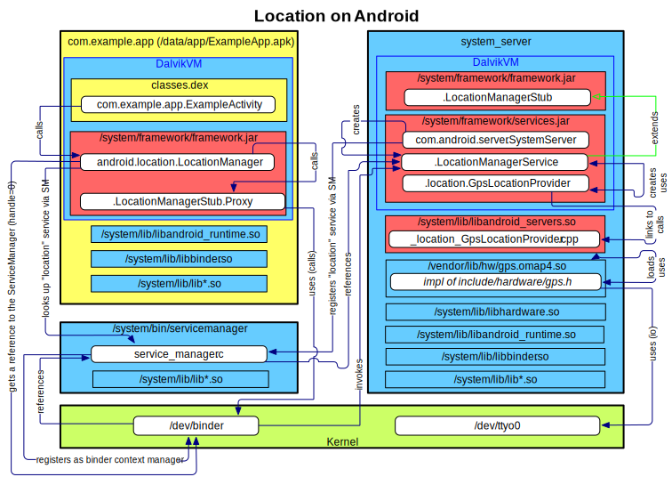

---
title: 【译】Android Binder
tags: Android
-------------

#### 一、Binder是什么

<center>
    
</center>

+ Binder 是 Android 系统中的一种 IPC（进程间通信）/组件系统，专为开发面向对象的操作系统服务而设计
  - 不是另一个面向对象的内核，而是一个基于传统内核（如 Linux）运行的面向对象操作系统环境
+ Binder 是 Android 的核心组件之一，其起源可以追溯到 OpenBinder 项目：
  - 最初由 Be, Inc. 开发，作为“下一代 BeOS”的关键部分（约 2001 年）。
  - 后来被 PalmSource 收购，并首次应用于 Palm Cobalt（一种基于微内核的操作系统）。
  - 在 Palm 转向 Linux 后，Binder 被移植到 Linux 并开源（约 2005 年）。
+ Google 招募了 OpenBinder 的核心工程师 Dianne Hackborn 加入 Android 团队。
  -在 Android 初期，Binder 被直接用于系统的启动过程，但随后在 2008 年被完全重写。
+ OpenBinder 项目已停止维护，但 Binder 成为了 Android 系统的核心。

+ Binder 的设计目标：
  - 高扩展性、高稳定性、高灵活性。
  - 低延迟和低开销的通信机制。
  - 提供简单易用的编程模型，便于开发者构建复杂的系统服务。

#### 二、IPC-进程间通信

<center>
    
</center>

进程间通信（IPC）是一种用于在多个进程之间交换信号和数据的框架，广泛应用于以下场景：

+ 功能：消息传递、同步、共享内存、远程过程调用（RPC）。
+ 作用：
  - 实现信息共享。
  - 提高计算速度。
  - 支持模块化设计和便捷开发。
  - 实现权限分离和数据隔离。
  - 提升系统的稳定性。
在 IPC 中，每个进程通常具有独立的（沙箱化）地址空间，并运行在唯一的系统 ID 下。

+ 常见的 IPC 实现方式：
  - 文件（包括内存映射文件）。
  - 信号。
  - 套接字（UNIX 域套接字、TCP/IP）。
  - 管道（包括命名管道）。
  - 信号量。
  - 共享内存。
  - 消息传递（包括消息队列和消息总线）。
  - Android 特有方式：
    - Intents。
    - ContentProviders。
    - Messenger。
    - Binder

#### 三、为什么使用Binder

<center>
    
</center>

Binder 是 Android 系统中实现进程间通信（IPC）的核心机制，专为解决应用和系统服务运行在独立进程中的数据共享和交互问题而设计。这种设计基于以下需求：

+ 安全性：每个进程都运行在沙箱中，并拥有独立的系统身份（UID）。
+ 稳定性：即使某个进程异常（如崩溃），也不会影响其他进程的运行。
+ 内存管理：系统会回收“无用”进程以释放资源（主要是内存）供新任务使用。
事实上，一个 Android 应用的不同组件可以运行在独立的进程中，因此需要高效的进程间通信机制。

##### Binder 的诞生背景
Android 的 libc（又称 bionic）不支持传统的 System V IPC，例如信号量、共享内存段、消息队列等。System V IPC 存在内核资源泄漏的风险，例如进程在终止时未正确释放共享资源可能导致系统问题。此外，低内存环境中被强制终止的进程也可能导致资源无法回收。

为解决这些问题，Binder 引入了以下机制：

+ 内置引用计数：自动管理“对象”引用。
+ 死亡通知机制：当 Binder 服务不再被客户端引用时，服务的拥有者会自动收到通知以释放资源。

这些特性使 Binder 特别适合于低内存等“恶劣”环境。
##### Binder 的主要特性
1、线程迁移式编程模型：
+ 自动管理线程池。
+ 远程对象的方法调用看似本地调用，线程会“跳转”到另一进程中执行。
+ 支持同步调用和异步（单向）调用。

2、跨进程唯一对象映射：
+ 远程对象的引用可以传递给其他进程，并用作标识令牌。

3、强大的数据传输能力：
+ 可在进程间传递文件描述符。
+ 内置支持序列化许多常见数据类型。

4、Android 接口定义语言（AIDL）：
+ 提供简单的接口定义。
+ 支持通过自动生成的代理和存根简化事务调用（仅适用于 Java）。

5、递归支持：
+ 跨进程调用的递归语义与本地调用一致。

6、本地执行模式：
+ 如果客户端和服务端在同一进程中运行，Binder 会跳过 IPC 和数据序列化，直接执行。
##### Binder 的局限性
+ 不支持传统的远程过程调用（RPC）。
+ 基于消息的客户端-服务端通信模式，不适合流式数据传输。
+ 不符合 POSIX 或其他标准定义。
##### Binder 的重要性
+ Android 中的大多数应用和核心系统服务都依赖 Binder 实现生命周期回调（如 onResume()、onDestroy() 等）。
+ Binder 是 Android 系统的中枢：如果关闭 Binder，整个系统将陷入瘫痪（无显示、无音频、无输入、无传感器等）。
+ 在某些场景下（如 RILD），可能会使用 Unix 域套接字进行通信，但 Binder 仍是主要的 IPC 机制。

Binder 的设计聚焦于高效性、低延迟、稳定性和灵活性，是 Android 系统不可或缺的一部分。

#### 四、使用Intents 和 ContentProviders进程间通讯

<center>
    
</center>


在 Android 系统中，Intents 和 ContentProviders 提供了一种简单的进程间通信（IPC）机制，用于组件之间的数据交换和交互：

##### Intents：异步通信框架
+ Intents 是一个框架，用于在 Android 组件之间进行异步通信。
  -这些组件可以位于同一个应用内，也可以跨不同的应用（即不同进程）。
+ 支持点对点（Point-to-Point）和发布-订阅（Publish-Subscribe）两种消息传递模式。
+ Intent 本身是一条消息，包含操作的描述以及需要传递给接收方的数据。
+ 隐式 Intent 提供松耦合的 API，使得组件之间的依赖性更低。
+ Android 中的所有组件都可以作为消息的发送方，大多数组件也可以充当接收方。
##### ContentProviders：同步通信框架
+ ContentProviders 提供了一种固定的 CRUD API，通过 ContentResolver 进行同步通信。
+ 通常，ContentProviders 运行在不同的应用中（即不同进程），为跨进程数据共享提供支持。
##### 工作机制
+ 所有通信默认发生在主线程（Looper 线程）上。
+ Intents 和 ContentProviders 实际上是 Binder 的高级抽象：
  - 通过系统服务（如 ActivityManagerService 和 PackageManagerService）实现底层通信。
##### 优点
+ 提供了一种简单、直观的进程间通信方式。
+ 支持灵活的消息传递模式（点对点和发布-订阅）。
+ 隐式 Intent 提供了松耦合的开发模式，提升了 API 的灵活性。
##### 局限性
+ 非面向对象：无法完全体现 OOP 的特点。
+ 仅支持异步模型：Intent 的通信方式仅支持异步操作，难以满足低延迟需求。
+ 松散的 API 定义：由于 API 定义不够严格，容易出现运行时错误。
+ 低延迟适配性不足：并不适合需要低延迟的通信场景。
##### 总结
Intents 和 ContentProviders 是 Android 系统中基于 Binder 的高层抽象，提供了简化的通信接口，适用于大多数组件间的通信需求。然而，它们也存在一定的局限性，特别是在需要高效、低延迟的场景下，可能需要直接使用 Binder 或其他机制来替代。

+ 例如:
```java
//src/com/marakana/shopping/UpcLookupActivity.java
//…
public class ProductLookupActivity extends Activity {
  private static final int SCAN_REQ = 0;
  //…
  public void onClick(View view) {
    Intent intent = new Intent("com.google.zxing.client.android.SCAN");           //Specify who we want to call
    intent.setPackage("com.google.zxing.client.android");                         //Specify who we want to call
    intent.putExtra("SCAN_MODE", "PRODUCT_MODE");                                 //Specify the input parameter for our call
    super.startActivityForResult(intent, SCAN_REQ);                               //Initiate the call asynchronously
  }

  @Override
  protected void onActivityResult(int requestCode, int resultCode, Intent data) { //Receive the response via a call-back
    if (requestCode == SCAN_REQ && resultCode == RESULT_OK) {                     //Verify that this is the response we we expecting
      String barcode = data.getStringExtra("SCAN_RESULT");                        //Get the response
      String format = data.getStringExtra("SCAN_RESULT_FORMAT");                  //Get the response
      //…
      super.startActivity(
        new Intent(Intent.ACTION_VIEW,
          Uri.parse("http://www.upcdatabase.com/item/" + barcode)));              //Initiate another IPC request, but don’t expect a result
    }
    //…
  }
}
```
```java
//src/com/google/zxing/client/android/CaptureActivity.java:
//…
public class CaptureActivity extends Activity {
 // …
  private void handleDecodeExternally(Result rawResult, …) {
    Intent intent = new Intent(getIntent().getAction());
    intent.addFlags(Intent.FLAG_ACTIVITY_CLEAR_WHEN_TASK_RESET);
    intent.putExtra(Intents.Scan.RESULT, rawResult.toString());                   //On the service side, put the result into a new intent
    intent.putExtra(Intents.Scan.RESULT_FORMAT,
      rawResult.getBarcodeFormat().toString());
    //…
    super.setResult(Activity.RESULT_OK, intent);
    super.finish();                                                               //Send the result back (asynchronously)
  }
}
```

#### 五、Messenger 进程间通讯

<center>
    
</center>

在 Android 中，Messenger 是一种基于 Handler 的进程间通信（IPC）机制，其特点是简单高效，适用于服务端与客户端之间的回调通信：

##### Messenger 的工作原理
+ Messenger 是 Handler 的引用：可以通过 Intent 传递给远程进程。
+ 远程进程通过 Messenger 发送的消息，会交由本地的 Handler 处理。
+ 消息结构：类似于 Intent，包含操作描述（Message.what）和数据（Message.getData()）。
##### 特点与优势
1、低延迟、低开销：
+ 相较于 Intent，Messenger 提供了更高效的异步通信方式。

2、适合服务端回调：
+ 非常适用于服务端向客户端发送回调消息的场景。

3、线程默认性：
+ 消息默认在主线程（Looper 线程）上处理，避免复杂的线程管理。

4、基于 Binder：
+ Messenger 的底层通信依然依赖 Binder。
##### 局限性
仍然是异步通信机制，无法直接满足同步通信需求。
##### 总结
Messenger 是一种轻量级的 IPC 工具，适用于需要简单、高效异步通信的场景。作为 Binder 的高层封装，它在服务端与客户端之间的消息交互中提供了易用的编程模型，是 Android IPC 体系的重要补充。

客户端代码：

```java
public class DownloadClientActivity extends Activity {
  private static final int CALLBACK_MSG = 0;
  //…
  @Override
  public void onClick(View view) {
    Intent intent = new Intent(
      "com.marakana.android.download.service.SERVICE");                    //Specify who we want to call (back to using Intents!)
    ArrayList<Uri> uris = //…
    intent.putExtra("uris", uris);                                         //Specify the input parameter for our call
    Messenger messenger = new Messenger(new ClientHandler(this));          //Create a messenger over our handler
    intent.putExtra("callback-messenger", messenger);                      //Pass the messenger also as an input parameter
    super.startService(intent);                                            //Initiate the call asynchronously
  }

  private static class ClientHandler extends Handler {
    private final WeakReference<DownloadClientActivity> clientRef;         //Our handler remembers a reference to the client

    public ClientHandler(DownloadClientActivity client) {
      this.clientRef = new WeakReference<DownloadClientActivity>(client);
    }

    @Override
    public void handleMessage(Message msg) {                               //Receive responses via a call-back on the handler
      Bundle data = msg.getData();
      DownloadClientActivity client = clientRef.get();
      if (client != null && msg.what == CALLBACK_MSG && data != null) {
        Uri completedUri = data.getString("completed-uri");                //Get the response data
        // client now knows that completedUri is done
        //…
      }
    }
  }
}
```

服务端代码：
```java
public class MessengerDemoService extends IntentService {
  private static final int CALLBACK_MSG = 0;
  …
  @Override
  protected void onHandleIntent(Intent intent) {                           //Handle the request from our client (which could be local or remote)
    ArrayList<Uri> uris = intent.getParcelableArrayListExtra("uris");      //Get the request data
    Messenger messenger = intent.getParcelableExtra("callback-messenger"); //Get the reference to the messenger
    for (Uri uri : uris) {
      // download the uri
      …
      if (messenger != null) {
        Message message = Message.obtain();                                //Use Message as a generic envelope for our data
        message.what = CALLBACK_MSG;
        Bundle data = new Bundle(1);
        data.putParcelable("completed-uri", uri);                          //Set our reply
        message.setData(data);                                             //Use Message as a generic envelope for our data
        try {
          messenger.send(message);                                         //Send our reply
        } catch (RemoteException e) {
          …
        } finally {
          message.recycle();                                               //Use Message as a generic envelope for our data
        }
      }
    }
  }
}
```


#### 六、Binder术语
<center>
    
</center>

#### Binder 术语表

| **术语**                  | **定义**                                                                                                   |
|---------------------------|-----------------------------------------------------------------------------------------------------------|
| **Binder Framework**      | Android 的整体 IPC 架构。                                                                                 |
| **Binder Driver**         | 内核级驱动程序，用于跨进程边界实现通信。                                                                   |
| **Binder Protocol**       | 与 Binder 驱动程序通信的低级协议（基于 `ioctl`）。                                                        |
| **IBinder Interface**     | Binder 对象必须实现的一组定义良好的行为（方法）。                                                          |
| **AIDL**                  | Android Interface Definition Language，用于描述 IBinder 接口上的业务操作。                                |
| **Binder Object**         | IBinder 接口的通用实现。                                                                                   |
| **Binder Token**          | 一个抽象的 32 位整数值，用于在系统中唯一标识一个 Binder 对象。                                              |
| **Binder Service**        | 实现具体业务操作的 Binder 对象。                                                                           |
| **Binder Client**         | 需要使用 Binder 服务提供的行为的对象。                                                                     |
| **Binder Transaction**    | 调用远程 Binder 对象上的操作（方法）的过程，包括通过 Binder 协议发送和接收数据。                              |
| **Parcel**                | 消息的容器（包含数据和对象引用），是 Binder 事务的数据单位。<br>- 一个用于传递请求。<br>- 一个用于接收回复。 |
| **Marshalling**           | 将高级应用程序数据结构（如请求/响应参数）转换为 Parcel 的过程，以嵌入到 Binder 事务中。                     |
| **Unmarshalling**         | 从 Binder 事务中接收的 Parcel 恢复高级应用程序数据结构（如请求/响应参数）的过程。                           |
| **Proxy**                 | AIDL 接口的实现，负责：<br>- 数据的序列化/反序列化（Marshalling/Unmarshalling）。<br>- 将方法调用映射到事务。 |
| **Stub**                  | AIDL 接口的部分实现，负责：<br>- 将事务映射到 Binder 服务的方法调用。<br>- 处理数据的序列化/反序列化。      |
| **Context Manager**       | 一个特殊的 Binder 对象，具有已知的句柄（注册为句柄 0），用作其他 Binder 对象的注册/查找服务（名称 → 句柄映射）。 |

#### Binder 通信和发现
+ 对于客户端而言，他只是想使用该服务:
<center>
    
</center>

+ 因为一个进程不能直接调用其他进程上的操作（或读/写数据），但内核可以，所以它们使用 Binder 驱动程序：
<center>
    
</center>

📒 Binder 驱动程序通过 /dev/binder 公开，并提供基于 open、release、poll、mmap、flush 和 ioctl 操作的相对简单的 API。 事实上，大多数通信都是通过 ioctl(binderFd, BINDER_WRITE_READ, &bwd) 进行的，其中 bwd 定义为
```c++
struct binder_write_read {
        signed long     write_size;     /* bytes to write */
        signed long     write_consumed; /* bytes consumed by driver */
        unsigned long   write_buffer;
        signed long     read_size;      /* bytes to read */
        signed long     read_consumed;  /* bytes consumed by driver */
        unsigned long   read_buffer;
};
```

客户端通过事务与服务进行通信，其中包含绑定器令牌、要执行的方法的代码、原始数据缓冲区和发送者 PID/UID（由驱动程序添加）。 也就是说，最底层的操作和数据结构（即 Parcel）是由 libbinder（在本机级别）抽象的，这是客户端和服务使用的。

⚠️由于服务可能会收到来自多个客户端的并发请求，因此它需要保护（同步访问）其可变状态。


+ 除了客户端和服务不想了解有关 Binder 协议和 libbinder 的任何信息，因此它们使用代理和存根：
<center>
    
</center>
📒 AIDL 工具可以为使用 AIDL 描述的服务自动生成基于 Java 的代理和存根。


+ 事实上，大多数客户甚至不想知道他们正在使用 IPC，更不用说 Binder 或代理，因此他们指望管理人员为他们抽象出所有这些复杂性：
<center>
    
</center>
📒 对于系统服务来说尤其如此，系统服务通常仅通过其管理器向客户端公开其 API 的子集。


+ 但是客户端如何获得它想要与之通信的服务的句柄呢？只需询问servicemanager（Binder的CONTEXT_MGR），并希望该服务已经向其注册：
<center>
    
</center>

📒 出于安全/理智的原因，binder 驱动程序将只接受单次/一次性 CONTEXT_MGR 注册，这就是为什么 servicemanager 是第一个在 Android 上启动的服务之一。
❓ 要获取当前向 servicemanager 注册的服务列表，请运行
```shell
$ adb shell service list
Found 71 services:
0 sip: [android.net.sip.ISipService]
1 phone: [com.android.internal.telephony.ITelephony]
…
20  location: [android.location.ILocationManager]
…
55  activity: [android.app.IActivityManager]
56  package: [android.content.pm.IPackageManager]
…
67  SurfaceFlinger: [android.ui.ISurfaceComposer]
68  media.camera: [android.hardware.ICameraService]
69  media.player: [android.media.IMediaPlayerService]
70  media.audio_flinger: [android.media.IAudioFlinger]
```

+ 另一个视角来看：
<center>
    
</center>


#### 以*定位服务*为例

<center>
    
</center>


#### AIDL


#### 参考
[1.Deep Dive into Android IPC/Binder Framework](https://www.protechtraining.com/static/slides/Deep_Dive_Into_Binder_Presentation.html#title-slide)