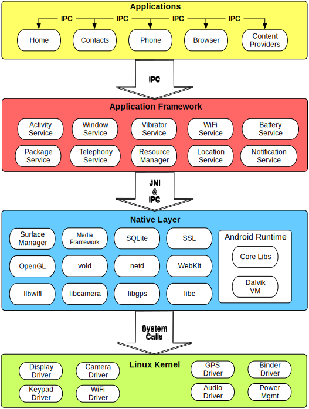
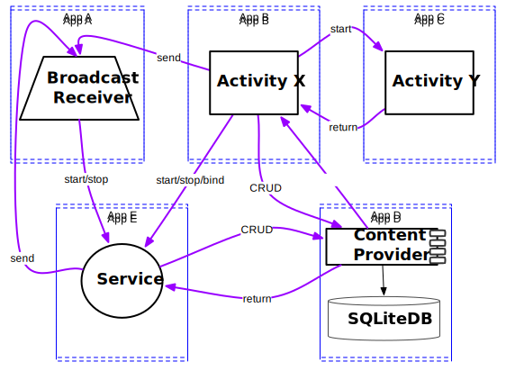

---
title: Android Binder
tags: Android
-------------

#### 看到一个讲Binder的ppt，讲解思路清晰，目录结构如下。

+ Binder是什么
+ IPC进程间通信
+ 为什么使用Binder
+ 使用ContentProvider和Intent的进程通讯
+ 使用Messenger的进程通讯
+ Binder术语
+ Binder通信和服务发现
  + 以定位服务为例
+ AIDL
+ Binder对象引用映射和跨进程边界
+ 创建一个基于Binder的客户端和服务端
  + 
  +
  +
+ Async Binder IPC (by Example)
  + 
  +
  +
+ 通过Binder共享内存
+ Binder的局限性


#### 一、Binder是什么

<center>
    
</center>

+ 开发面向对象的系统级服务时使用的一种进程通讯手段（为了开发面向对象的操作系统服务而设计的进程通讯组件）
 - Not yet another object-oriented kernel
 - Instead an object-oriented operating system environment that works on traditional kernels, like Linux!
+ 对于安卓至关重要
+ 起源于 OpenBinder
 - Started at Be, Inc. as a key part of the "next generation BeOS" (~ 2001)
 - Acquired by PalmSource
 - First implementation used in Palm Cobalt (micro-kernel based OS)
 - Palm switched to Linux, so Binder ported to Linux, open-sourced (~ 2005)
 - Google hired Dianne Hackborn, a key OpenBinder engineer, to join the Android team
 - Used as-is for the initial bring-up of Android, but then completely rewritten (~ 2008)
 - OpenBinder no longer maintained - long live Binder!

+ Focused on scalability, stability, flexibility, low-latency/overhead, easy programming model

#### 二、IPC-进程间通信

+ Inter-process communication (IPC) 是一个在多个进程间交换数据和信号📶的框架。
+ Used for message passing, synchronization, shared memory, and remote procedure calls (RPC)
+ Enables information sharing, computational speedup, modularity, convenience, privilege separation, data isolation, stability
 - Each process has its own (sandboxed) address space, typically running under a unique system ID
+ 进程间通讯的方案
 - Files (including memory mapped)
 - Signals
 - Sockets (UNIX domain, TCP/IP)
 - Pipes (including named pipes)
 - Semaphores
 - Shared memory
 - Message passing (including queues, message bus)
 - Intents, ContentProviders, Messenger
 - Binder!


#### 三、为什么使用Binder

<center>
    
</center>

+ Android apps and system services run in separate processes for security, stability, and memory management reasons, but they need to communicate and share data!
 - Security: each process is sandboxed and run under a distinct system identity
 - Stability: if a process misbehaves (e.g. crashes), it does not affect any other processes
 - Memory management: "unneeded" processes are removed to free resources (mainly memory) for new ones
 - In fact, a single Android app can have its components run in separate processes
+ IPC to the rescue
 - But we need to avoid overhead of traditional IPC and avoid denial of service issues
+ Android’s libc (a.k.a. bionic) does not support System V IPCs,
 - No SysV semaphores, shared memory segments, message queues, etc.
 - System V IPC is prone to kernel resource leakage, when a process "forgets" to release shared IPC resources upon termination
 - Buggy, malicious code, or a well-behaved app that is low-memory SIGKILL'ed
+ Binder to the rescue!
 - Its built-in reference-counting of "object" references plus death-notification mechanism make it suitable for "hostile" environments (where lowmemorykiller roams)
 - When a binder service is no longer referenced by any clients, its owner is automatically notified that it can dispose of it

+ Many other features:
 - "Thread migration" - like programming model:
    Automatic management of thread-pools
    Methods on remote objects can be invoked as if they were local - the thread appears to "jump" to the other process
    Synchronous and asynchronous (oneway) invocation model
 - Identifying senders to receivers (via UID/PID) - important for security reasons
 - Unique object-mapping across process boundaries
    A reference to a remote object can be passed to yet another process and can be used as an identifying token

 - Ability to send file descriptors across process boundaries
 - Simple Android Interface Definition Language (AIDL)
 - Built-in support for marshalling many common data-types
 - Simplified transaction invocation model via auto-generated proxies and stubs (Java-only)
 - Recursion across processes - i.e. behaves the same as recursion semantics when calling methods on local objects
 - Local execution mode (no IPC/data marshalling) if the client and the service happen to be in the same process

+ But:
 - No support for RPC (local-only)
 - Client-service message-based communication - not well-suited for streaming
 - Not defined by POSIX or any other standard
+ Most apps and core system services depend on Binder
 - Most app component life-cycle call-backs (e.g. onResume(), onDestory(), etc.) are invoked by ActivityManagerService via binder
 - Turn off binder, and the entire system grinds to a halt (no display, no audio, no input, no sensors, …)
 - Unix domain sockets used in some cases (e.g. RILD)


#### 四、使用Intents 和 ContentProviders进程间通讯

<center>
    
</center>

+ Android supports a simple form of IPC via intents and content providers
+ Intent messaging is a framework for asynchronous communication among Android components
 - Those components may run in the same or across different apps (i.e. processes)
 - Enables both point-to-point as well as publish-subscribe messaging domains
 - The intent itself represents a message containing the description of the operation to be performed as well as data to be passed to the recipient(s)
 - Implicit intents enable loosely-coupled APIs
+ ContentResolvers communicate synchronously with ContentProviders (typically running in separate apps) via a fixed (CRUD) API
+ All android component can act as a senders, and most as receivers
+ All communication happens on the Looper (a.k.a. main) thread (by default)
+ But:
 - Not really OOP
 - Asynchronous-only model for intent-based communication
 - Not well-suited for low-latency
 - Since the APIs are loosely-defined, prone to run-time errors
 - All underlying communication is based on Binder!
 - In fact, Intents and ContentProvider are just a higher-level abstraction of Binder
 - Facilitated via system services: ActivityManagerService and PackageManagerService
+ For example:
```java
//src/com/marakana/shopping/UpcLookupActivity.java
//…
public class ProductLookupActivity extends Activity {
  private static final int SCAN_REQ = 0;
  //…
  public void onClick(View view) {
    Intent intent = new Intent("com.google.zxing.client.android.SCAN");           //1
    intent.setPackage("com.google.zxing.client.android");                         //1
    intent.putExtra("SCAN_MODE", "PRODUCT_MODE");                                 //2
    super.startActivityForResult(intent, SCAN_REQ);                               //3
  }

  @Override
  protected void onActivityResult(int requestCode, int resultCode, Intent data) { //4
    if (requestCode == SCAN_REQ && resultCode == RESULT_OK) {                     //5
      String barcode = data.getStringExtra("SCAN_RESULT");                        //6
      String format = data.getStringExtra("SCAN_RESULT_FORMAT");                  //6
      //…
      super.startActivity(
        new Intent(Intent.ACTION_VIEW,
          Uri.parse("http://www.upcdatabase.com/item/" + barcode)));              //7
    }
    //…
  }
}
```
```java
//src/com/google/zxing/client/android/CaptureActivity.java:
//…
public class CaptureActivity extends Activity {
 // …
  private void handleDecodeExternally(Result rawResult, …) {
    Intent intent = new Intent(getIntent().getAction());
    intent.addFlags(Intent.FLAG_ACTIVITY_CLEAR_WHEN_TASK_RESET);
    intent.putExtra(Intents.Scan.RESULT, rawResult.toString());                   //8
    intent.putExtra(Intents.Scan.RESULT_FORMAT,
      rawResult.getBarcodeFormat().toString());
    //…
    super.setResult(Activity.RESULT_OK, intent);
    super.finish();                                                               //9
  }
}
```
- 1	Specify who we want to call
- 2	Specify the input parameter for our call
- 3	Initiate the call asynchronously
- 4	Receive the response via a call-back
- 5	Verify that this is the response we we expecting
- 6	Get the response
- 7	Initiate another IPC request, but don’t expect a result
- 8	On the service side, put the result into a new intent
- 9	Send the result back (asynchronously)


#### 五、Messenger IPC

<center>
    
</center>


[1.Deep Dive into Android IPC/Binder Framework](https://www.protechtraining.com/static/slides/Deep_Dive_Into_Binder_Presentation.html#title-slide)