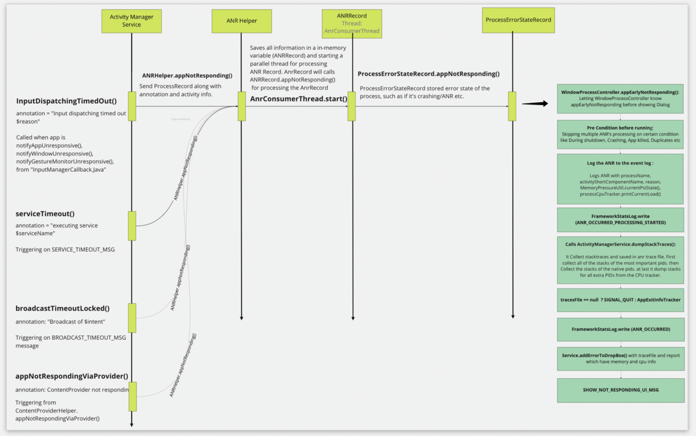

---
title: Android之ANR
tags: Android
-------------


<center>
    
</center>


分类

+ 1.Service ANR：前台20s，后台200s；startForeground超时10s
+ 2.Broadcast ANR：前台10s，后台60s
+ 3.Input ANR：按键或触摸事件在5s内无响应
+ 4.ContentProvider ANR：10s

#### ANR原理

##### 1.超时检测

+ Service
    - serviceForegroundTimeout
    - serviceTimeout

<center>
    
</center>

```java
    void scheduleServiceTimeoutLocked(ProcessRecord proc) {
    if (proc.mServices.numberOfExecutingServices() == 0 || proc.getThread() == null) {
        return;
    }
    Message msg = mAm.mHandler.obtainMessage(
            ActivityManagerService.SERVICE_TIMEOUT_MSG);
    msg.obj = proc;
    mAm.mHandler.sendMessageDelayed(msg, proc.mServices.shouldExecServicesFg()
            ? SERVICE_TIMEOUT : SERVICE_BACKGROUND_TIMEOUT);
}
```

+ Broadcast Receiver

<center>
    
</center>

```java
    final void setBroadcastTimeoutLocked(long timeoutTime) {
    if (!mPendingBroadcastTimeoutMessage) {
        Message msg = mHandler.obtainMessage(BROADCAST_TIMEOUT_MSG, this);
        mHandler.sendMessageAtTime(msg, timeoutTime);
        mPendingBroadcastTimeoutMessage = true;
    }
}


final void cancelBroadcastTimeoutLocked() {
    if (mPendingBroadcastTimeoutMessage) {
        mHandler.removeMessages(BROADCAST_TIMEOUT_MSG, this);
        mPendingBroadcastTimeoutMessage = false;
    }
}
```

##### 2.超时处理

<center>
    
</center>

<center>
    
</center>


[源码链接](https://cs.android.com/search?q=ANRHelper&sq=&ss=android%2Fplatform%2Fsuperproject)

#### 捕获ANR

+ Play Console Android vitals
+ Firebase and AppExitInfo
+ ANR-WatchDog
+ block-canary

#### ANR的分析方法

1、trace文件内容

| 字段        | 解释                                               |
|-----------|--------------------------------------------------|
| main      | main标识是主线程，如果是线程，那么命名成“Thread-X”的格式,x表示线程id,逐步递增 |
| prio      | 线程优先级,默认是5                                       |
| tid       | 线程唯一标识ID                                         |
| group     | 线程组名称                                            |
| sCount    | 该线程被挂起的次数                                        |
| dsCount   | 该线程被调试器挂起的次数                                     |
| obj       | 对象地址                                             |
| self      | 该线程Native的地址                                     |
| sysTid    | 线程号(主线程的线程号和进程号相同)                               |
| nice      | 线程的调度优先级                                         |
| sched     | 线程的调度策略和优先级                                      |
| cgrp      | 调度归属组                                            |
| handle    | 线程处理函数的地址                                        |
| state     | 调度状态                                             |
| schedstat | 线程在cpu上执行的时间、线程的等待时间和线程执行的时间片长度                  |
| utm       | 线程用户态下使用的时间值(单位是jiffies）                         |
| stm       | 内核态下的调度时间值                                       |
| core      | 最后执行这个线程的cpu核的序号                                 |

[1.ANR官方文档](https://developer.android.com/topic/performance/vitals/anr)
[](https://medium.com/okcredit/how-we-reduced-our-anr-by-three-times-d9ae0b41ad94)


[今日头条 ANR 优化实践系列 - 设计原理及影响因素](https://mp.weixin.qq.com/s?__biz=MzI1MzYzMjE0MQ==&mid=2247488116&idx=1&sn=fdf80fa52c57a3360ad1999da2a9656b&chksm=e9d0d996dea750807aadc62d7ed442948ad197607afb9409dd5a296b16fb3d5243f9224b5763&token=569762407&lang=zh_CN#rd)
[ANR detection in InputDispatcher](https://android.googlesource.com/platform/frameworks/native/+/2d2150edc2/services/inputflinger/docs/anr.md)