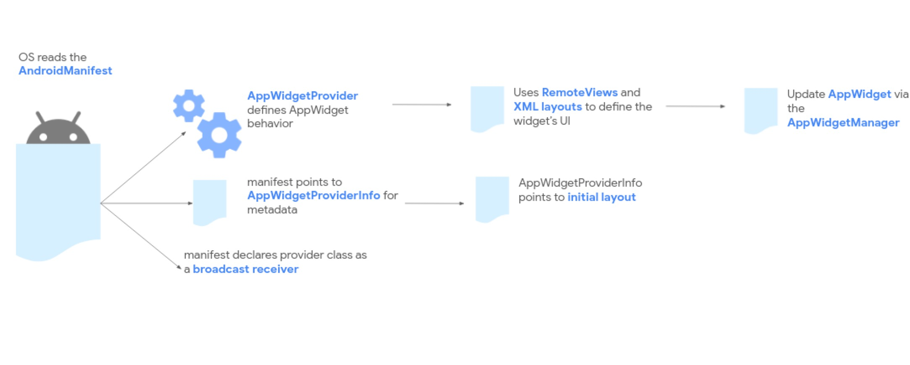
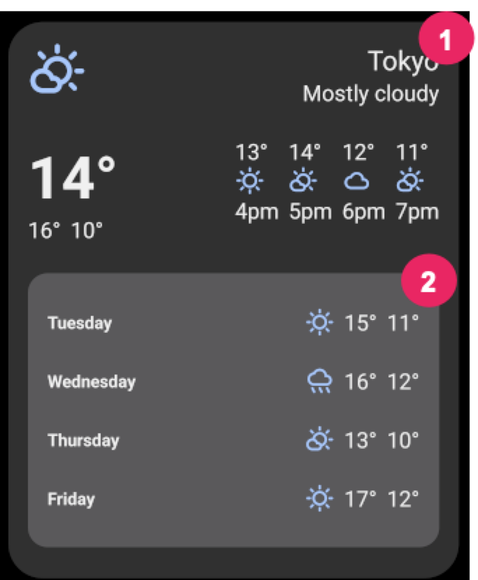

---
title: Android的小部件
tags:
- Android
---------


####  一、概览：
1.1 小部件的分类
+ 信息展示小部件：天气小部件主要展示天气信息
+ 集合小部件：多个相同类型元素的集合，相册预览小部件、文章预览小部件，可垂直滚动。
+ 控制类小部件：常用功能的开关等
+ 混合类型小部件：音乐播放小部件既有控制操作也能展示信息


1.2 和谷歌助手整合
    通过相关集成，上述小部件可以通过语音指令添加。

1.3 小部件的局限性
+ 手势
    由于小部件在主屏幕展示，需要和导航共存，所以左右滑动只能交给导航来处理。小部件只能处理触摸和垂直滑动。
+ 元素
    由于上述手势交互的约束，一些UI元素就不能使用了。

1.4 设计指引
+ 小部件内容
    小部件是吸引用户进入app的绝佳机制。
+ 小部件导航
    将用户导航到常用功能，快速完成用户的意图。
+ 小部件的尺寸
    长按并放手进入大小调节模式。通过尺寸变化，控制信息的展示量。
+ 布局注意事项
    根据设备网格的分辨率来摆放布局。记住以下几点：

- Planning your widget resizing strategy across "size buckets" rather than variable grid dimensions gives you the most reliable results
- The number, size, and spacing of cells can vary widely from device to device. Hence, it is very important that your widget is flexible and can accommodate more or less space than anticipated
- In fact, as the user resizes a widget, the system responds with a dp size range in which your widget can redraw itself.
- Android-12后，你能更精确的指定尺寸和灵活布局：
  - 略
  - 略
  - 略
  - 略


1.5 小部件设计清单
+ 瞄一眼的信息放在小部件上，详细信息放进app
+ 根据需求选择合适小部件类型
+ 内容和尺寸的适配
+ 确保布局能够伸展来保证设备无关
+ 思考是否需要额外的配置


####  二、创建简单的小部件

##### 2.1 涉及的类
+ `AppWidgetProviderInfo`
    描述小部件元信息，布局、更新频率等
+ `AppWidgetProvider`
    定义交互的编程接口。


<center>
    
</center>

除了基本的元器件，如果你的小部件需要用户配置信息，你需要提供配置修改界面让用户修改配置，如钟表小部件的时区修改。
+ Android-12起，提供默认配置，之后用户再修改。
+ Android-11及以前，每次添加小部件都启动配置页。


#####  2.2 声明`AppWidgetProviderInfo`
在res/xml/声明：
```xml
<appwidget-provider xmlns:android="http://schemas.android.com/apk/res/android"
    android:minWidth="40dp"
    android:minHeight="40dp"
    android:targetCellWidth="1"
    android:targetCellHeight="1"
    android:maxResizeWidth="250dp"
    android:maxResizeHeight="120dp"
    android:updatePeriodMillis="86400000"
    android:description="@string/example_appwidget_description"
    android:previewLayout="@layout/example_appwidget_preview"
    android:initialLayout="@layout/example_loading_appwidget"
    android:configure="com.example.android.ExampleAppWidgetConfigurationActivity"
    android:resizeMode="horizontal|vertical"
    android:widgetCategory="home_screen"
    android:widgetFeatures="reconfigurable|configuration_optional">
</appwidget-provider>

```

2.2.1 尺寸属性:
+ `targetCellWidth` & `targetCellHeight` (Android-12新增)
+ `maxResizeWidth` & `maxResizeHeight` (Android-12新增)
+ `minWidth` & `minHeight`
+ `minResizeWidth` & `minResizeHeight`
+ `resizeMode`

2.2.2 其他属性：
+ updatePeriodMillis
+ initialLayout
+ configure
+ description
+ previewLayout(Android-12) & previewImage(Android11-↓)
+ autoAdvanceViewId
+ widgetCategory
+ widgetFeatures


##### 2.3 使用`AppWidgetProvider`类处理广播

2.3.1 在`AndroidManifest`声明

```xml
<receiver android:name="ExampleAppWidgetProvider"
                 android:exported="false">
    <intent-filter>
        <action android:name="android.appwidget.action.APPWIDGET_UPDATE" />
    </intent-filter>
    <meta-data android:name="android.appwidget.provider"
               android:resource="@xml/example_appwidget_info" />
</receiver>
```

2.3.2 实现`AppWidgetProvider`类
+ onUpdate()
+ onAppWidgetOptionsChanged()
+ onDeleted(Context, int[])
+ onEnabled(Context)
+ onDisabled(Context)
+ onReceive(Context, Intent)

其中`onUpdate()`回调尤为重要。


2.3.3 接收小部件广播意图
+ ACTION_APPWIDGET_UPDATE
+ ACTION_APPWIDGET_DELETED
+ ACTION_APPWIDGET_ENABLED
+ ACTION_APPWIDGET_DISABLED
+ ACTION_APPWIDGET_OPTIONS_CHANGED


##### 2.4 创建布局
布局基于RemoteViews实现，不能使用自定义view。也不能使用RemoteViews支持的类的子类。但它支持ViewStub。

2.4.1 对状态行为的支持
Android-12支持以下包含状态的View，但是需要保存状态并注册状态变更事件。
+ CheckBox
+ Switch
+ RadioButton

```kotlin
// Check the view.
remoteView.setCompoundButtonChecked(R.id.my_checkbox, true)

// Check a radio group.
remoteView.setRadioGroupChecked(R.id.my_radio_group, R.id.radio_button_2)

// Listen for check changes. The intent will have an extra with the key
// EXTRA_CHECKED that specifies the current checked state of the view.
remoteView.setOnCheckedChangeResponse(
        R.id.my_checkbox,
        RemoteViews.RemoteResponse.fromPendingIntent(onCheckedChangePendingIntent)
)
```

##### 2.5 实现圆角
Android-12新增的参数：
+ system_app_widget_background_radius 不能大于28dp
+ system_app_widget_inner_radius

<center>
    
</center>


#### 三、Android-12的变更

##### 3.1 添加设备主题
    3.1.1 使用动态颜色向后兼容

##### 3.2 声音支持

##### 3.3 优化选择小部件时的体验
    Android-12增加动态预览和小部件描述。


##### 3.4 添加小部件描述
```xml
<appwidget-provider
    android:description="@string/my_widget_description">
</appwidget-provider>
```
##### 3.5 平滑转场效果
Android-12起当用户从小部件拉起应用时，使用`@android:id/background` or `android.R.id.background`优化拉起效果：
```xml
// Top level layout of the widget.
<LinearLayout
    android:id="@android:id/background">
</LinearLayout>
```

##### 3.6 运行时修改`RemoteViews`
Android-12新增一些方法
```xml
// Set the colors of a progress bar at runtime.
remoteView.setColorStateList(R.id.progress, "setProgressTintList", createProgressColorStateList())

// Specify exact sizes for margins.
remoteView.setViewLayoutMargin(R.id.text, RemoteViews.MARGIN_END, 8f, TypedValue.COMPLEX_UNIT_DP)
```


#### 四、高级小部件

4.1 小部件的更新
4.1.1 更新类型
+ 全量更新：`AppWidgetManager.updateAppWidget(int, android.widget.RemoteViews)` ，新RemoteView全量替换旧RemoteView
+ 部分更新：`AppWidgetManager.partiallyUpdateAppWidget`，新RemoteView合并入旧RemoteView
+ 数据更新：`AppWidgetManager.notifyAppWidgetViewDataChanged`，刷新一组View的数据

4.1.2 更新频率

+ 周期更新
`updatePeriodMillis`参数控制更新频率但不能小于30分钟当设置为0时，屏蔽周期更新。每次更新回调`AppWidgetProvider.onUpdate()`方法

+ 用户事件更新
  - App内的点击事件
  - notification类型的远端事件

+ 广播事件更新

4.1.3 通过广播更新
+ 更新间隔
  广播的ANR是10秒，如果执行耗时操作考虑使用WorkManager，或者使用`goAsync`方法可以使广播运行30s，但会堵塞后面的广播。
+ 更新优先级
  由于广播📢在后台进程，资源过载会导致延迟，可以通过设置前台进程提高优先级。例如当使用`PendingIntent.getBroadcast` 时给Intent添加`Intent.FLAG_RECEIVER_FOREGROUND`


#### [1.App Widget Design Guidelines](https://developer.android.com/guide/practices/ui_guidelines/widget_design#anatomy)
#### [2.App widgets overview](https://developer.android.com/guide/topics/appwidgets/overview)


