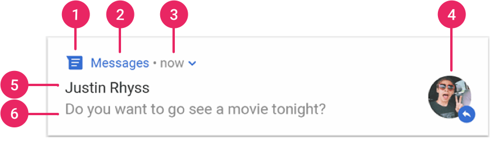

---
title: Android之通知
tags: Android
-------------


#### 一、通知基础

##### 1、通知的组成
<center>
    
</center>

+ 小图标: 必选项，setSmallIcon()
+ App名字: 系统设置
+ 时间戳: 系统设置，setWhen()修改，setShowWhen(false)不显示
+ 大图标: 可选项，setLargeIcon()
+ 标题: 可选项，setContentTitle()
+ 内容: 可选项，setContentText()

##### 2、NotificationChannel

+ 创建 NotificationChannel
+ 读取 NotificationChannel
+ 打开 NotificationChannel 设置页
+ 删除 NotificationChannel
+ 创建 NotificationChannel Group

```java
    @RequiresApi(api = Build.VERSION_CODES.O)
    public void createDefaultChannel(NotificationManager notificationManager) {
        NotificationChannel notificationChannel = new NotificationChannel(
                DEFAULT_CHANNEL_ID,
                DEFAULT_CHANNEL_NAME,
                NotificationManager.IMPORTANCE_DEFAULT);
        notificationChannel.enableLights(true);////是否在桌面icon右上角展示小红点
        notificationChannel.setLightColor(Color.GREEN);////小红点颜色
        notificationChannel.setShowBadge(true);////是否在久按桌面图标时显示此渠道的通知
        notificationChannel.setDescription("this is default channel");//描述信息
        notificationManager.createNotificationChannel(notificationChannel);
    }

    
    public void deleteNotificationChannel() {
        NotificationManager notificationManager =
            (NotificationManager) getSystemService(Context.NOTIFICATION_SERVICE);
        notificationManager.deleteNotificationChannel(DEFAULT_CHANNEL_ID);
    }
    
    public void createNotificationGroup() {
        // The user-visible name of the group.
        CharSequence groupName = getString(R.string.group_name);
        NotificationManager notificationManager =
            (NotificationManager) getSystemService(Context.NOTIFICATION_SERVICE);
        notificationManager.createNotificationChannelGroup(
                new NotificationChannelGroup(DEFAULT_CHANNEL_ID, groupName));
    }
```
