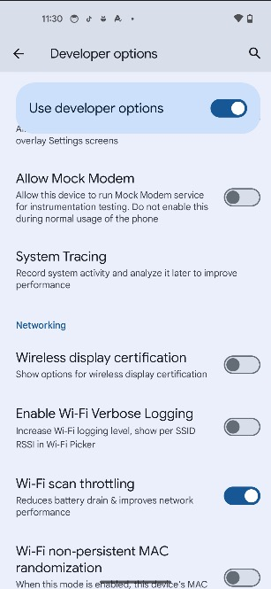
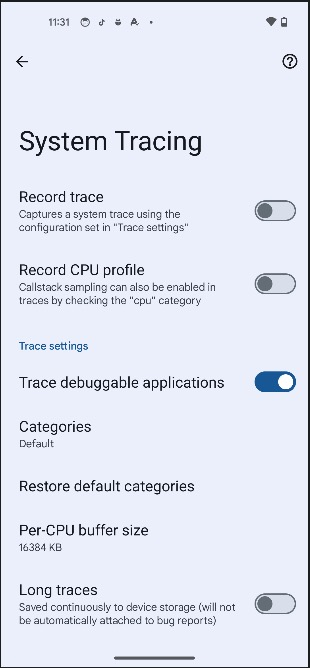

一、Perfetto工具介绍


+ 采集阶段：不同来源（系统、Chrome、App） → Tracing Service/Daemon → 保存成 trace 文件（Protobuf/JSON）。
+ 分析阶段：Trace Processor 导入 trace → SQL 查询 → 生成指标。
+ 可视化阶段：Perfetto UI（可离线）展示 → 用户可搜索、筛选、分析


二、Perfetto工具使用
2.1 捕获日志
+ 通过Android Studio捕获日志


+ 通过命令行捕获日志

```shell
adb shell perfetto -c <config_file> -o /data/misc/perfetto-traces/trace_file.perfetto-trace
```
+ `-c` 配置文件
+ `-o` 输出trace的保存路径
+ `-t` 采集持续多少秒

[官方配置文件](https://cs.android.com/android/platform/superproject/main/+/main:external/perfetto/test/configs/)

配置文件的详细介绍[文档](https://perfetto.dev/docs/concepts/config)


+ 通过手机开发者模式捕获日志

<table>
    <tr>
        <td></td>
        <td></td>
    </tr>
</table>

  - 1、打开开发者选项
  - 2、选择 System Tracing
  - 3、点击 Record trace
  - 4、操作手机 APP
  - 5、点击通知栏 Stop trace
  - 6、选择Share trace 分享到文件管理器
  - 7、从文件管理器拉出电脑并使用[Perfetto UI](https://ui.perfetto.dev/]) 打开


2.2 分析日志


