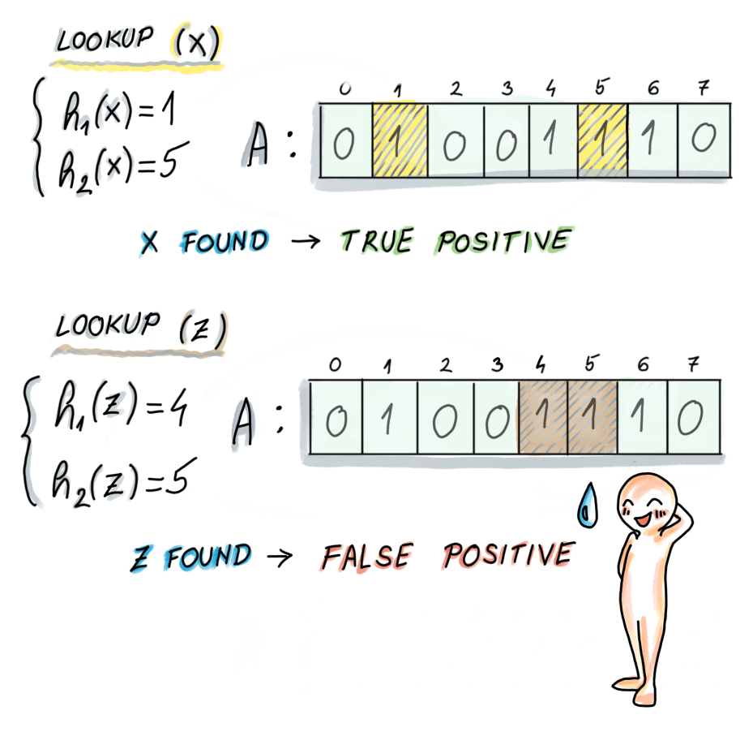

---
title: 数据结构之布隆过滤器
tags: 计算机
---------

#### 一、概念
一种空间高效的概率型数据结构，用于判断一个元素是否存在于集合中。

#### 二、基本操作
##### 2.1 插入操作：

    

##### 2.2 查找操作：

    

#### 三、应用：
+ 代理服务器的缓存

[参考图片](https://freecontent.manning.com/all-about-bloom-filters/)
