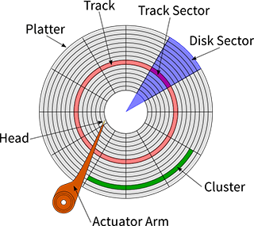
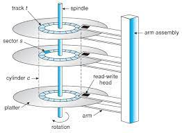
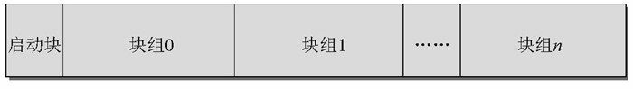
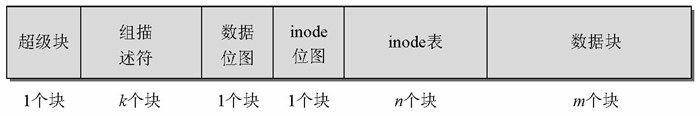

---
title: 文件系统
tags: Linux
-----------

一、磁盘的结构
磁盘按照物理结构和逻辑结构区分比较好。

1.1 物理结构
+ Platters：盘片
+ Head：读写头
+ Spindle：主轴
+ Actuator Arm：机械臂
+ Cylinder:柱面
+ Sector：扇区
+ Track：磁道：

    
    
    

1.2 逻辑结构

文件系统block -> 磁盘block -> n * 扇区

    

    

二、文件系统挂载

三、虚拟文件系统

四、相关系统调用

https://z.itpub.net/article/detail/8ABB71A5EFED33EA9D09353759A91F1C

[深入理解 Linux Ext 文件系统设计原理](http://chuquan.me/2022/05/01/understand-principle-of-filesystem/)

[第4章 ext文件系统机制原理剖析 ](https://www.cnblogs.com/f-ck-need-u/p/7016077.html#auto_id_4)

[Linux 虚拟文件系统四大对象：超级块、inode、dentry、file之间关系](https://www.eet-china.com/mp/a38145.html)

[从内核文件系统看文件读写过程 ](https://www.cnblogs.com/huxiao-tee/p/4657851.html)