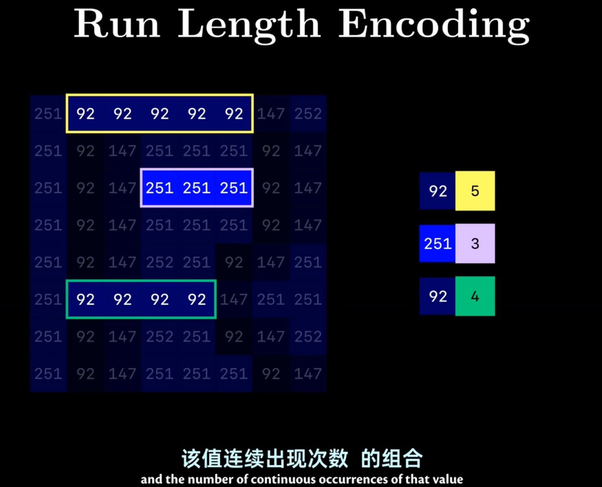
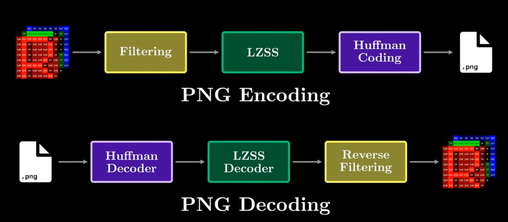
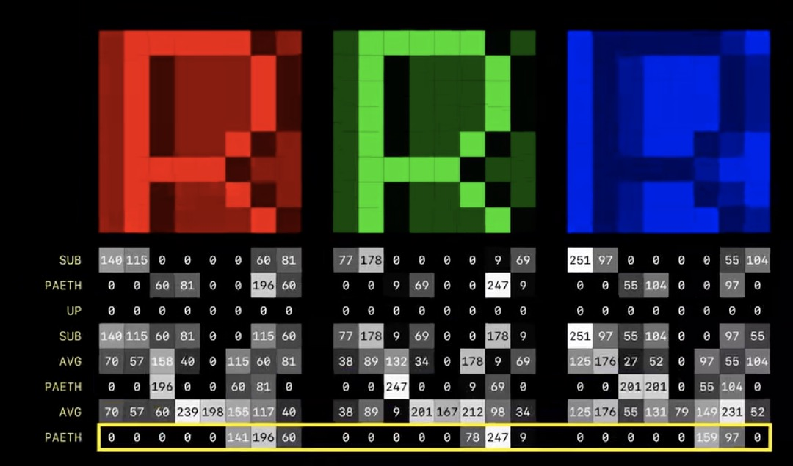
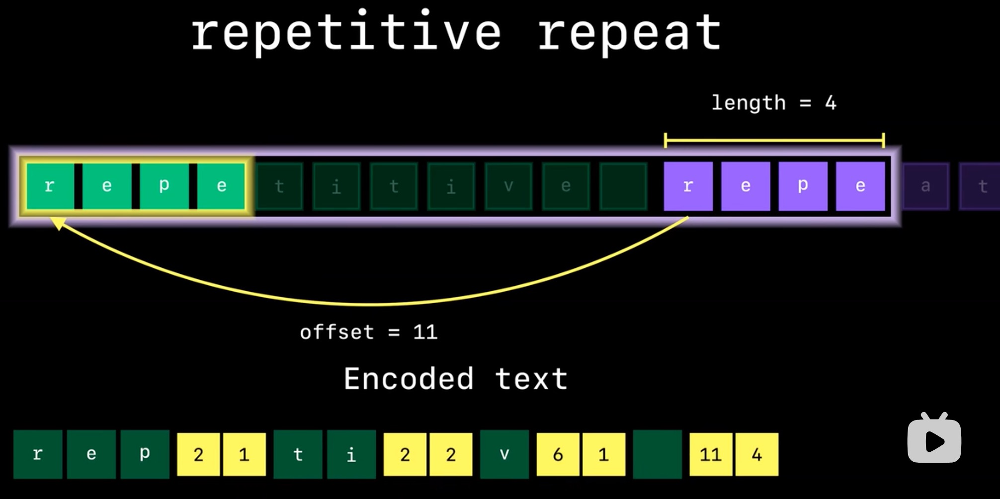
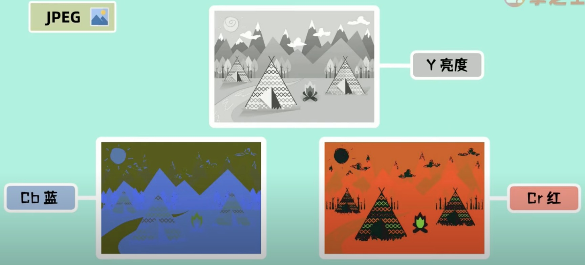

### 基础知识：
+ 差分编码：数据存储前后的差值：d(i) = x(i) − x(i−1)
+ 霍夫曼编码：
+ 颜色空间：YUV、RGBA
+ 离散余弦变换（DCT）：
+ 预测编码：
+ LZ77：
+ LZSS:
+ DEFLATE压缩：
+ 行程编码（RLE=Run Length Encoding）

    

### PNG压缩：

    

#### Filtering

五种filtering：

    

#### LZSS

    

 
#### Huffman Coding

https://juejin.cn/post/6905635070397612039
https://medium.com/@duhroach/how-png-works-f1174e3cc7b7
https://www.w3.org/TR/2003/REC-PNG-20031110/
https://www.cnblogs.com/yunqian2017/p/14617200.html
https://blog.csdn.net/helimin12345/article/details/108210763

### JPEG压缩：

+ 采用YUV颜色空间（YCbCr）

    

+ 人眼对亮度Y敏感，对色度UV不敏感，减少UV数据的数量（Y:Cb:Cr=4：2：0）
+ 将图像切分成8x8像素块，对每个像素块进行DCT离散余弦变换
+ Z字形编排
+ RLE游程编码
+ 霍夫曼编码

### webp
+ 分块
+ 帧内预测
+ dct
+  Arithmetic entropy encoding编码
