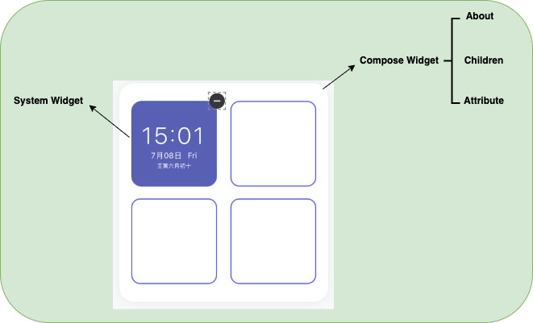

一、框架结构

<center>
    
</center>


```json
{
  "id":"uuid",
  "name":"compose widget 01",
  "res_id": "---------疑问点1----------weather-1/clock-1",
  "build": "platform-app_version",
  "author": "system/user_id",
  "m_time": "",
  "size": {
    "w": 2,
    "h": 2
  },
  "child": [
  
  ],
  "attr": {
   
  }
}
```

> 问题1：需要把文件描述基本信息抽到about或package里面？
> 疑问2：组合小部件无需知道对应的是哪个内置资源

逻辑推导：

type:group/widget : child == null → 去掉type

author:official/username  → 去掉category
            ↑
category:system/user/designer


二、child的结构

<center>
    
</center>

```json
{
  "id": "xxxxx",
  "name": "",
  "author": "system",
  "build": "",
  "m_time": "",
  "position":{
    "x":"",
    "y":""
  },
  "size":{
    "w":"2",
    "h":"1"
  },
  "attr":[
  
  ]
}
```


#### 三、属性attr对象

> 属性

##### 3.1 数据结构

```json
  {
    "type": "single/group",
    "name": "",
    "value": ""
  }
```
+ type
  + single:单个属性描述
  + group：多个属性组成的属性组
+ id
  + 属性的id，需要和view做好映射关系
+ name：名字描述，现阶段做映射关系
  + bg -> Background
  + border -> Border
+ value：当type = single时，为对象类型。当type = group时，为数组类型。

##### 3.2 支持的编辑项

| 编辑项名称 | 对应属性名称       |
|:------|:-------------|
| 背景    | bg           |
| 边框    | border       |
| 边框宽度  | border-width |
| 文字    | text         |
| 字体    | font         |
| 字色    | text-color   |
| 字号    | text-size    |
| 文字位置  | text-loc     |
| 地区    | area         |
| 时间格式  | time-format  |
| 温度格式  | temp-format  |


#### 四、行为定义

+ create ：创建容器
+ add ：添加操作
+ replace ： 替换操作
+ remove ： 删除操作
+ select ： 选中某个Widget
