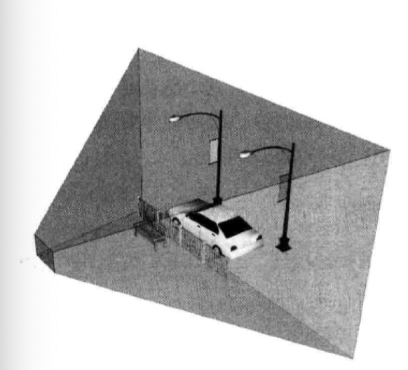
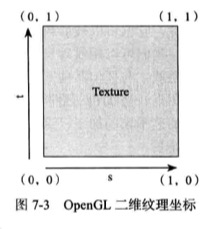

##### 第一章：准备开始
略

#### 第一部分：一个简单的空气曲棍球游戏
##### 第2章 定义顶点和着色器
+ 在OpenGL里，只能绘制点、直线以及三角形
+ 桌面：逆时针定义2个三角形

    

+ 数据放入本地内存：ByteBuffer
+ 顶点着色器 & 片元着色器
##### 第3章 编译着色器及在屏幕上绘制
+ 加载着色器：
+ 编译着色器：
  + 创建一个着色器对象：glCreateShader
  + 上传和编译着色器：glShaderSource/glCompileShader
  + 取出编译状态：glGetShaderiv
+ 把着色器链接进程序
+ 做最后的拼接
  + 验证程序：glValidateProgram
  + 获得uniform的位置：glGetUniformLocation
  + 获取属性的位置：glGetAttribLocation
  + 关联属性和顶点数据：glVertexAttribPoint
  + 使能顶点数组：glEnableVertexAttribArray
+ 在屏幕上绘制
##### 第4章 增加颜色和着色
+ 4.1 平滑着色
+ 4.2 引入三角形扇
+ 4.3 增加一个新的颜色属性
+ 4.4 使用新的颜色属性渲染
##### 第5章 调整屏幕宽高比
##### 第6章 进入第三维
6.1 三维的艺术
6.2 从着色器到屏幕的坐标变换：顶点位置 -> 透视除法 -> 归一化坐标
6.3 增加w分量创建三维图：曲棍球项目新的坐标点用（x，y，z，w，r，g，b）这样的形式表示。
6.4 使用透视投影：视椎体 

    

6.5 定义透视投影
6.6 在代码中创建投影矩阵
6.7 开始使用投影矩阵
6.8 增加旋转
6.9 小结

##### 第7章 用纹理增加细节
7.1 理解纹理

    

7.2 把纹理加载进OpenGL中
- 纹理过滤
7.3 创建新的着色器集合
7.4 为顶点数据创建新的类结构
7.5 为着色器程序添加类
7.6 绘制纹理
7.7 小结
##### 第8章 构建简单物体
##### 第9章 增加触控反馈：与空气曲棍球游戏交互
9.1 glSurfaceView.setOnTouchListener 
9.2 

#### 第二部分：构建三维世界
##### 第10章 用粒子增添趣味
##### 第11章 添加天空盒
##### 第12章 增加地形
##### 第13章 点亮世界
##### 第14章 创建动态壁纸
##### 第15章 采取下一步行动