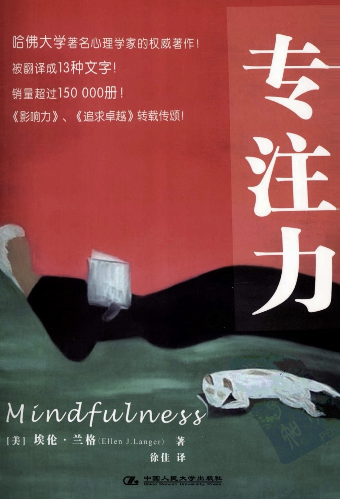

#### 概述
###### 书籍简介
<table>
    <tr>
        <td></td>
        <td>专注力</td>
    </tr>
</table>

+ 第一章：缺乏专注力的本质
  - 缺乏专注力的三种类型
    - 范畴陷阱：我们通过划分范畴并区分不同范畴来感受世界。
      - 块长70 厘⽶，宽30 厘⽶的⽊板。很难想到是“门”对吗？
    - 自动行为：在 没有明确的欲望或者有意识的选择时，正常⼈⼤致倾向于依据习惯⾏事。
      - 劳驾，我可以⽤⼀下复印机吗？
      - 劳驾，我可以⽤⼀下复印机吗？因为我想复印⽂件。 
      - 劳驾，我可以⽤⼀下复印机吗？因为我现在赶时间。（一旦听到理由，⼈们就更趋向于顺从）
        
    **⼈们只是对熟悉的句式⼼不在焉地做出反应，他们根本就没有仔细地去关注当时的情景。**
    - 行为角度单一化:照章办事
>当提供帮助的⼈听闻 Ace 牌绷带已售完 时，我们研究的25⼈中竟⽆⼀⼈询问店主是否有其他可以推荐的急救品有售。⼈们两⼿空空地离开药店，对“受害者”如实相告。

+ 第二章：缺乏专注力的根源
  + “缺乏专注力”集大成者：
    + 过于熟练的工作已经不太需要专注力。边看电视边织毛衣、边开车边听收音机、边打字边读懂内容。
    + 重复导致的专注力缺乏几乎出现在任何职业。
  + 亵渎圣灵的卷毛狗（牧师的狗叼着圣经）
    + 早熟认知界定：当我们初次碰到某事时即形成了⼀套思路，⽽当再次遇到相同情况时，会仍然坚持以往的思路。由于这样的思路在我们进⾏⾜够的思考之前就形成了，因此⼼理学上把它叫做“早熟认知界定”
    + 还同时期形成的不成熟的思路，影响未来的判断。
    + 缺乏专注力的人忠于已形成的思路。
  + 缺乏专注力和无意识
  + 过于迷信“资源有限论”
    + 离婚时争夺孩子的监护权，本质是维系孩子的情感。感情并不是有限资源。
    + 金钱是有限的，但满足基本需求后，人们追求的是一种心境。
  + “熵”和“线性时间论”对思维的局限
  + 功利化教育
    + 以过程为导向 vs 以结果为导向
  + 场景的力量
    + 在医院，我们低声耳语。在公墓我们悲痛。在派对，我们大肆狂欢。

+ 第三章：缺乏专注力的代价
  + 故事一：洗漱完之后准备参加晚宴，却去睡觉了。
  + 故事二：烧烤前总要切一块肉下来，因为母亲这样做。母亲说外婆也这样做。外婆说他的锅放不下。

  + 缺乏专注力的后果：
    + ⾃我形象单⼀化、
    + ⽆⼼之过的残忍、
    + ⽣ 活、思维失控、
    + 潜⼒受抑制