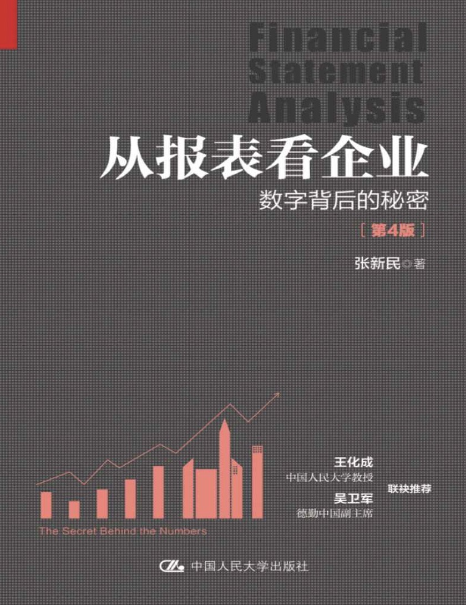

#### 概述
###### 书籍简介
<table>
    <tr>
        <td></td>
        <td>从报表看企业：数字背后的秘密</td>
    </tr>
</table>

第四章 传统报表分析 vs 张氏报表分析
+ 传统：财务比率分析方法不适用中国情况
+ 张氏：八看
  + 看战略
  + 看经营资产 
  + 管理与竞争力
  + 看效益和质量
  + 看价值
  + 看成本决定机制
  + 看财务状况质量
  + 看风险
  + 看前景

第五章 看战略

5.3 从资产负债表看战略之一：资产结构的战略信息

资产按对利润的贡献方式：经营资产 vs 投资资产

按经营资产和投资资产的比重分三类：
+ 以经营资产为主的经营主导型
  + 战略内涵
    （1）以特定的商业模式、行业选择和提供特定产品或劳务 为主营业务的总体战略为主导。
    （2）以一定的竞争战略（如低成本战略、差异化战略和聚 焦战略等）和职能战略（如研发、采购、营销、财务、人力资源 等战略）为基础。
    （3）以固定资产、存货的内在联系及其与市场的关系管理 为核心。为企业的利益相关者持续创造价值。
+ 以投资资产为主的投资主导型
  + 战略内涵
    （1）以多元化或一体化的总体战略（或其他总体战略）为 主导。
    （2）以子公司采用适当的竞争战略和职能战略，特别是财 务战略中的融资战略（子公司通过吸纳少数股东入资、子公司自 身债务融资和对商业信用的利用等融资战略，可以实现在母公司 对其投资不变情况下的快速扩张）为基础。
    （3）以对子公司的经营资产管理为核心，通过快速扩张为 企业的利益相关者持续创造价值。投资主导型企业可以在较短时 间内通过直接投资或者并购实现做大做强企业集团的目标，或者 在整体上保持财务与经营的竞争能力和竞争地位。

+ 经营资产与投资资产比较均衡的投资与经营并重型

5.4 从资产负债表看战略之二：企业控制性投资的扩张效应分析
投资相关的报表：
  + 交易性金融资产
  + 衍生金融资产
  + 债权投资
  + 其他债权投资
  + 长期股权投资
  + 其他权益工具投资
  + 其他非流动金融资产

5.5 从资产负债表看战略之三：企业的资本引入战略
5.6　从资产负债表看战略之四：立场
5.7　从资产负债表看战略之五：集团管理
+ 债务筹资管理
  + 母公司筹资为主，子公司筹资为辅
  + 子公司筹资为主，母公司不筹资或筹资为辅
  + 母子公司各自为战，谁缺钱谁去筹资
+ 货币资金管理
  + 母公司集中统一管理为主
  + 分散管理
  + 集权与分权相结合
+ 业务关系管理
  + 母公司向市场提供产品或服务为主，子公司为母公司提供 配套支持
  + 母公司和子公司各自有自己的产品或者服务向市场提供， 双方业务关联度较低
  + 母公司向子公司提供产品或服务为主，子公司向市场销售 母公司的产品
+ 销售活动管理
+ 管理费用管理 
+ 研发活动管理

第六章 看经营资产管理与竞争力
6.1 货币资金存量管理
企业现金用于两种支付
+ 资本性支出（固定资产、无形资产、对外投资）
+ 维持日常周转

6.2 以存货为核心的上下游关系管理

6.3 固定资产利用

6.4 资产管理的综合效应

6.5 关于高商誉并购与企业集团整体的综合效益

第八章 看价值：企业非证券市场交易条件下股东权益的价值

入资时的价值 vs 入资后的价值

第十一章 看风险
11.1 经营风险

11.2 财务风险