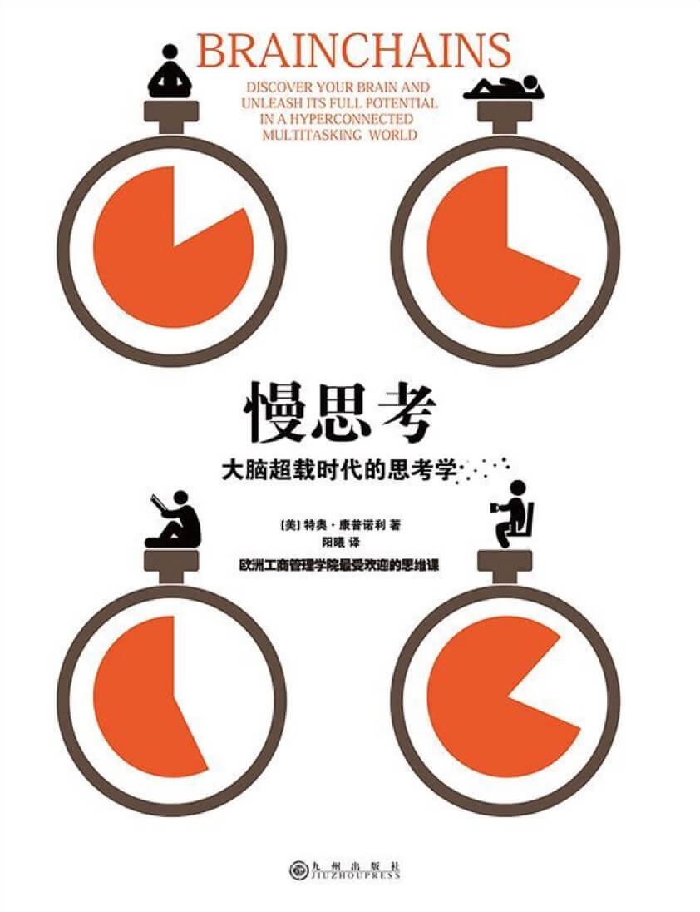

#### 概述
###### 书籍简介
<table>
    <tr>
        <td></td>
        <td>慢思考：大脑超载时代的思考学</td>
    </tr>
</table>

#### 关于作者
[特奥·康普诺利（Teo Compagnoli）](https://www.amazon.com/stores/author/B004N70U74/about)教授是一位在医学、神经精神病学、心理治疗和商业咨询领域都颇有建树的专家。
+ 比利时的鲁汶天主教大学获得医学博士
+ 荷兰的阿姆斯特丹大学获得博士

其他出版物：
- 《压力：朋友和敌人》

 

#### 本书的结构
1. 第一部分：解释了大脑的工作机制
2. 第二部分：忽视大脑的优势劣势就会给大脑套上无形的锁链
3. 第三部分：解开大脑锁链的方案——慢思考

#### 导读
人的大脑有三套负责认知决策的脑系统：
+ 反射脑：快速原始无意识处理问题
+ 思考闹：慢而成熟消耗大量能量
+ 存储闹：存储信息激发创意

如何保持专注：
+ 第一，彻底离线：抽出固定的不受打扰的时间完成专注工作和对话
+ 第二，批量处理：尽量减少切换次数
+ 第三，恢复正常的睡眠模式
+ 第四，科学应对负面压力

#### 第一部分：神奇大脑一个简单而迷人的科学真相
- 第一章，关于大脑的惊人真相
    大脑里帮助我们处理数据的细胞总数共有1600亿个，大脑并不像机器一样由一个个独立部件组成，而是一套层层叠叠的复杂网络，他没有中枢决策器官。新细胞的产出会随着年龄的增长而减少但不会彻底停止。
    大脑能够与身体里的50万亿～100万亿个细胞进行直接的双向通信，这些细胞组成了我们的“身体脑”。
    身体脑通过三套系统影响全身所有细胞：
    + 反应极其迅速的神经系统
    + 反应较慢的内分泌系统。
    + 免疫系统。
- 第二章，果壳里的三种脑
  - 慢而成熟的思考脑
    - 速度慢，需要专注，消耗大量能量，易疲劳，串行处理，制定远期目标并提前做出预判。
  - 快而原始的反射脑
    - 速度快，自发无意识，情感网络也属于反射脑的一部分。
  - 时刻等待空闲的存储脑
    - 信息分类存储，主要以联想方式保存信息，年龄增加信息检索时间增加，与思考脑保持平衡，其中一个激活另一个就休息。
- 第三章，思考脑：不能一心二用
- 第四章，反射脑：总喜欢抄捷径
- 第五章，存储闹：至关重要的放松
- 第六章，如何在扁平的世界深入思考

#### 第二部分
- 第七章，1号锁链：随时在线
- 第八章，2号锁链：多任务并行
- 第九章，3号锁链：低水平压力
- 第十章，4号锁链：睡眠不足
- 第十一章，离线思考为何如此困难

#### 第三部分
- 第十二章，1号解锁秘诀：离线思考
- 第十三章，2号解锁秘诀：批量处理
- 第十四章，3号解锁秘诀：恢复正常的睡眠模式
- 第十五章，4号解锁秘诀：科学应对负面压力
- 第十六章，ABC模式：如何把坏习惯变成好习惯
