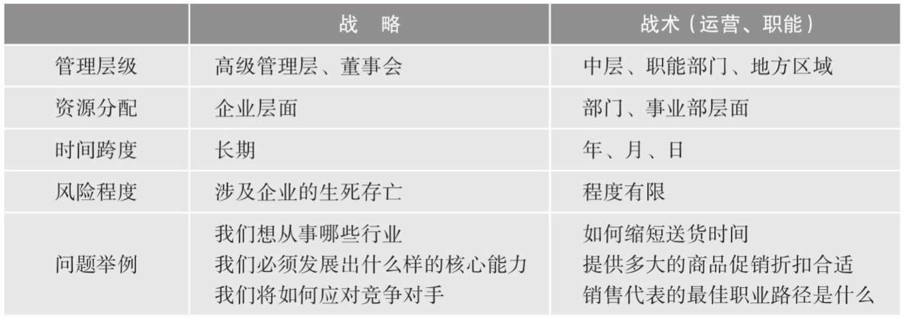
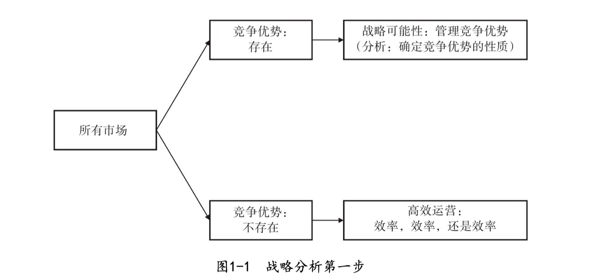
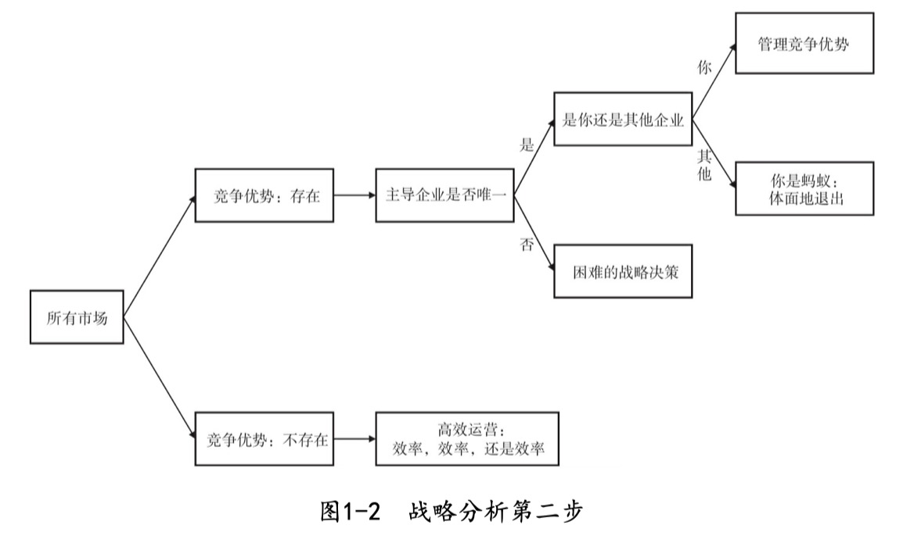

#### 概述
###### 书籍简介
<table>
    <tr>
        <td></td>
        <td>竞争优势：透视企业护城河</td>
    </tr>
</table>

###### 关于作者
布鲁斯·格林沃尔德：
美国著名经济学家，哥伦比亚大学商学院罗伯特·海尔布伦终身金融与资产管理讲席教授（荣誉退休）
先后获得麻省理工学院电气工程学士、普林斯顿大学电气工程硕士与公共管理硕士以及麻省理工学院经济学博士学位。
在1991年加入哥伦比亚大学商学院之前，格林沃尔德教授于维思大学任教，在贝尔实验室担任经济学家，在哈佛大学商学院担任助理教授和副教授。

其他著作：
《价值投资：从格雷厄姆到巴菲特》
《竞争优势：透视企业护城河》
《全球化》
《被诅咒的巨头》
《劳动力市场的逆向选择》
《增长的方法》
《关于货币经济学新模式》

贾德·卡恩：

#### 第一章 战略、市场和竞争
+ 何为战略
  + 战略和战术

    

+ 决定竞争优势的唯一力量
  + 进入壁垒和竞争优势
+ 局部霸主：本节举例（沃尔玛、微软、因特尔、苹果）说明，帮助企业获得竞争优势的是局部因素。
> 无论是一家企业还是少数几家情况类似的企业，帮助它们获得市场主导地位的竞争优势通常来自局部因素，无论是地理空间还是产品范 围，而不是大而分散的因素。这背后的原因就是：竞争优势从本质上来 说是局部的和特定的，而不是普遍的和分散的

+ 何种竞争优势
  战略分析应从两个关键问题开始：
    1、在企业当前所处或计划进入的市场，是否真的存在任何竞争优势？
    2、如果存在竞争优势，那么它们属于什么类型的竞争优势？
    + 供给侧竞争优势（成本优势）：比竞争对手更便宜的生产和提供产品服务。
    + 需求侧竞争优势（需求优势）：消费者习惯、转换成本高、寻找替代品难度大成本高
    + 规模经济效益竞争优势
+ 战略分析的程序

    

    

+ 竞争格局
  + 管理竞争优势
  + 竞争博弈：和竞争对手的互动
  + 另一种选择：与竞争对手合作
+ 本书章节安排

#### 第二章 竞争优势：供给和需求
+ 差异化迷思
  + 效率的重要性
+ 进入壁垒与竞争优势
  + 竞争优势的类型
+ 供给侧竞争优势：有竞争力的成本
+ 需求侧竞争优势：客户锁定
  + 习惯
  + 转换成本
  + 搜寻成本

#### 第三章 竞争优势：规模经济效益与战略
+ 规模经济效益与客户锁定
+ 捍卫规模经济效益
+ 供给侧或需求侧的竞争优势与相关的战略
+ 规模经济效益与相关战略
+ 竞争优势、战略规划与局域性机会

#### 第四章 评估竞争优势

#### 第五章 在地利之处壮大：沃尔玛、库尔斯 与局部规模经济效益

#### 第六章 细分市场优势与增长困境：个人计算机行业里的康柏与苹果

#### 第七章 制造优势丧失：光盘、数据交换与烤面包机

#### 第八章 企业间的博弈：竞争战略的结构化方法

#### 第九章 野蛮的可乐大战：可口可乐与百事可乐的囚徒困境

#### 第十章 狐入鸡笼：福克斯进军电视网

#### 第十一章 企业间的博弈：竞争战略的结构化方法

#### 第十二章 插翅难飞：几维航空的崛起

#### 第十三章 无速成之功：柯达挑战宝丽来

#### 第十四章 精诚合作：把饼做大，公平分食

#### 第十五章 合作：规范和禁忌

#### 第十六章 战略视角下的价值评估：改进投资策略

#### 第十七章 企业发展与战略：并购、风险投资与品牌拓展

#### 第十八章 平等竞技场：在竞争性环境中兴旺发达

