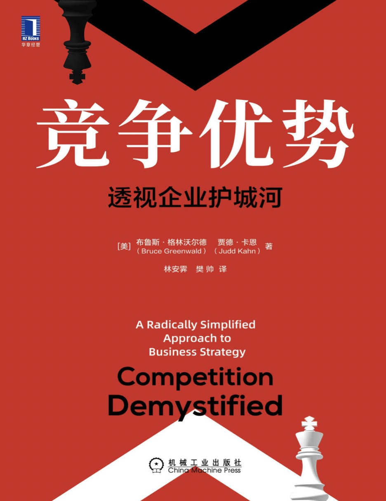

#### 概述
###### 书籍简介
<table>
    <tr>
        <td></td>
        <td>竞争优势：透视企业护城河</td>
    </tr>
</table>

###### 关于作者
布鲁斯·格林沃尔德：
美国著名经济学家，哥伦比亚大学商学院罗伯特·海尔布伦终身金融与资产管理讲席教授（荣誉退休）
先后获得麻省理工学院电气工程学士、普林斯顿大学电气工程硕士与公共管理硕士以及麻省理工学院经济学博士学位。
在1991年加入哥伦比亚大学商学院之前，格林沃尔德教授于维思大学任教，在贝尔实验室担任经济学家，在哈佛大学商学院担任助理教授和副教授。

其他著作：
《价值投资：从格雷厄姆到巴菲特》
《竞争优势：透视企业护城河》
《全球化》
《被诅咒的巨头》
《劳动力市场的逆向选择》
《增长的方法》
《关于货币经济学新模式》

贾德·卡恩：

