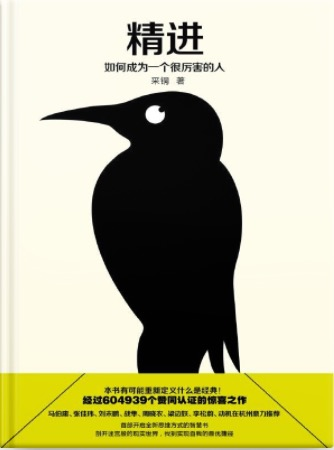

#### 概述
##### 书籍简介
<table>
    <tr>
        <td></td>
        <td>精进，如何成为一个很厉害的人</td>
    </tr>
</table>

+ 01-如何对待时间
+ 02-如何做出更好的选择
+ 03-即刻行动
+ 04-怎样学习
+ 05-修炼思维
+ 06-优化你的"努力"
+ 07-创造成功

#### 我们如何对待时间

+ "郑重"：不敷衍、不迟疑、认真聚焦当下，不急功近利、不消极避世
+ 未来
  + 近期未来：人们倾向于做可行性高、容易的事情，回避更有意义和挑战性的事。
    + 怎么办？ 提高逃避成本
  + 远期未来：人们倾向于考虑目标价值和意义，但缺乏可行性。
    + 怎么办？ 多思考实现目标的具体途径

>1.使远期未来的目标更加具体化、情境化和可实施；
>2.降低近期未来中的“非期望行为”的便利性，主动增加挑战的难度。

我们所做的事：
+ 高收益，长半衰期
+ 高收益，短半衰期
+ 低收益，长半衰期
+ 低收益，短半衰期

>现代社会就像一架高速运转的机器，每个人都在其中扮演着某种角色。机器越转越快，人就被推着一直往前跑，疲于奔命。

工作要快，生活要慢。
+ 尽可能求快的事情：做家务等体力劳动，完成常规的事务性工作，完成简单的执行性任务，常用商品的线上线下购买，注定无法达成共识的争吵和争论等。
+ 尽可能求慢的事情：与家人共度闲暇时光，欣赏艺术作品，自我反思，思考重大决策，创造性活动中的酝酿过程，为一个挑战性任务做好准备等。

提升时间的使用深度：
+ 我们从闲暇中获得放松和满足的程度并不取决于闲暇时间的长度，而是取决于其质量。（看电视 vs 写作绘画）

#### 如何做出更好的选择

+ 更高的标准，才会有更好的选择

**逃离隐含假设的牢笼 发现人生中的更多可能选项**

“当我们陷于某个人生困局时，困住我们的不仅有外界的客观现实，还有我们过去的经历、习惯和思维惯性。这些东西会在我们思考时自动植入“隐含假设”，从而限制了思考的角度和范围。其结果是，我们通常只是在两三个“可见选项”中去做决定，而意识不到更多的“可能选项”。”

四种最普遍的隐含假设
+ 赛道假设：在外界固化了的轨道中赛跑
+ 低关联假设：小时候的绘画基础对未来没啥用。
+ 僵固型心智：认为自己能力不行而不去努力
+ 零和博弈：认为只能一赢一输，要学会共赢。

三种灵活的思维框架
+ 目标悬置：把目标先放放，实际成熟再做。
+ 能力嫁接：能力可以迁移
+ 特性改造：被动枯燥的工作改造成主动积极的工作。把自己的乐趣和爱好融合进去。

选择太多，如何决策? **维度分析法**（通过列表格，给权重，做判断）
+ 第一步：重新定义问题
+ 第二步：因素穷举
+ 第三步：因素赋权
+ 第四步：列出表格

#### 即刻行动
> “如果总能想到一件事就完成一件，那么我们同时应对的事情就少了，也就不用多花心思去“管理”这些事情。而待完成的事情一多，管理的复杂度就直线上升，相应地，记忆负担、情绪负担和人际负担也会显著加重。这些心理成本虽然是隐性的，却影响着我们的生活质量。随着事情越积越多，我们慢慢会觉得无法承受，情绪上的各种问题首先会爆发，然后与周围人的关系也会变差，于是生活开始失控。”

一个人的“最小化可行产品”是什么？
+ “在某家公司的实习经历不是产品，但基于实习经历写成的系统性总结报告可以算作产品；”
+ “阅读一本书的经历不是产品，但是对这本书深入、透彻分析的文章可以算作产品；”
+ “拥有绘画的技能不是产品，但是使用这项技能创造的绘画作品可以算作产品；”

把批评当作一种“信息”对待，而不是一种评价。
+ 正面反馈能坚定我们犹豫不决的心态，增强我们的自信
+ 否定和批评会促使我们反思，校正之前的错误想法
+ 提示之前未知的方面则让我们发现新的世界，让我们的思考更加周全

#### 怎样学习
不只做信息搬运工，更要解码事物的深层。

解码的三个层次：
+ 他说了什么，给我什么感受？
+ 他是什么，对我有什么价值？
+ 他是怎么做到的？

深度学习：不止了解，还要知晓
    知晓：**理解原理后能够思考和推导出其他结论。**

>见文字平铺纸上，易；见若干文字自纸面浮超凸出，难。  
>见书中文字都是一般大小，易；见书中文字重要性有大小，而如变大或变小，难。  
>顺书之文句之次序读书，易；因识其义理之贯通，见前面文句如跑到后面，后面文句如跑到前面，平面之纸变卷筒，难。  
>于有字处见字而知其意义，易；心知著者未言之意，于字里行间无字处见出字来，难

#### 创造成功
校园的标准化教育有2个风险：
+ 教学内容更新赶不上社会整体进步
+ 内容脱离应用环境、教师缺乏实操经验

从被动学习转为主动探索：
+ 突破教师、教材、课程计划的限制
+ 对其他领域保持好奇和探索

如何做：
+ 利用好本校平台资源
+ 利用互联网教育资源
+ 主动试错
+ 了解和评估自己智力资产的价值
  自我教育者要能评估自己所学知识的价值，尤其是实践中的价值。
+ 以完成具有创造力的作品为目标
  学习一个东西要拿作品展示给别人，这样别人才知道你会这个东西。