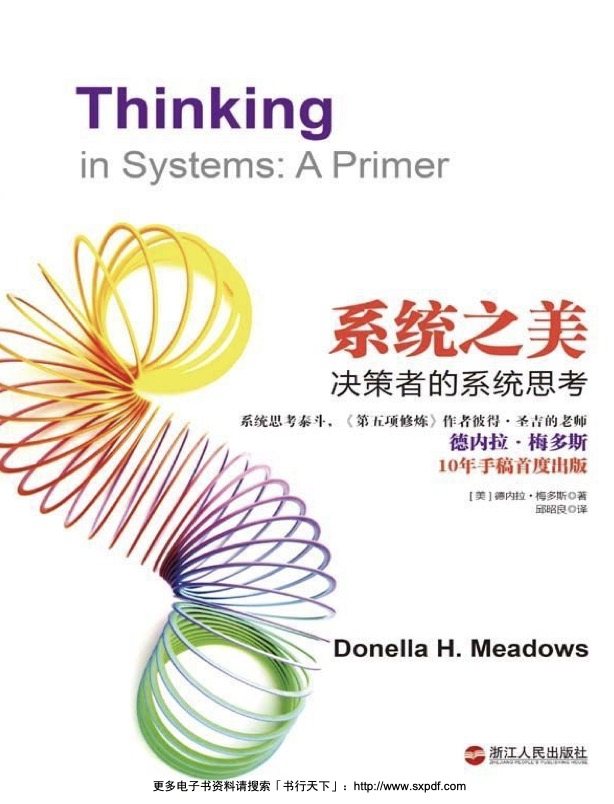

#### 概述
##### 书籍简介
<table>
    <tr>
        <td></td>
        <td>系统之美-决策者的系统思考</td>
    </tr>
</table>

##### 关于作者
德内拉·梅多斯（Donella Meadows，1941-2001）是一位美国环境科学家、系统分析师和作家。她以其在可持续发展、系统动力学和环境建模方面的贡献而闻名。
从1972年直到2001年去世，她一直在达特茅斯学院环境研究项目任教，致力于在经济学、环境和社会变革等领域应用系统思考和组织学习的方法。

其他著作：
《增长的极限》（1972）
《超越增长的极限》（1992）
《系统思考：改变世界的方法》（2008）

##### 结构
第一部分：系统的结构和行为
+ 系统基础
+ 单存量系统、双存量系统
第二部分：系统思考和我们
+ 第三章 系统的3大特征：适应力、自组织、层次性
+ 第四章 系统的6大障碍：
+ 第五章 系统的8大陷阱与对策：
第三部分：改变系统
+ 第六章 系统的12大变革方式
+ 第七章 系统的15大生存法则

