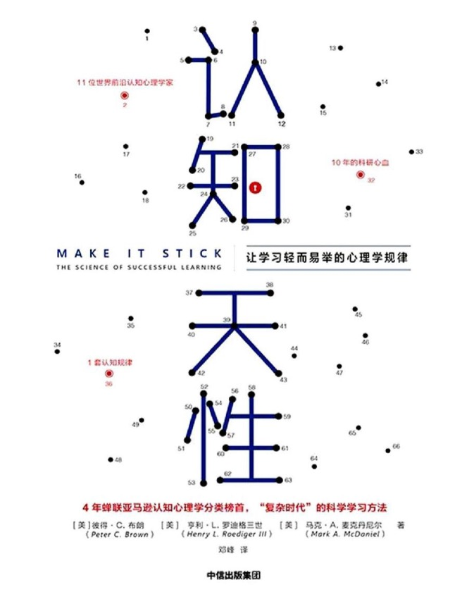

#### 概述
###### 书籍简介
<table>
    <tr>
        <td></td>
        <td>认知天性 : 让学习轻而易举的心理学规律</td>
    </tr>
</table>

###### 关于作者
三位作者：
+ 彼得·布朗（Peter C. Brown）
  一位作家和独立出版人，专注于撰写历史、商业和心理学方面的书籍。他在《认知天性》中担任主要撰稿人，负责将科学家们的研究成果转化为易于理解和应用的内容
+ 亨利·勒迪格（Henry L. Roediger III）
  华盛顿大学心理与脑科学系的教授。他的研究主要集中在记忆和学习方面，尤其是记忆的提取和测试效应（testing effect）。勒迪格教授在认知心理学领域发表了大量的研究论文，并获得了多项荣誉和奖项。
+ 马克·麦克丹尼尔（Mark A. McDaniel）
  华盛顿大学心理与脑科学系的教授，专注于认知心理学和教育心理学。他的研究兴趣包括记忆、学习策略和如何在实际教育环境中应用这些策略。麦克丹尼尔教授也在认知心理学领域发表了许多重要的研究成果，并与勒迪格教授共同开展了大量的合作研究。

##### 结构
+ 学习是挑战天性的必须课
+ 学习的本质：知识链和记忆结
+ “后刻意练习”时代的到来
+ 知识的“滚雪球”效应
+ 打造适合自己的心智模型
+ 选择适合自己的学习风格
+ 终身学习者基本的基本
+ 写给大家的学习策略

##### 内容

+ 1、学习是挑战天性的必须课
  + 天性懒惰孕育了认知规律和心智模型
    - 耗费心血的学习才是深层次的，效果也更持久。不花力气的学习就像在沙子上写字，今天写上，明天字就消失了。
    - 与反复阅读这种复习方法相比，**回想事实、概念或事件**会更有效。这种方法被称为检索式练习。
  + 科学“照妖镜”下的学习方法
    + 背诵、不断重复、反复阅读、**功利性记忆**、集中练习等方式，看起来很刻苦，其实效果不好，很快被忘记。
    + 对文字越熟悉、越流畅阅读，会造成一种掌握的假象。
    + 当事关重大时，当抽象的事务被形象化时，当事情和个人息息相关时，你就会把学到的东西记得更牢。
    + 轻易接受别人的观点，不给自己提问题，没有去想什么是自己不知道的
  + 知识多不等于学习能力强
    + 学习知识不能求快，要求扎实，循序渐进理解。
  + 考试是最有效的学习策略之一
    - 不要把考试当做衡量学习成果的标尺，而是记忆检索的练习，一种学习工具。
    - 主动检索（考试）可以强化记忆，而且检索花费的心思越多，受益就越多。

读书笔记：不要无意识的重复，集中练习、把抽象形象化，找到知识与自己的关联。别太在意考试的成绩。

+ 2、学习的本质：知识链和记忆结
  + 知识最终将变成条件反射
    + 可以带来更好的学习效果：从记忆中检索知识或是早期的训练内容，把这些和新体验联系起来，借助观察和思考，预先演练你下次可能采取的不同做法。
  + 自我检查：给知识链打上记忆结
    + 重复检索能让记忆更清透，而且它把记忆这条绳子又缠了一圈，使其变得 更牢靠。
  + 只需一次自测：一周后回忆率28%跃迁为39%
    + 自测是一种检索式学习，可以强化记忆。
  + 如何成为一名主动学习者
  + 为何学习越轻松效果越不好

读书笔记：不断回顾知识（考试）可以加深印象，减少遗忘。反思也是一种记忆检索。

+ 3、“后刻意练习”时代的到来
  + 频繁的集中练习只会产生短期记忆
  + 间隔练习使知识存储得更牢固
  + 穿插练习有助于长期记忆
  + 多样化练习促进知识的活学活用
  + 善用练习组合，带来成长性思维
  + 知识是平面的，复合型知识是立体的
  + 关于练习的几条普适性原则

读书笔记：这一部分的副标题是连贯深入的。

+ 4、知识的“滚雪球”效应
  + 学习的三个关键步骤
    + 编码
    + 巩固
    + 检索
  + 欲求新知，先忘旧事
    + 使用Mac电脑，要先忘记Windows电脑，因为Windows的操作习惯会干扰你的学习。忘掉的不是知识本身，而是检索的线索。
  + 越容易想起，越不容易记住
  + 学习中必须要做哪些努力
    + 重新巩固记忆
    + 打造心智模型：复杂理论或连续运动技能融合成有意义的整体。
    + 举一反三
    + 构建概念学习
    + 学习迁移
    + 做好学习的心理准备
  + 这些”良性干扰“能提升学习效果
  + 化解因失败带来的焦虑感
  + 创造性源于不设限的学习
  + 别在无法克服的困难上浪费时间

读书笔记：

+ 5、打造适合自己的心智模型
  + 没头脑的机制1和爱自省的机制2
    + 指反射脑和逻辑脑（《思考快与慢》）
  + 学习时避免错觉和记忆扭曲
  + 打造适合自己的心智模型
  + 你无法从不擅长的事情里学到知识
  + 实践和测验才能暴露学习漏洞

读书笔记：

+ 6、选择适合自己的学习风格
  + 主动学习能制造掌控感
  + 你是分析型、创新型、还是实践型思维
    + 第一种智力区分模型：8种
      - 逻辑——数学智力：批判性思考，以及使用数字和抽象概念的能 力，诸如此类。
      - 空间智力：三维判断，以及在脑海中具象化的能力。
      - 语言智力：使用文字和语言的能力。
      - 肢体动觉智力：行动敏捷和控制身体的能力。
      - 音乐智力：对声音、旋律、音色，以及音乐的敏感性。
      - 人际交往智力：“读懂”他人，以及与人有效协作的能力。
      - 内省智力：理解自身，准确判断自身知识、能力、效率的能力。
      - 自然观察智力：区分和关联周围自然环境的能力（例如园丁、猎人 或厨师特有的智力）。
    + 第二种智力区分模型：3种
      - 分析型智力 ：分析型智力是我们解决问题的能力，典型的例子就是解答测验中的问题
      - 创新型智力 ：创新型智力是我们综合并应用现有的知识与技能，应对那些新的特殊情况的能力；
      - 实践型智力 ：实践型智力是我们适应日常生活的能力——明白在具体环境下需要做什么并行动，也就是我们所说的“街头智慧”。
  + 学不好的领域暴露了你的能力结构
  + 用搭积木的方法构建知识
  + 有人喜欢看说明书，有人喜欢动手试错

读书笔记：不同的文化与学习场景需要不同的智力类型。

+ 7、终身学习者基本的基本
  + 双胞胎的认知能力也会天差地别
    大脑的结构与整体构造在很大程度上是由基因决定的，但神经网络的精细构造似乎也可以由经验来塑造，而且具备大幅修改的能力。
  + 性格、求知欲和家庭条件对学习的影响
智商是基因🧬与环境共同作用的产物。
人类智商在持续升高，因为教育、文化（电视机兴起）、营养（脂肪酸、铁、维B）发生了极大的变化。
社会经济地位也会影响智商。早期教育可以提升贫困孩子的智商。
  + 脑力训练可以提升学习自信
    流体智力：指推理、发现关系、抽象 思维，以及在解决问题的同时头脑中保留信息的能力。
    晶体智力：指积累的关于世界的知识，以及从过去的学习与经验中提炼出来的 程序或心智模型。
  + 想要终身成长，请像专家一样思考
1、信念：你要相信智力水平不是固定的，而是在很大程度上掌握在自己手中。
2、面对失败的态度：那些将失败归咎于本身无能的人——说“我就是不够聪明”的人——会变得无助；而那些认为失败是努力不够或策略不对的人则会深入发掘，尝试不同的做法。
3、目标：有的学生以成绩为目标，而有的学生则以学习为目标。对于前一种人来说，他们努力是为了证明自己的能力。对于第二种人来说，他们努力则是为了学到新的知识或技能
  + 学习执行力比学习技巧更重要：成为专家需要一万小时刻意练习。
  + 掌握几个适合自己的记忆方法：记忆宫殿等记忆技巧

读书笔记：智商 = 基因 + 环境因素。我们可以通过改变环境因素提升我们的智商。

+ 8、写给大家的学习策略
  + 给学生的学习策略
    + 练习从记忆中检索新知识
    + 有间隔的安排检索练习
    + 学习时穿插安排不同类型问题
  + 给职场人士的学习策略
  + 给教师的学习策略
    + 向学生解释学习的过程
    + 教学生如何学习
    + 在课堂上创造合意困难
    + 保证透明度：让学生理解用意。
  + 给培训者的学习策略

##### 全书总结
从作者的职业可以看出，一个出版人和两个教授合作出版的一本书。属于认知心理学范畴。主要介绍学习、认知、大脑相关实验和结论。

1、自己究竟有没有掌握一个知识点。考试（测验、自测）是一个很好的检验手段。不像学校里的考试，要以正确的心态看待考试，只是检测自己知识的掌握度，而不是要一较高下。

个人理解：
获取到新知识，停留在浅层记忆，会有迷惑性，以为自己懂了。实则过段时间就忘记了。我们应该间隔性的回忆知识，内化吸收，这样才能将知识灵活运用。

