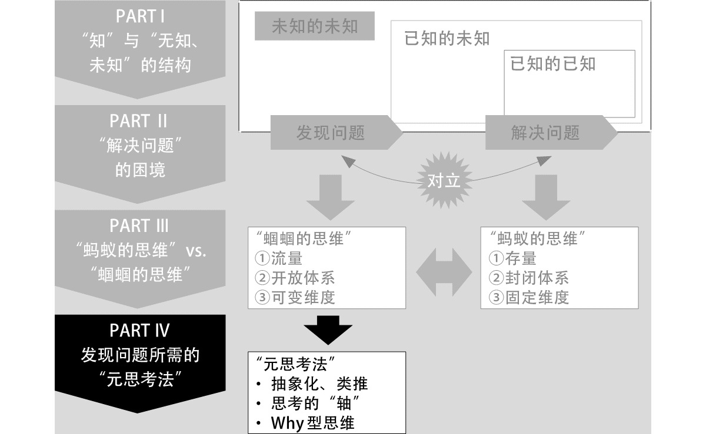

#### 概述
###### 书籍简介
<table>
    <tr>
        <td></td>
        <td>高纬度思考法：如何从解决问题进化到发现问题</td>
    </tr>
</table>

作者简介：
细谷功，商务顾问。毕业于东京大学工学部。初任职于东芝，后进入安永咨询公司（Ernst&Young Consulting，QUNIE 前身），负责产品开发等领域的战略制定及业务改革计划的制订、执行和定义。现任QUNIE 顾问研究员，另于企业和大学开展思维能力相关的研修和业务。

书本结构：

    

#### 第一部分：知、无知、未知及其结构

1.1 “未知的未知”这一死角
认识到知的三个层次，即：已知的已知、已知的未知、未知的未知。尤其是要意识到未知的未知这一层。

1.2 “知”是“事实和解释的组合”
  + 事实和解释的关系：事实只有一个，解释因人而异

    

1.3 “无知、未知”的思考框架

1.4 已知和未知的不可逆循环

1.5 苏格拉底和德鲁克所提倡的"无知"的两种视角

#### 第二部分：解决问题的困境：能解决问题的人，不能发现问题
2.1 “知”的困境
2.2 封闭体系的困境
2.3 “解决问题”的困境
#### 第三部分：从解决问题到发现问题
3.1 蚂蚁思维与蝈蝈思维的差异
3.2 从存量到流量
3.3 从封闭体系到开放体系
3.4 从固定思维到可变思维
3.5 从“奇点”出发的问题发现法
3.6 蚂蚁和蝈蝈能否共存共荣

#### 第四部分：发现问题的元思考法，升维发现问题

    

4.1 上位概念&下位概念
4.2 通过“抽象化、类推”升维
4.3 通过思考的“轴”升维
4.4 通过“Why”升维
4.5 为了活用“元思考法”

#### 总结

