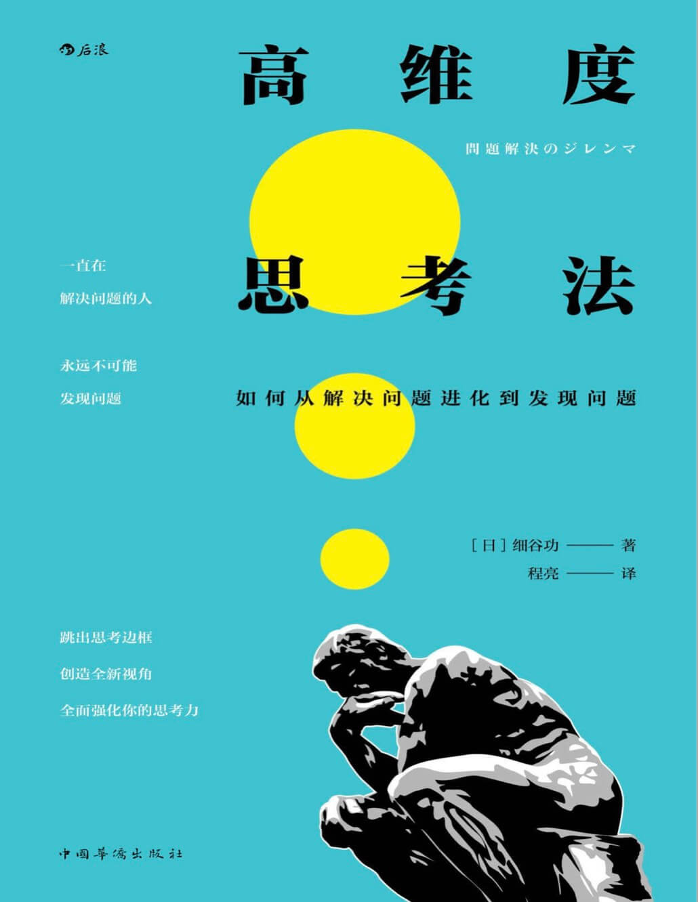
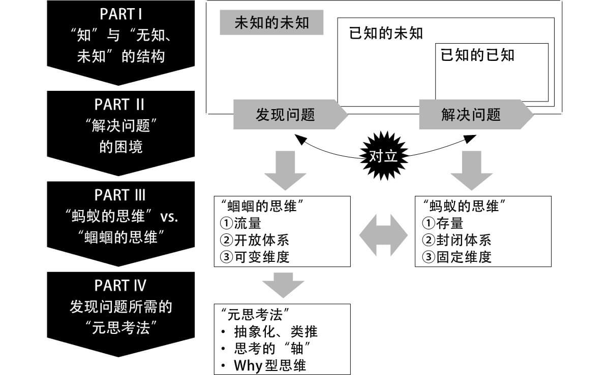
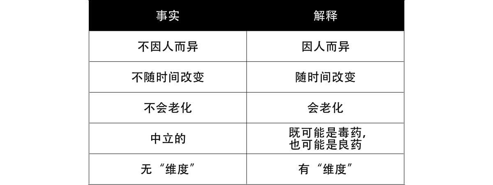

#### 概述
###### 书籍简介
<table>
    <tr>
        <td></td>
        <td>高纬度思考法：如何从解决问题进化到发现问题</td>
    </tr>
</table>

作者简介：
细谷功，商务顾问。毕业于东京大学工学部。初任职于东芝，后进入安永咨询公司（Ernst&Young Consulting，QUNIE 前身），负责产品开发等领域的战略制定及业务改革计划的制订、执行和定义。现任QUNIE 顾问研究员，另于企业和大学开展思维能力相关的研修和业务。

书本结构：

    

#### 第一部分：知、无知、未知及其结构

+ “未知的未知”这一死角

+ “知”是“事实和解释的组合”
  + 事实和解释的关系：事实只有一个，解释因人而异

    

+ “无知、未知”的思考框架

+ 已知和未知的不可逆循环

+ 苏格拉底和德鲁克所提倡的"无知"的两种视角

#### 第二部分：解决问题的困境：能解决问题的人，不能发现问题

#### 第三部分：从解决问题到发现问题

#### 第四部分：发现问题的元思考法

#### 总结

