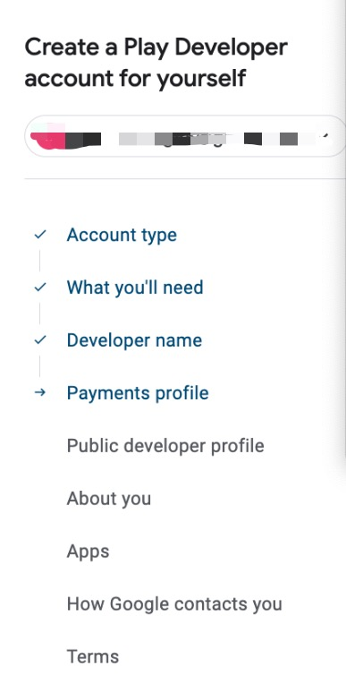

概述：
这里记录了在Google Play上架一款安卓App的过程。

#### 一、开发者账号的注册

    

#### 二、上架
+ Store list设置
  1、上传app icon
    + https://icons8.com/icons
    + https://icon.kitchen/
  2、应用截图和宣传图
    
  [宣传图](https://www.norio.be/graphic-generator/)

+ 隐私协议
  免费生成隐私协议：
    https://www.freeprivacypolicy.com/

+ 开发者网站准备-landing page（非必须）
    相关模版：
        https://github.com/sandoche/Mobile-app-landingpage-template
+ 隐私和数据安全准备
    https://github.com/Privado-Inc/SDK-Privacy-Report

三、其他资源
+ JSON托管：
    https://www.npoint.io/

代码框架：

+ on boarding 新手引导
+ feedback 反馈
+ rating 评分
+ crash report 崩溃
+ analytics 数据上报
+ google service

如何搭建landing-page
+ 1、可视化搭建
    + 应用名称
    + 商店地址
    + 屏幕截图
    + 隐私协议
+ 2、下载zip
+ 3、建立github project sites仓库
  + create repo
  + settings->pages

谷歌广告投放

推广：
+ 社媒营销
  + FB、Ins、TT、
+ 网红营销
+ 问答平台
  + Quora
+ 应用商店推广告
  + ASO
+ 广告 

搭建自动化：
+ GitHub Action