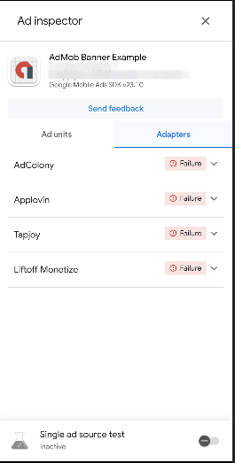
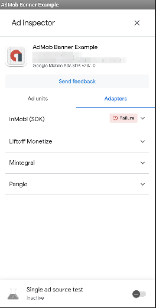

在接入Google Admob时，依据官方文档 或 依据开发习惯，我们一般先对Admob SDK进行初始化，然后进行广告加载：

```kotlin
// first init the admob sdk
MobileAds.initialize(context) {
    //init successful
}

//second load Ad
val adRequest = AdRequest.Builder().build()
adView.loadAd(adRequest)
```

那么，多思考一下，我们有个疑问：

#### 1、一定要先初始化，才能加载广告吗❓

实验设计：不执行初始化操作，直接请求广告。

```kotlin
val adRequest = AdRequest.Builder().build()
adView.loadAd(adRequest)
```

实验结论：不初始化SDK也能成功加载到广告。

#### 2、为什么不初始化也能加载广告呢❓

猜想：
1、初始化和加载有关联性：加载广告时，发现没有初始化，先进行了初始化，再执行广告加载操作。
2、初始化和加载无关联系：加载广告不需要SDK初始化，两者无关联。

设：广告初始化耗时m毫秒，广告加载耗时n毫秒，总耗时m+n毫秒。

实验设计：
A组：执行初始化，同时执行广告加载。
若初始化和加载有关联性，广告加载时长约等于m+n。
若初始化和加载无关联性，广告加载时长约等于n。

日志输出示例：

```shell
2024-07-06 10:10:06.061 23555-23555 InitAndLoad     com...oid.gms.example.bannerexample  D  call init....
2024-07-06 10:10:06.224 23555-23555 InitAndLoad     com...oid.gms.example.bannerexample  D  start load....
2024-07-06 10:10:07.401 23555-23555 InitAndLoad     com...oid.gms.example.bannerexample  D  after init = 1340
2024-07-06 10:10:08.416 23555-23555 InitAndLoad     com...oid.gms.example.bannerexample  D  onAdLoaded...cost = 2192
```

初始化耗时 m=1340ms
加载耗时 n=2192ms

B组：延迟10s执行初始化。立即执行广告加载。

日志输出示例：

```shell
2024-07-06 13:23:42.675 27481-27481 DelayInitAndLoad    com...oid.gms.example.bannerexample  D  start load....
2024-07-06 13:23:43.453 27481-27481 DelayInitAndLoad    com...oid.gms.example.bannerexample  D  call init....
2024-07-06 13:23:46.208 27481-27481 DelayInitAndLoad    com...oid.gms.example.bannerexample  D  onAdLoaded...cost = 3532
2024-07-06 13:23:53.486 27481-27481 DelayInitAndLoad    com...oid.gms.example.bannerexample  D  after init = 24
```

初始化耗时 m=24ms
加载耗时 n=3532ms

结论：由于广告加载成功后，才调用初始化逻辑，因此初始化时长大幅降低。故：初始化和加载有关联性。


#### 3、聚合的SDK初始化了吗❓

实验设计：
A：不初始化SDK，加载广告后，打开AdInspector。
B：初始化SDK，加载广告后，打开AdInspector。

<table>
    <tr>
        <td></td>
        <td></td>
    </tr>
</table>

实验结论：不初始化只能加载Admob自身的广告，初始化后可以加载聚合源的广告。

#### 3、初始化成功后再加载广告 VS 直接加载广告 加载速度的对比

直接加载：

| 第一组    | 第二组    | 第三组    | 第四组    | 第五组    |
|--------|--------|--------|--------|--------|
| 2915ms | 1581ms | 1435ms | 1621ms | 1581ms |

初始化后加载：

|       | 第一组    | 第二组  | 第三组  | 第四组  | 第五组  |
|-------|--------|------|------|------|------|
| 初始化   | 2373ms | 2374 | 2463 | 2427 | 2298 |
| 加载    | 1468ms | 1386 | 1505 | 2498 | 1250 |
| 日志总耗时 | 3843   | 3762 | 3970 | 4927 | 3550 |


结论：初始化后才加载广告慢于直接加载广告。


#### 4、一种开屏广告的优化方案

不初始化SDK也能加载到Admob广告，且加载速度较快，但是没有参与bidding，价格较低。
初始化之后，加载聚合源广告，速度较慢，但经过bidding后，价格会高一点。

结合两个加载方式，闪屏时段内加载广告，闪屏n秒时长内，加载到bidding类型则展示bidding类型。没加载到，则展示Admob类型。