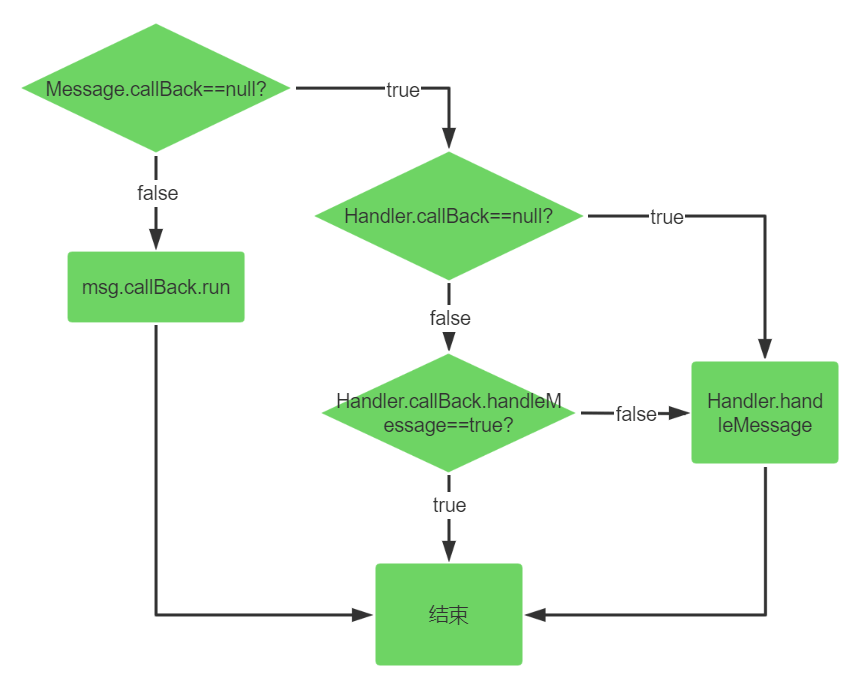

---
title: Android消息机制
tags:
  - Android
date: 2022-06-20 15:34:15
categories:
- 计算机
description:
------

#### 相关类和结构
<center>
    
</center>

#### 基本使用
##### 主线程的事件循环
```java
package android.app;

public final class ActivityThread extends ClientTransactionHandler
        implements ActivityThreadInternal {
    
     public static void main(String[] args) {
         //...
         Looper.prepareMainLooper();
         
         Looper.loop();
     }
}

```

##### 构建自己的事件循环
```java
class LooperThread extends Thread {
      public Handler mHandler;

      public void run() {
          Looper.prepare();

          mHandler = new Handler() {
              public void handleMessage(Message msg) {
                  // process incoming messages here
              }
          };

          Looper.loop();
      }
}
```

#### 原理剖析

##### 构建事件循环

<center>
    
</center>


##### 发送消息

<center>
    
</center>


##### 消息执行

<center>
    
</center>

##### 同步屏障

###### 3.4.1 消息的分类
+ 同步消息
+ 异步消息
+ 屏障消息

###### 3.4.2 同步屏障是什么

一种特殊的Message，其target=null

###### 3.4.3 同步屏障工作原理
```java
Message next() {
    //...

    int pendingIdleHandlerCount = -1; // -1 only during first iteration
    int nextPollTimeoutMillis = 0;
    for (;;) {
        //...
        synchronized (this) {
            // Try to retrieve the next message.  Return if found.
            final long now = SystemClock.uptimeMillis();
            Message prevMsg = null;
            Message msg = mMessages;
            if (msg != null && msg.target == null) {//碰到同步屏障
                // Stalled by a barrier.  Find the next asynchronous message in the queue.
                // do while循环遍历消息链表
                // 跳出循环时，msg指向离表头最近的一个异步消息
                do {
                    prevMsg = msg;
                    msg = msg.next;
                } while (msg != null && !msg.isAsynchronous());
            }
            if (msg != null) {
                if (now < msg.when) {
                    //...
                } else {
                    // Got a message.
                    mBlocked = false;
                    if (prevMsg != null) {
                        //将msg从消息链表中移除
                        prevMsg.next = msg.next;
                    } else {
                        mMessages = msg.next;
                    }
                    msg.next = null;
                    if (DEBUG) Log.v(TAG, "Returning message: " + msg);
                    msg.markInUse();
                    //返回异步消息
                    return msg;
                }
            } else {
                // No more messages.
                nextPollTimeoutMillis = -1;
            }
            //...
        }
        //...
    }
}
```
当设置了同步屏障之后，next函数将会忽略所有的同步消息，返回异步消息。换句话说就是，设置了同步屏障之后，Handler只会处理异步消息。再换句话说，同步屏障为Handler消息机制增加了一种简单的优先级机制，异步消息的优先级要高于同步消息。


###### 3.4.4 实际应用

Android应用框架中为了更快的响应UI刷新事件在ViewRootImpl.scheduleTraversals中使用了同步屏障

```java
void scheduleTraversals() {
    if (!mTraversalScheduled) {
        mTraversalScheduled = true;
        //设置同步障碍，确保mTraversalRunnable优先被执行
        mTraversalBarrier = mHandler.getLooper().getQueue().postSyncBarrier();
        //内部通过Handler发送了一个异步消息
        mChoreographer.postCallback(
                Choreographer.CALLBACK_TRAVERSAL, mTraversalRunnable, null);
        if (!mUnbufferedInputDispatch) {
            scheduleConsumeBatchedInput();
        }
        notifyRendererOfFramePending();
        pokeDrawLockIfNeeded();
    }
}
```


#### 常见问题

Epoll 实现原理
https://www.jxhs.me/2021/04/08/linux%E5%86%85%E6%A0%B8Epoll-%E5%AE%9E%E7%8E%B0%E5%8E%9F%E7%90%86/

【原创】Linux select/poll机制原理分析
https://www.cnblogs.com/LoyenWang/p/12622904.html