#### 一、概述
&ensp;&ensp;&ensp;&ensp;Android中的视图是以树的形式组织起来的，它是一种层次结构。在代码中体现为组合模式，一个ViewGroup可以包含一个或多个View，同时ViewGroup又是一个View。在布局文件中体现为xml的结点和缩进。
&ensp;&ensp;&ensp;&ensp;同时视图的渲染少不了对其进行遍历，这就涉及数据结构中树的深度优先遍历和广度优先遍历。有时候一些复杂的布局一次遍历还无法完全确定View的信息。如何通过算法方式降低树的层次呢？也许这就是约束布局存在的意义吧。
&ensp;&ensp;&ensp;&ensp;在Android中，灵活运用ConstraintLayout包括以下几个点：
+ 主属性
    - 通过相对位置约束View
    - 控制约束之间的距离
    - 居中和偏移百分比
    - 通过圆定位📌View
    - 通过可见性控制View
    - 通过分辨率约束View
    - 通过链⛓约束View
+ 辅助工具
    - Barrier屏障约束
    - Group分组约束
    - Placeholder占位约束
    - Guideline引导线约束
    
#### 二、使用  
##### 2.1 通过相对位置约束View

<center>
    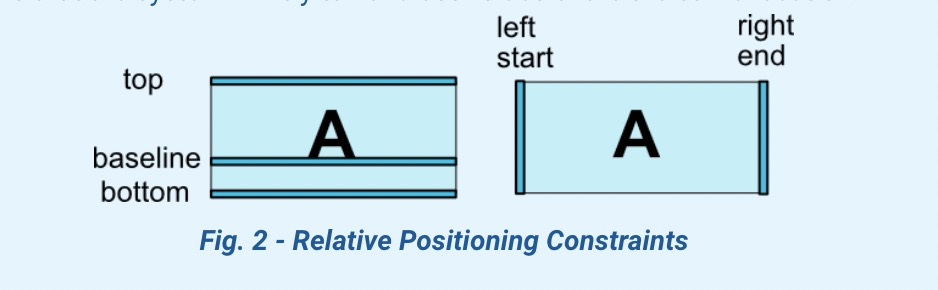
</center>

| 约束属性 | 描述 | 约束属性 | 描述 |
| ----| ---- |----| ---- |
| layout_constraintLeft_toLeftOf |  |layout_constraintLeft_toRightOf |  |
| layout_constraintRight_toLeftOf |  |layout_constraintRight_toRightOf |  |
| layout_constraintTop_toTopOf |  |layout_constraintTop_toBottomOf |  |
| layout_constraintBottom_toTopOf |  |layout_constraintBottom_toBottomOf |  |
| layout_constraintStart_toEndOf |  |layout_constraintStart_toStartOf |  |
| layout_constraintEnd_toStartOf |  |layout_constraintEnd_toEndOf |  |
| layout_constraintBaseline_toBaselineOf |  | |  |

##### 2.2 控制约束之间的距离
<center>
    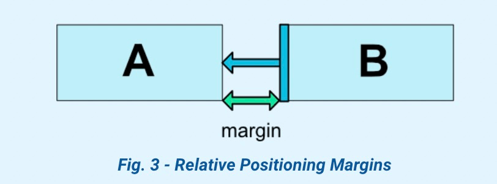
</center> 

| 约束属性 | 描述 | 约束属性 | 描述 |
| ----| ---- |----| ---- |
|android:layout_marginStart |    |layout_goneMarginStart|  |
|android:layout_marginEnd |    |layout_goneMarginEnd |  |
|android:layout_marginLeft |   |layout_goneMarginLeft |  | 
|android:layout_marginTop |    |layout_goneMarginTop|  |
|android:layout_marginRight |    |layout_goneMarginRight|  |
|android:layout_marginBottom |    |layout_goneMarginBottom|  |
|android:layout_marginBaseline |  |layout_goneMarginBaseline|  |

##### 2.3 居中和偏移百分比

<table>
    <tr>
        <td>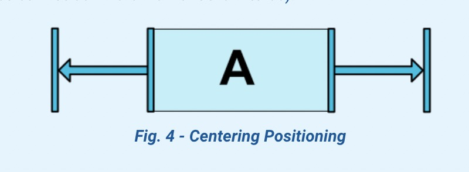</td>
        <td>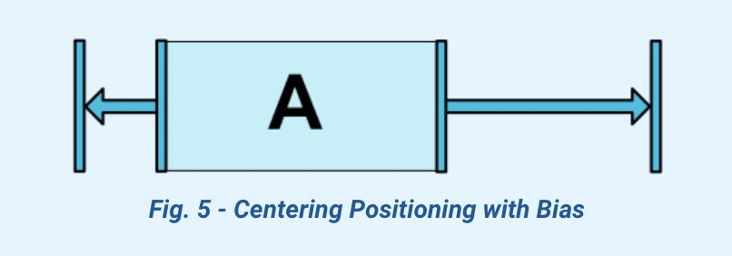</td>
    </tr>
</table>

| 约束属性 | 描述 | 约束属性 | 描述 |
| ----| ---- |----| ---- |
|layout_constraintHorizontal_bias| |layout_constraintVertical_bias| |


##### 2.4 通过圆定位📌View
<center>
    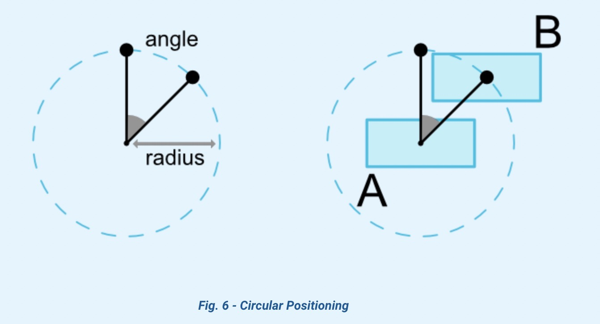
</center>

| 约束属性 | 描述 | 
| ----| ---- |
|layout_constraintCircle|另一个widget的id|
|layout_constraintCircleRadius|圆的半径|
|layout_constraintCircleAngle|角度|

```xml
<Button android:id="@+id/buttonB" 
   app:layout_constraintCircle="@+id/buttonA"
   app:layout_constraintCircleRadius="100dp"
   app:layout_constraintCircleAngle="45" />
```

##### 2.5 通过可见性控制View
<center>
    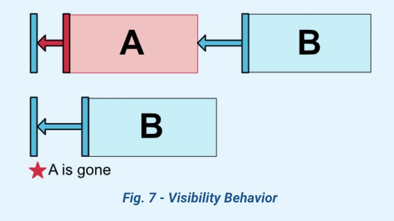
</center>

##### 2.6 通过分辨率约束View

| 约束属性 | 描述 | 约束属性 | 描述 |
| ----| ---- |----| ---- |
|android:minWidth| |android:minHeight| |
|android:maxWidth| |android:maxHeight| |

2.6.1 百分比
```xml
<Button android:id="@+id/buttonA" 
    android:layout_width="0dp"
    app:layout_constraintWidth_default="percent"
    app:layout_constraintWidth_percent="0.5"
/>
```
`app:layout_constraintWidth_default`可以取的值包括：
+ spread
+ percent
+ wrap

在ConstraintLayout-1.1之后，使用`app:layout_constrainedWidth="true"`替代`app:layout_constraintWidth_default="wrap"`

2.6.2 比率  
宽高一比一：
```xml
<Button android:id="@+id/buttonA" 
    android:layout_height="0dp"
    app:layout_constraintDimensionRatio="1:1"
/>
```
指定一条边符合约束比率：
```xml
<Button android:layout_width="0dp"
        android:layout_height="0dp"
        app:layout_constraintDimensionRatio="H,16:9"
        app:layout_constraintBottom_toBottomOf="parent"
        app:layout_constraintTop_toTopOf="parent"/>
```

##### 2.7 通过链⛓约束View

<table>
    <tr>
        <td>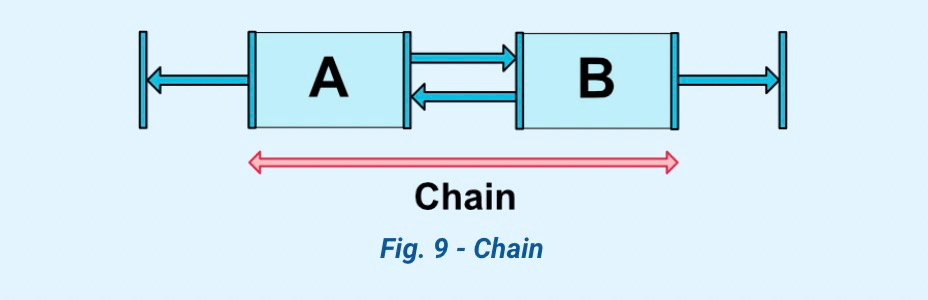</td>
        <td>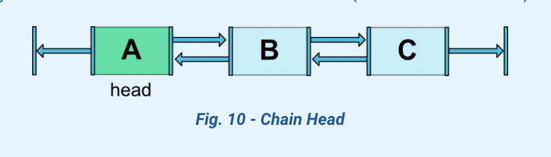</td>
    </tr>
</table>

<table>
    <tr>
        <td>图示</td>
        <td>Style</td>
    </tr>
    <tr>
        <td>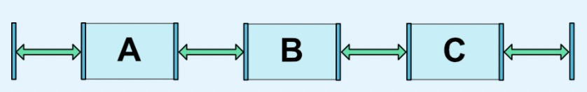</td>
        <td> _chainStyle="spread" </td>
    </tr>
     <tr>
      <td>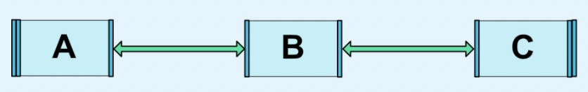</td>
      <td> _chainStyle="spread_inside" </td>
     </tr>
     <tr>
     <td>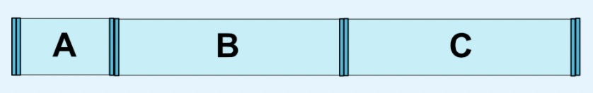</td>
     <td> _chainStyle="spread" <br> _weight="1" </td>
     </tr>
     <tr>
     <td>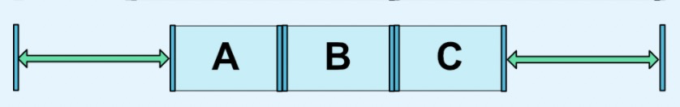</td>
     <td> _chainStyle="packed" </td>
     </tr>
     <tr>
     <td>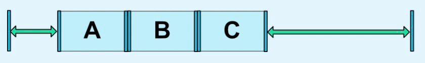</td>
     <td> _chainStyle="packed" <br> _bias="0.3"</td>
     </tr>
</table>

##### 2.8 Barrier
将多个View的某一边的极端值作为约束：
<table>
    <tr>
        <td>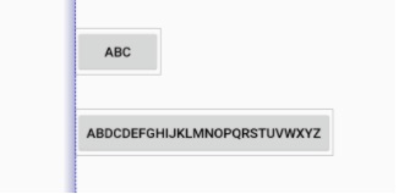</td>
        <td>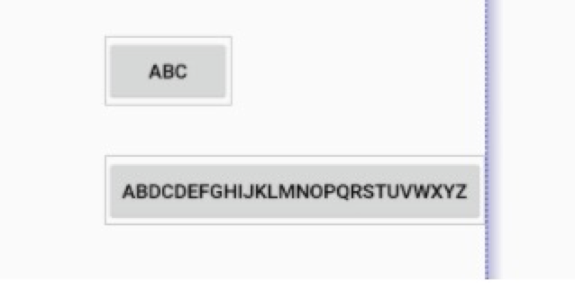</td>
    </tr>
</table>
```xml
<androidx.constraintlayout.widget.Barrier
              android:id="@+id/barrier"
              android:layout_width="wrap_content"
              android:layout_height="wrap_content"
              app:barrierDirection="start/end"
              app:constraint_referenced_ids="button1,button2" />
```

##### 2.9 Group分组约束
将多个View作为一个组一起控制：

```xml
<androidx.constraintlayout.widget.Group
              android:id="@+id/group"
              android:layout_width="wrap_content"
              android:layout_height="wrap_content"
              android:visibility="visible"
              app:constraint_referenced_ids="button4,button9" />
```
+ 无法通过group设置点击事件
```kotlin
group.referencedIds.forEach { id ->
     view.findViewById(id).setOnClickListener {
        //do something
     }
}
```

##### 2.10 Placeholder占位约束
&ensp;&ensp;&ensp;&ensp;Placeholder是一个虚拟的占位符View，界面上其他存在的View可以通过`placeholder.setContentId(R.id.xxx)`将自己的位置设置到placeholder的位置，原位置视图将不可见。
&ensp;&ensp;&ensp;&ensp;我们可以使用Placeholder搭建一个布局模板，include到其他布局当中，来填充模板中的视图，这将使所有的界面有一个通用的模板。

##### 2.11 Guideline引导线约束
Guideline只能在ConstraintLayout中使用，在水平或垂直方向设置辅助布局的不可见线条。

| 约束属性 | 描述 | 
| ----| ---- |
|layout_constraintGuide_begin|距布局的左边或者上边x处设置引导线|
|layout_constraintGuide_end|距布局右边或下面x处设置引导线|
|layout_constraintGuide_percent|宽或高的百分之x处设置引导线|

```xml
<androidx.constraintlayout.widget.ConstraintLayout
        xmlns:android="http://schemas.android.com/apk/res/android"
        xmlns:app="http://schemas.android.com/apk/res-auto"
        xmlns:tools="http://schemas.android.com/tools"
        android:layout_width="match_parent"
        android:layout_height="match_parent">

    <androidx.constraintlayout.widget.Guideline
            android:layout_width="wrap_content"
            android:layout_height="wrap_content"
            android:id="@+id/guideline"
            app:layout_constraintGuide_begin="100dp"
            android:orientation="vertical"/>

    <Button
            android:text="Button"
            android:layout_width="wrap_content"
            android:layout_height="wrap_content"
            android:id="@+id/button"
            app:layout_constraintLeft_toLeftOf="@+id/guideline"
            android:layout_marginTop="16dp"
            app:layout_constraintTop_toTopOf="parent" />

</androidx.constraintlayout.widget.ConstraintLayout>
```

#### 三、原理

##### 3.1 解决约束问题  
3.1.1 定义变量
```
x[1], x[2], ... x[n]
```
3.1.2 定义约束问题：
```
a[1]x[1] + ... + a[n]x[n] = b
a[1]x[1] + ... + a[n]x[n] <= b
a[1]x[1] + ... + a[n]x[n] >= b
```
3.2.3 计算约束方程  
食火鸡算法：食火鸡是一种生活在新几内亚热带雨林中的鸟类，以水果为食。同时它也是一种解决线性方程和线性不等式的算法。1990年在华盛顿大学被证明和发现。线性方程非常适合用于表示用户界面中视图的位置、大小、与其他视图的关系。

##### 3.2 个人理解：  
定义变量 -> 声明View对象  
定义约束问题 -> 建立View之间的约束关系  
计算约束方程 -> 计算视图的大小、坐标  

#### 四、参考文档  
[1.官方文档](https://developer.android.com/reference/androidx/constraintlayout/widget/ConstraintLayout)  
[2.基本使用](https://constraintlayout.com/layouts/)  
[3.基本使用-译文](https://biaomingzhong.github.io/2017/constraintlayout-basics-chains-2/)  
[4.ConstraintLayout, Inside and Out: Part 1](https://wiresareobsolete.com/2016/07/constraintlayout-part-1/)  
[5.ConstraintLayout, Inside and Out: Part 2](https://wiresareobsolete.com/2016/07/constraintlayout-part-2/)  
[6.线性约束解决算法](https://constraints.cs.washington.edu/cassowary/cassowary-tr.pdf)  
[7.解决约束](https://cassowary.readthedocs.io/en/latest/topics/theory.html)