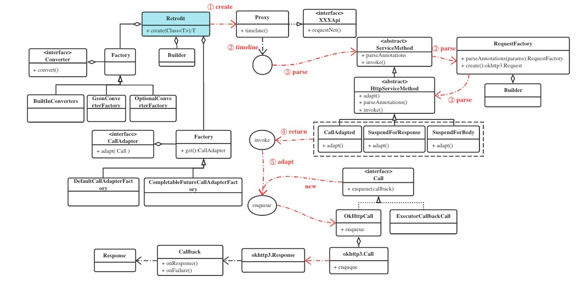

#### 一、使用

##### 1.1 定义API方法

```kotlin
    interface RemoteApi {
        @GET("timeline")
        suspend fun timeline(): RemoteLaunchesResponse 
    }
```
##### 1.2 获取服务
```kotlin
   val client = OkHttpClient.Builder()
                .addInterceptor(loggingInterceptor)
                .build()

    val retrofit = Retrofit.Builder()
                .client(client)
                .baseUrl("http://10.0.0.2:8080/")
                .addConverterFactory(GsonConverterFactory.create())
                .build()

    val api = retrofit.create(RemoteApi::class.java) //1、create做了什么？
```

##### 1.3 发起请求
```kotlin
    api.timeline() //2、调用接口方法怎么发起请求?
```


#### 二、原理

<center>
    
</center>

##### 2.1 create做了什么

Retrofit的网络请求方法都是定义在接口中的，它会在运行时利用Java的动态代理产生代理对象，所以`create()`就是创建代理对象的方法。


##### 2.2 调用接口方法怎么发起请求

当调用接口方法时，实际上是调用了代理对象的方法。它会去Retrofit中找该方法对应的`ServiceMethod`，如果找到缓存直接使用，否则解析后再使用。

解析的结果是`ServiceMethod`的子类`CallAdapted`、`SuspendForResponse`、`SuspendForBody`三者之一。

解析结束后调用返回对象的`invoke`方法初始化OkHttpCall对象发起真正的请求。


#### 三、总结

阅读源码的过程当中，画了详细的代码执行流程图供后续回顾。另外源码中还有两个重要的对外拓展接口`CallAdapter`和`Converter`没有详细分析。


