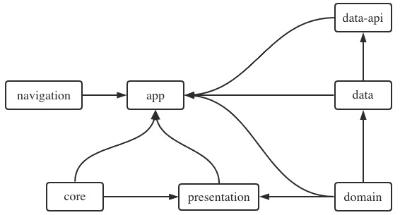
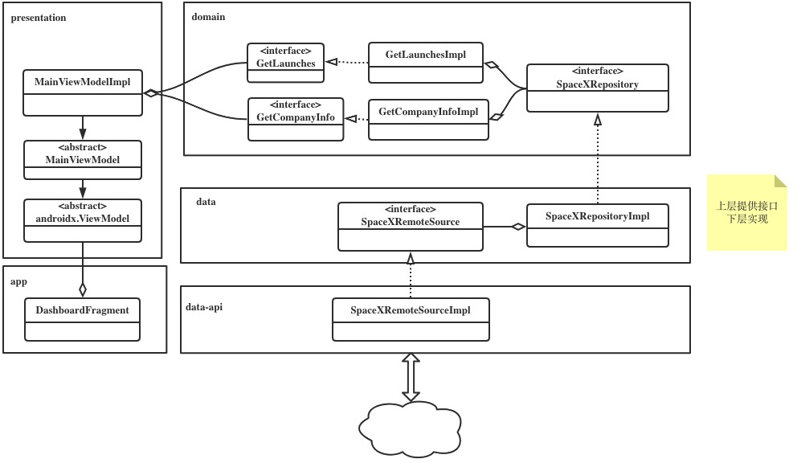

#### 一、概述

此文是对Github开源项目[SpaceX-prepare-for-Clean-Architecture-liftoff](https://github.com/ferPrieto/SpaceX-prepare-for-Clean-Architecture-liftoff) 的源码阅读记录。它是一个为了阐述对**Clean Architecture**的理解而作的Demo项目，是一个值得学习的项目。

#### 二、源码分析

##### 2.1 模块之间的依赖关系

项目包含以下library：
+ app
+ buildSrc
+ core
+ core-android-test
+ data
+ data-api
+ domain
+ navigation
+ presentation

模块之间的依赖关系可用下图简述：

    

##### 2.2 类和模块之间的关系

    

#### 三、总结

项目重在阐述架构思想所以比较简单，其中很多东西值得我们在项目中借鉴。数据层的架构模式参看[martin fowler](https://martinfowler.com/bliki/PresentationDomainDataLayering.html) 的文章。