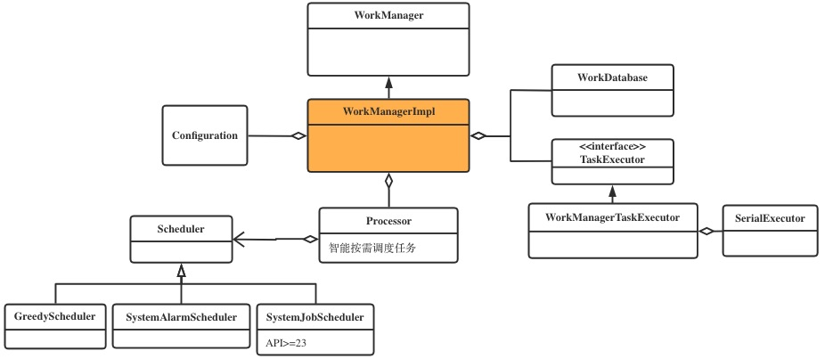
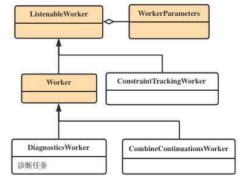
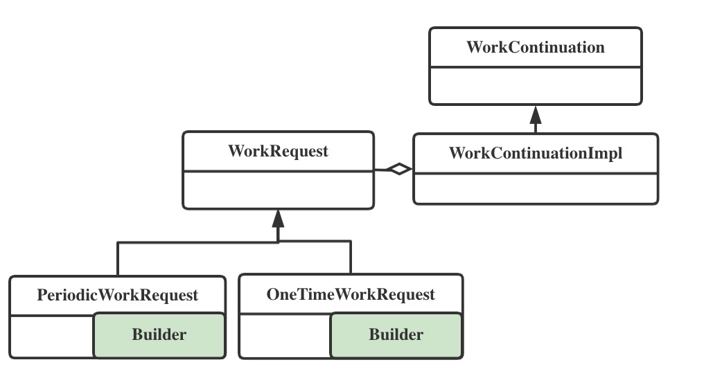
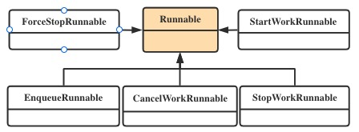

#### 一、初始化流程

1、WorkManager集成了`androidx.startup` 库，通过`startup`库的`ContentProvider`在应用启动时进行初始化。
见`work-runtime`的Manifest文件：
```xml
        <provider
            android:name="androidx.startup.InitializationProvider"
            android:authorities="${applicationId}.androidx-startup"
            android:exported="false"
            tools:node="merge" >
            <meta-data
                android:name="androidx.work.WorkManagerInitializer"
                android:value="androidx.startup" />
        </provider>
```
其初始化类为`WorkManagerInitializer`，其中调用了`WorkManager#initialize`，然后调用`WorkManager`的构造函数。
整个流程初始化了如下一些对象：

<center>
    
</center>


#### 二、任务

##### 2.1 定义任务
当我们自定义任务时，需要继承`Work`类，WorkManager内部对`Work`的结构定义如下：
<center>
    
</center>

其中`DiagnosticsWorker`和`CombineContinueationsWorker`是内部使用的两个任务。

##### 2.2 提交任务

我们将任务以请求（WorkRequest）的形式提交（enqueue）给WorkManager。WorkManager会将请求装换成内部的WorkContinuation对象。

<center>
    
</center>

WorkContinuation可以将多个`OneTimeWorkrequest`构建成任意依赖关系的无环图。而WorkContinuation的`enqueue`方法则是任务被执行调度的入口。


##### 2.3 执行任务

对任务进行不同的操作，如：取消、结束、开始等。WorkManager内部会将这些行为转换成对应的Runnable交给调度系统进行执行。

<center>
    
</center>


#### 三、任务的调度
提交给WorkManager的任务，会封装成`EnqueueRunnable`交给默认的`SerialExecutor`去执行。
`EnqueueRunnable`的run方法会先将任务加入数据库中保存。然后进行任务调度。
```java
    @Override
    public void run() {
        try {
            if (mWorkContinuation.hasCycles()) {
                throw new IllegalStateException(
                        String.format("WorkContinuation has cycles (%s)", mWorkContinuation));
            }
            //加入数据库
            boolean needsScheduling = addToDatabase();
            if (needsScheduling) {
                // Enable RescheduleReceiver, only when there are Worker's that need scheduling.
                final Context context =
                        mWorkContinuation.getWorkManagerImpl().getApplicationContext();
                PackageManagerHelper.setComponentEnabled(context, RescheduleReceiver.class, true);
                //进行任务调度
                scheduleWorkInBackground();
            }
            mOperation.setState(Operation.SUCCESS);
        } catch (Throwable exception) {
            mOperation.setState(new Operation.State.FAILURE(exception));
        }
    }
```

#### 四、其他
##### 4.1 任务的约束

#### 五、总结
WorkManager库并不算复杂。这种对任务的管理和调度框架的源码，我们可以多看，学习一下里面的设计思路。有个大概的印象，后续写相关逻辑时可以借鉴。
+ 借助`startup`初始化你的框架
+ 构建有依赖关系的任务
+ 通过Runnable解耦任务的请求和执行。


