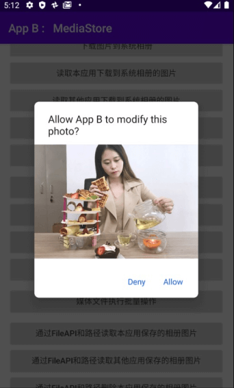

### 一、What、Why（是什么、为什么）

1.1 什么是分区存储
了解传统的共享存储 (Shared Storage):
+ 每个app有独立的存储空间Android/data/pkg其他应用不可见（Context.getExternalFileDir）
+ 访问外部空间需要额外权限READ/WRITE_EXTERNAL_STORAGE、获取存储权限的应用可以访问整个外部存储空间
+ 应用卸载时，保存在外部存储空间文件不会被删除。

<!-- more -->

共享存储带来的问题
+ 数据安全
+ 存储空间浪费，难以管理

分区存储解决方案(Scoped Storage):
+ 必须通过Media Store API和Storage Access FrameWork访问文件系统。=>对传统共享存储系统的一种强制约束
+ 文件归属：操作自己创建的文件无需任何权限（自己创建的文件系统会记录此文件的归属app，应用卸载后清除该归属字段，重装后读取该文件仍需权限申请），非共享文件存入私有目录。=>文件和应用挂钩，便于操作系统进行管理

By The Way:
在Android-Q （API-29）中通过android:requestLegacyExternalStorage=”true”可以禁用分区存储
在Android-R （API-30）中必须使用分区存储
在Android-Q中完全禁用了File API，Android-R重新启用


### 二、How（分区存储实践-数据的增、删、改、查）
2.1 对媒体文件的增删改查：

+ 增查：新增操作无需任何权限。查询其他应用的媒体资源需要READ_EXTERNAL_STORAGE权限。查询自己应用创建的媒体资源无需权限，当应用卸载重装后，自己创建的资源也需要申请权限。

```kotlin
suspend fun saveImageToAlbum(context: Context, imageFile: File, imageName: String): Boolean {
    return withContext(Dispatchers.IO) {
        val contentValues = ContentValues().apply {
            put(MediaStore.Images.Media.DISPLAY_NAME, imageName)
            put(MediaStore.Images.Media.DESCRIPTION, "图片描述")
            put(MediaStore.Images.Media.MIME_TYPE, "image/jpg")
            // 文件待处理状态，本应用独占，其他应用暂时无法访问
            if (Build.VERSION.SDK_INT >= Build.VERSION_CODES.Q) {
                put(MediaStore.Images.Media.IS_PENDING, 1)
            }
        }
        // 插入数据库，获得uri
        val uri = context.contentResolver
            .insert(MediaStore.Images.Media.EXTERNAL_CONTENT_URI, contentValues)
            ?: return@withContext false
        // 根据uri打开输出流，写入imageFile文件
        context.contentResolver.openOutputStream(uri)?.use { it.write(imageFile.readBytes()) }
        // 切换文件待处理状态
        if (Build.VERSION.SDK_INT >= Build.VERSION_CODES.Q) {
            contentValues.clear()
            contentValues.put(MediaStore.Images.Media.IS_PENDING, 0)
            context.contentResolver.update(uri, contentValues, null, null)
        }
        return@withContext true
    }
}
```


+ 删改：删改自己创建的媒体资源无需权限。删改其他应用创建的资源需要捕获RecoverableSecurityException异常后，向用户申请删除权限。


```kotlin
private suspend fun performDeleteImage(image: MediaStoreModel) {
    withContext(Dispatchers.IO) {
        try {
            getApplication<Application>().contentResolver.delete(
                image.contentUri,
                "${MediaStore.Images.Media._ID} = ?",
                arrayOf(image.id.toString())
            )
        } catch (securityException: SecurityException) {
            if (Build.VERSION.SDK_INT >= Build.VERSION_CODES.Q) {
               val recoverableSecurityException = securityException as? RecoverableSecurityException
                        ?: throw securityException
               startIntentSenderForResult(
                   recoverableSecurityException.userAction.actionIntent.intentSender,
                   DELETE_PERMISSION_REQUEST,
                   null,
                   0,
                   0,
                   0,
                   null)
            } else {
                throw securityException
            }
        }
    }
}
```


2.2 对文档的增删改查：
对外部文档的读写操作需要使用Storage Access FrameWork，通过各种Intent交由系统处理。更多实例见[参考资料2]

SAF存储的限制：
+ Intent.ACTION_OPEN_DOCUMENT_TREE访问限制
    - 内部存储根目录
    - Download目录
    - Android/data/  和  Android/obb/
    
    
```kotlin
//创建文档-返回Uri再进行写入
val intent = Intent(Intent.ACTION_CREATE_DOCUMENT).apply {
    addCategory(Intent.CATEGORY_OPENABLE)
    type = "text/plain"
    putExtra(Intent.EXTRA_TITLE, "test.txt")
}
//读取&删改
val intent = Intent(Intent.ACTION_OPEN_DOCUMENT).apply {
    addCategory(Intent.CATEGORY_OPENABLE)
    type = "*/*"
}
//目录操作
val intent = Intent(Intent.ACTION_OPEN_DOCUMENT_TREE).apply {
    flags = Intent.FLAG_GRANT_WRITE_URI_PERMISSION
}

```


2.3 批量操作
通过MediaStore静态方法创建修改请求，征求用户同意后进行操作。Android-R后新增的API，旧版需走回contentResolver.delete()操作

| 操作 | 解释 |
| ----| ---- |
| createWriteRequest | 向用户请求媒体文件组写入权限 |
| createFavoriteRequest | 用户将设备上指定的媒体文件标记为“收藏”的请求 |
| createTrashRequest | 用户将指定的媒体文件放入设备垃圾箱的请求。垃圾箱中的内容会在系统定义的时间段后被永久删除。 |
| createDeleteRequest | 用户立即永久删除指定的媒体文件 |


```kotlin

val uriList = /* A collection of content URIs to modify. */
val pendingIntent = MediaStore.createWriteRequest(contentResolver,urisToModify)

// Launch a system prompt requesting user permission for the operation.
startIntentSenderForResult(editPendingIntent.intentSender,
                           EDIT_REQUEST_CODE, 
                           null, 0, 0, 0)

```


### 三、直接文件读写
Android-11重新支持File对象访问文件的直接路径。
1、针对媒体文件
    - 归属于你应用的文件 和 你的私有目录 的文件 可以直接使用File API访问
    - 如果直接用File API访问没有权限的文件，抛出 FileNotFoundException
2、Media Store DATA 属性
DATA属性存储了媒体文件的绝对路径，在Android-10的时候废弃了该属性。由于Android-11又支持File对象，所以DATA属性也可以读取直接路径，但不一定有值。但是新增和更新操作不要再使用DATA了，请使用DISPLAY_NAME 和 RELATIVE_PATH 。


### 四、另外一扇窗
对于一些特殊的App，例如文件管理器，备份等。可以申请所有文件访问权限 
1.声明 MANAGE_EXTERNAL_STORAGE 权限
2.使用 ACTION_MANAGE_ALL_FILES_ACCESS_PERMISSION  操作将用户引导至一个系统设置页面


### 五、应用截图
<table>
    <tr>
        <td></td>
        <td></td>
    </tr>
</table>