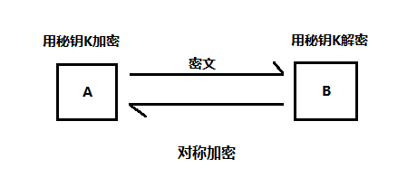
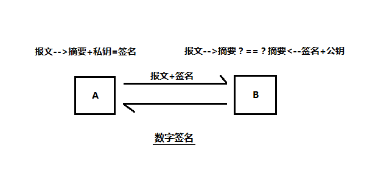
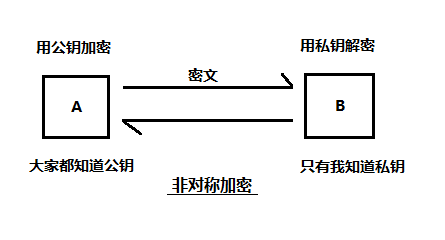

#### 1.对称加解密的过程：
（大家用相同的钥匙来进行加解密）
~~发送端和接收端首先要共享相同的密钥k(即通信前双方都需要知道对应的密钥)才能进行通信。发送端用共享密钥k对明文p进行加密，得到密文c，并将得到的密文发送给接收端，接收端收到密文后，并用其相同的共享密钥k对密文进行解密，得出明文p。~~
 
一般加密和解密的算法是公开的，需要保持隐秘的是密钥k
流行的对称加密算法有：DES，Triple-DES，RC2和RC4，AES
 
##### 缺点：
+ 发送方和接收方首先需要共享相同的密钥，即存在密钥k的分发问题，如何安全的把共享密钥在双方进行分享，这本身也是一个如何安全通信的问题，一种方法是提前双方约定好，不通过具体的通信进行协商，避免被监听和截获。另外一种方式，将是下面我们介绍的通过非对称加密信道进行对称密码的分发和共享，即混合加密系统。
+ 密钥管理的复杂度问题。由于对称加密的密钥是一对一的使用方式，若一方要跟n方通信，则需要维护n对密钥。
 
##### 优点：
+ 加密和解密的速度要比非对称加密快很多，因此常用非对称加密建立的安全信道进行共享密钥的分享，完成后，具体的加解密则使用对称加密。即混合加密系统。
 
另外一个点需要重点说明的是，密钥k的长度对解密破解的难度有很重大的影响，k的长度越长，对应的密码空间就越大，遭到暴力破解或者词典破解的难度就更大，就更加安全。
                    

    

#### 2.数字签名的过程：
+ 发送方A首先对变长的报文提取成一个定长的摘要，一般是md5等
+ A对摘要应用了一个签名函数，并且用A自己的私钥作为参数，因为只有A才知道私钥，所以正确的签名会说明签名者就是其所有者。
+ 一旦计算出签名，节点A就将其附加到报文的末尾，并将报文和签名一起都发送给B
+ 在接收端B，首先会按照同样的算法计算出报文的摘要，然后对签名用A的公钥进行解码，得出解码后的摘要，两个摘要进行比较，则可以判断是否是A发送的且内容没被篡改过。

    

#### 3.非对称加解密的过程：
加密一方找到接收方的公钥e (如何找到呢？大部分的公钥查找工作实际上都是通过数字证书来实现的)，然后用公钥e对明文p进行加密后得到密文c，并将得到的密文发送给接收方，接收方收到密文后，用自己保留的私钥d进行解密，得到明文p，需要注意的是：用公钥加密的密文，只有拥有私钥的一方才能解密，这样就可以解决加密的各方可以统一使用一个公钥即可。
 
常用的非对称加密算法有：RSA
 
##### 优点：
+ 不存在密钥分发的问题，解码方可以自己生成密钥对，一个做私钥存起来，另外一个作为公钥进行发布。
+ 解决了密钥管理的复杂度问题，多个加密方都可以使用一个已知的公钥进行加密，但只有拥有私钥的一方才能解密。
  
##### 缺点：
+ 非对称加密不足的地方是加解密的速度没有对称加密快。
 
综上，分析了对称加密和非对称加密各自的优缺点后，有没有一种办法是可以利用两者的优点但避开对应的缺点呢？答应是有的，实际上用得最多的是混合加密系统，比如在两个节点间通过便捷的公开密码加密技术建立起安全通信，然后再用安全的通信产生并发送临时的随机对称密钥，通过更快的对称加密技术对剩余的数据进行加密。

    

