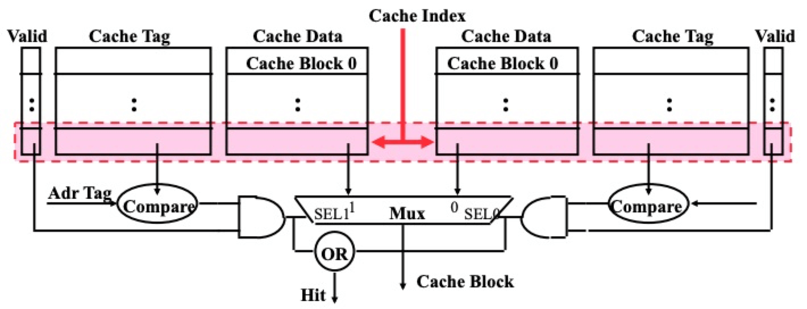

#### 一、性能

1.1 在分层存储结构中，随着存储容量的增加，延迟也随之增加。[参考](https://gist.github.com/jboner/2841832)

从数据可以看出，L1缓存和主存访问速度相差200倍。

    

#### 二、缓存行  

CPU缓存的基本单位是缓存行，主存数据和缓存的映射存在下列关系：
  
##### 2.1 直接映射缓存

    

1、 index用于计算在哪一个缓存行  
2、 offset用于计算在缓存行的哪个字节  
3、 tag用于判断缓存是否命中（假设0x7f6601 和 0x8f6602两个地址，低位都一样，缓存行和字节偏移都命中了，tag不命中）

缺点：
图中，cache缓存8行数据，当访问第0行、第8行、第16行时，缓存无法命中，每次都要去主存加载，发生**缓存颠簸**

##### 2.2 多路组相连

这是一个两路组相连的示意图：

    

1、index定位组
2、组内依次对tag进行对比（可以通过硬件并行比较增加性能）

#### 三、缓存一致性

##### 3.1 问题描述：

    

处理器 1 读 X ：从内存读取24并缓存  
处理器 2 读 X ：从内存读取24并缓存  
处理器 1 写 X = 32 ：更新自己的缓存  
处理器 3 读 X = ？  

如何保证缓存的一致性？[参考](https://people.eecs.berkeley.edu/~pattrsn/252F96/Lecture18.pdf)

##### 3.2 解决方案
3.1.1 嗅探-Snooping Solution(Snoopy Bus)

根据写操作对缓存数据的影响嗅探协议可分为：
Write-invalidate：
当处理器写入数据时，所有的独立缓存将通过总线嗅探得到通知，并标志自己的缓存失效。这保证了全局只有一份缓存是有效的。
- MSI
- MESI
- MOSI
- MOESI
- MESIF 

Write-update：
当处理器写入数据时，所有的独立缓存将通过总线嗅探得到通知，并更新自己的缓存。通过总线广播给所有的缓存造成了总线繁忙，所以不常见。

3.1.2 目录-Directory-Based Schemes

##### 3.2 MESI协议[参考](https://people.cs.pitt.edu/~melhem/courses/2410p/ch5-4.pdf)  
MESI是四个状态的首字母缩写，在缓存行中用2个bit标志该缓存行的状态。
+ M:Modified（只存在当前缓存行，已被修改，和主存不一致，需要更新回主存）
+ E:Exclusive（只存在当前缓存行，和主存一致）
+ S:Shared（其他缓存行也存在该数据，和主存一致）
+ I:Invalid（此缓存行失效）

MESI的状态迁移：

    

#### 四、参考文献  
[0.Java角度理解CPU缓存](https://www.cnkirito.moe/cache-line/#%E4%BB%80%E4%B9%88%E6%98%AF%E7%BC%93%E5%AD%98%E8%A1%8C-Cache-Line-%EF%BC%9F)  
[1.Cache的基本原理](https://zhuanlan.zhihu.com/p/102293437)  
[2.每个开发者需要知道的数据](https://gist.github.com/jboner/2841832)  
[3.硬件角度看内存屏障](https://medium.com/fcamels-notes/%E5%BE%9E%E7%A1%AC%E9%AB%94%E8%A7%80%E9%BB%9E%E4%BA%86%E8%A7%A3-memry-barrier-%E7%9A%84%E5%AF%A6%E4%BD%9C%E5%92%8C%E6%95%88%E6%9E%9C-416ff0a64fc1)  
[4.软件角度内存屏障](https://medium.com/fcamels-notes/%E5%BE%9E-double-checked-locking-%E4%BA%86%E8%A7%A3-memory-barrier-%E7%9A%84%E4%BD%9C%E7%94%A8-bb151a359c1b)   
[5.stackoverflow-How do cache lines work?](https://stackoverflow.com/questions/3928995/how-do-cache-lines-work)  
[6.courses-pdf](https://courses.cs.duke.edu/spring09/cps104/lectures/2up-lecture17.pdf)