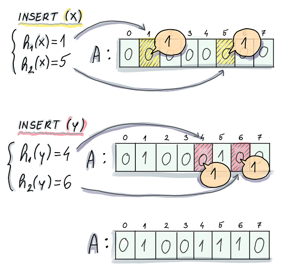
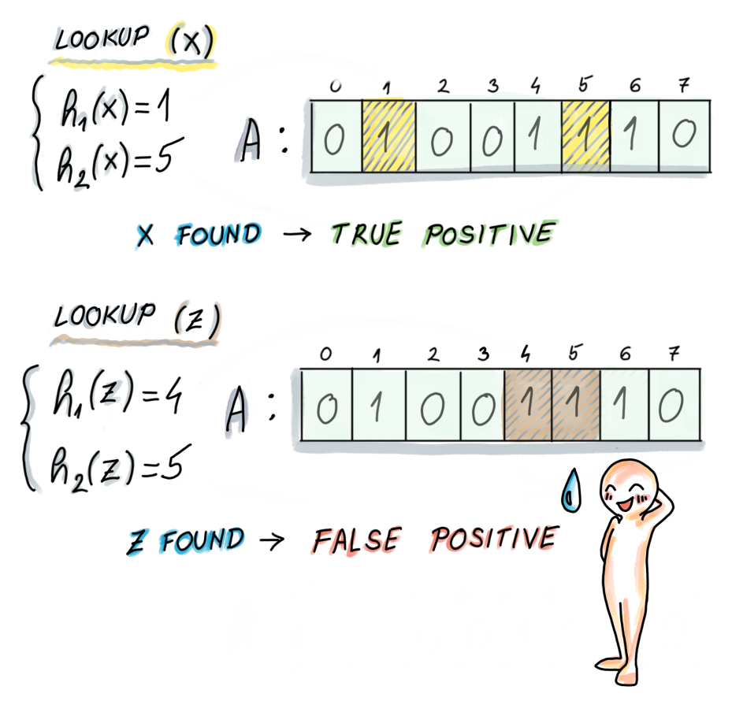

------

#### 概念
一种空间高效的概率型数据结构，用于判断一个元素是否存在于集合中。

空间高效：用几个比特位来标识存在与否，不占用太多内存空间。
概率型：有几率把一个不存在的元素判定为存在。

Hash表存在的问题：数据量很大时，占用内存太多了。

#### 基本操作

##### 插入操作：

初始bit数组A[m-1]全部置0，通过映射函数，将要插入的值随机映射到数组范围内，将该位置为1

    

##### 查找操作：

将要查找的元素通过映射函数，映射到数组中，判断该bit位是否为1

    

#### 应用
+ 网页爬虫对 URL 去重，避免爬取相同的 URL 地址；
+ 反垃圾邮件，从数十亿个垃圾邮件列表中判断某邮箱是否垃圾邮箱；

#### 参考资料
[图片来源](https://freecontent.manning.com/all-about-bloom-filters/)
[1](https://juejin.cn/post/6844904007790673933)
