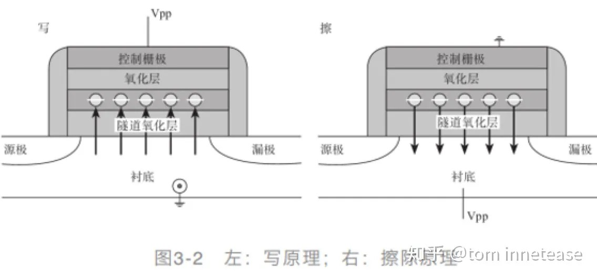
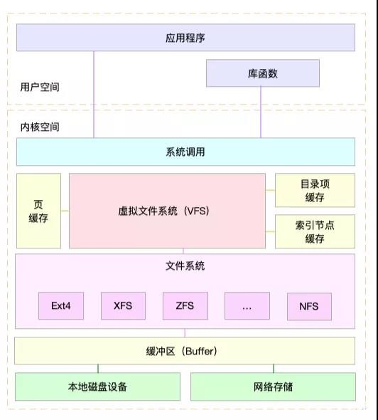

--------

##### 一、磁盘的结构
磁盘按照物理结构和逻辑结构区分比较好。

1.1 HDD物理结构(Hard Disk Drive)
+ Platters：盘片
+ Head：读写头
+ Spindle：主轴
+ Actuator Arm：机械臂
+ Cylinder:柱面
+ Sector：扇区
+ Track：磁道：

<center>
    
    
    
</center>

1.2 SSD的物理结构(Solid State Drive)

1.2.1 基本存储单元
<center>
    
</center>

通过向被绝缘层包围的浮栅层充放电来写入擦除数据。（非易失存储器）

1.3 逻辑结构

文件系统block -> 磁盘block -> n * 扇区

<center>
    
</center>

<center>
    
</center>


##### 二、文件系统挂载

文件系统生成后，还不能直接使用，需要借助"mount"操作，将这个文件系统加入到Linux的管理，这样用户才能看到并访问


##### 三、虚拟文件系统

<center>
    
</center>


虚拟文件系统为各种文件系统提供一个通用的接口，其支持的文件系统可以划分为三种主要类型：
+ 磁盘文件系统（EXT3、NTFS）
+ 网络文件系统
+ 特殊文件系统（/proc）

虚拟文件系统通过引入一套通用的文件模型来支持所有的文件系统，通用模型由四大对象组成：
+ 超级块对象
+ 索引节点对象
+ 目录项对象
+ 文件对象

3.1 超级快对象：代表一个具体的已安装文件系统
```c
struct super_block {
  struct super_operations s_op;//操作对象
}
```

3.2 索引节点对象：代表一个具体的文件
```c
struct inode {
  struct inode_operations *i_op;
}
```

3.3 目录项对象：代表一个目录项，是路径的一个组成部分
```c
struct dentry {
  struct dentry_operations *d_op;
}
```

3.4 文件对象：代表由进程打开的文件
```c
struct file {
  struct file_operations *f_op;
}
```


##### 四、相关系统调用


| 系统调用                      | 说明                     |
|:-----------------------------|:------------------------|
| mount() unmount() unmount2() | 安装卸载文件系统           |
| mkdir() rmdir()              | 创建删除目录              |
| unlink() rename()            | 对目录项进行操作           |
| mmap() mmap2() munmap()      | 处理文件内存映射           |
| read() write()               | 进行文件IO操作            |
| select() poll()              | 等待一组文件描述符上发生事件 |
| open() close() create()      | 打开关闭创建              |
| chmod() fchmod() utime()     | 更改文件属性              |


##### 五、参考文献

https://z.itpub.net/article/detail/8ABB71A5EFED33EA9D09353759A91F1C

[深入理解 Linux Ext 文件系统设计原理](http://chuquan.me/2022/05/01/understand-principle-of-filesystem/)

[第4章 ext文件系统机制原理剖析 ](https://www.cnblogs.com/f-ck-need-u/p/7016077.html#auto_id_4)

[Linux 虚拟文件系统四大对象：超级块、inode、dentry、file之间关系](https://www.eet-china.com/mp/a38145.html)

[从内核文件系统看文件读写过程 ](https://www.cnblogs.com/huxiao-tee/p/4657851.html)