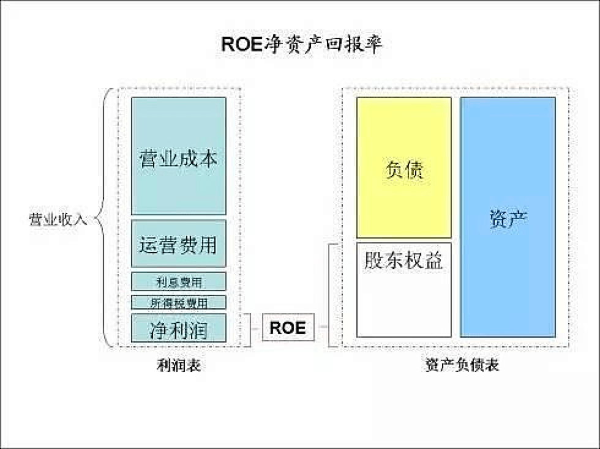
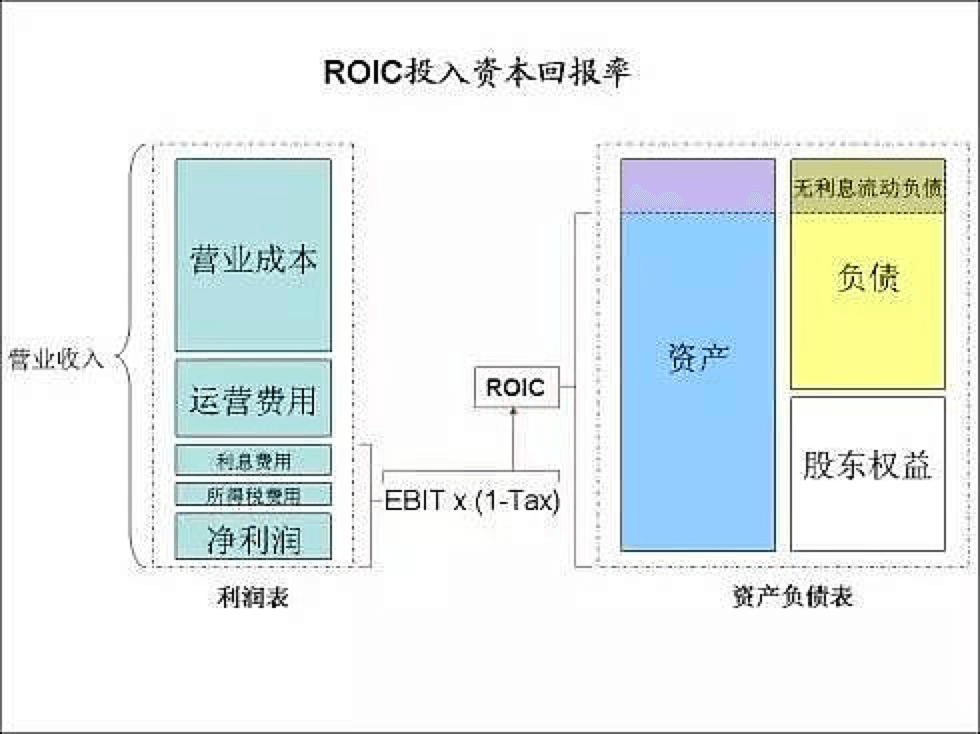

+ 资产回报率（ROA）
+ 净资产回报率（ROE）
+ 投入资本回报率（ROIC）
+ 使用资本回报率（ROCE）

不同的回报率，实际上是衡量公司的不同视角。

#### 资产回报率（ROA）

    

ROA的视角实际上是从资产负债表的左侧去看，从资产的角度衡量回报，而并不关注资本结构。

资产收益率=净利润 / 总资产总额Assets

资产收益率指标将资产负债表、损益表中的相关信息有机结合起来，是银行运用其全部资金获取利润能力的集中体现。

另一计算公式：

资产收益率ROA= 净利润率NPM × 资产利用率AU

其中：

净利润率NPM=税后净收入/营业总收入

反映银行费用管理（或成本控制）的有效性。

资产利用率AU=营业总收入/资产总额=（主营业务收入+非主营业务收入）/资产总额

反映银行业务经营及获利能力。

ROA这个回报率衡量的是资产的回报率。但是一个公司资产负债表上的资产价值更多的是反映了历史而不是当前，而且不同的行业的ROA具有不可比性。最简单的例子，很多类金融企业有无息流动负债，增加了总资产，降低了ROA，但是无偿使用上下游资金实际上是公司有竞争力的体现。

#### 净资产回报率（ROE）

    

ROE的视角是从股东的角度看问题，单纯从股权的角度衡量回报，而不考虑公司的资本结构及负债情况。

净资产收益率=税后利润/所有者权益

假定某公司年度税后利润为2亿元，年度平均净资产为15亿元，则其本年度之净资产收益率就是13．33%（即(2亿元/15亿元)*100%）。

ROE对股东来说意义最大，是股票复利增长的源泉。ROE可以在不同行业与不同企业之间横向比较。相当于股票这种“股权债券”的收益率。对投资人来说无论是投资铁路还是互联网，都相当于是买了“股权债券”。在同等风险情况下，当然是收益率越高越好。而且，ROE还可以与政府债券、企业债券的收益率跨资产类别横向比较。

ROE的问题在于无法反映债务杠杆对净利润的影响。如果一个企业借更多的债，一般就能产生更多净利润，ROE也会提高。但是这样的提高是以牺牲企业经营稳健程度为代价的。因此，分析ROE一定要结合杜邦公式，并与同行业进行比较。

#### 投入资本回报率（ROIC）

    

ROIC是从资本的角度看问题，综合考虑股权与债权，衡量投资的效率。与ROIC对应的是平均资金成本（WACC）。如果ROIC小于WACC，就说明投入资本的回报小于平均资本成本，公司是在浪费资本。

ROIC=息税前收益（EBIT）*（1-税率）/投入资本

投入资本=股东权益+有息负债，不包括信用借款

ROIC=EBIT（1-税率）/（有息负债+权益）。

公式中分子是指一家公司如果完全以权益筹资所应报告的税后利润，分母是指公司所有要求回报的现金来源的总和，也就是说，尽管应付账款也是公司的一种现金来源，但因其未附带明确的成本而被排除在外。实质上，ROIC是生产经营活动中所有投入资本赚取的收益率，而不论这些投入资本是被称为债务还是权益。

    

投入资本回报率是EBIT（税及利息前盈利）经过税率调整比上投入的资本，也就是股东权益加负债减去非运营现金和投资。之所以用EBIT就是因为利息是由债务产生的，是对债权的回报，当计算债权加股权的总的投入资本的回报率时应该把利息加回来。

投入资本也可以表示为净运营资金（流动运营资产减去无息流动负债）加固定资产，加无形资产及商誉，加其他运营资产。

ROIC的问题在于没有考虑无息流动负债的影响。ROIC实际上是衡量投入的总资本的使用效率，与平均资金成本WACC相结合可以揭示一个企业的真正效率。ROIC < WACC 是卖空大师Jim Chanos经常用来寻找卖空对象的一个重要指标。

但是，ROIC对于类金融企业的分析不太容易。一些类金融企业如国美、苏宁、联想、格力等，占用了大量上下游资金作为无息流动负债，因此提高了EBIT。但是，和有息负债一样，无息负债也存在风险。虽然不用付利息，但是一旦经营形式改变，这些资金很有可能像“热钱”一样撤走。国美在黄光裕被捕后就陷入了这样的危险境地，只要供应商撤资，国美就会破产。这些企业虽然ROIC很高，但是静态不稳定，动态稳定。

#### 使用资本回报率(ROCE)

    

ROCE实质上是从企业价值（EnterpriseValue，EV）的角度，从并购的角度看资本的回报率。ROCE中的使用资本是股东权益加有息负债再减现金。这实质上相当于1倍PB并购企业时的企业价值。因为如果你以1倍PB并购一个企业，你要付的价格就是股东权益，并且承担所有负债，但也获得所有现金。

ROCE实际上是从一个并购者的角度看问题，如果并购一个企业，付出企业价值EV后的回报率有多少？这与ROIC最大的不同是：ROIC从企业的拥有者的角度看问题，衡量投入资本的使用效率与回报率。而ROCE是从潜在并购者的角度看问题，衡量如果1倍PB并购付出EV后的回报率，也就是并购到底值不值的问题。这接近价值投资买股票就是买公司的原则。

ROCE：使用资本回报率是EBIT（税及利息前盈利）比上使用的资本，也就是所有有息负债加上股东权益。这个指标与ROIC相近，但是使用的是EBIT而没有经过税率调整，因此可以用来比较不同税率的企业。ROCE也容易忽视公司无息负债的融资效应。

总之，本质上是从四个不同的视角看问题，衡量不同的指标。只有全面综合考虑，才能更全面的看问题

作者：老韩7
链接：https://xueqiu.com/1484348349/107966592
来源：雪球
著作权归作者所有。商业转载请联系作者获得授权，非商业转载请注明出处。
风险提示：本文所提到的观点仅代表个人的意见，所涉及标的不作推荐，据此买卖，风险自负。