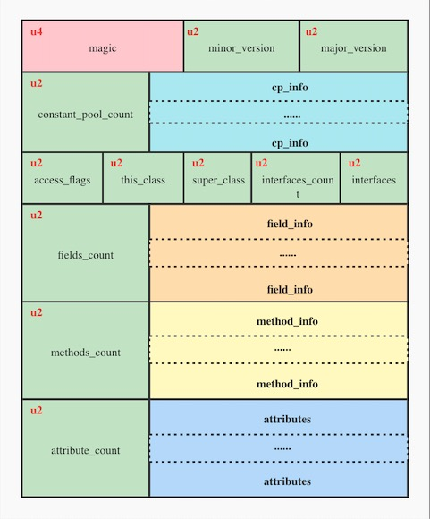

#### 一、Class文件结构概览
##### 1.1 概述
+ 每一个class文件包含一个类或者接口的定义
+ 以大端方式存储
+ u1、u2、u4分别表示1、2、4个字节  

##### 1.2 数据结构
```C
ClassFile {
    u4             magic;
    u2             minor_version;
    u2             major_version;
    u2             constant_pool_count;
    cp_info        constant_pool[constant_pool_count-1];
    u2             access_flags;
    u2             this_class;
    u2             super_class;
    u2             interfaces_count;
    u2             interfaces[interfaces_count];
    u2             fields_count;
    field_info     fields[fields_count];
    u2             methods_count;
    method_info    methods[methods_count];
    u2             attributes_count;
    attribute_info attributes[attributes_count];
}
```
##### 1.3 图形化表示

<center>
    
</center>

##### 1.4 示例

```java
public interface Car {
    void drive();
}

public class BMWCar implements Car{

    private String name;
    
    public BMWCar() {
        name = "宝马";
    }
    
    @Override
    public void drive() {
        System.out.println("BMW car drive." + name);
    }
}
```

```
Last modified 2017-11-10; size 644 bytes
  MD5 checksum ac6d7477d45479490e4ea3f660b1dcdd
  Compiled from "BMWCar.java"
public class BMWCar implements Car
  minor version: 0
  major version: 52
  flags: ACC_PUBLIC, ACC_SUPER
Constant pool:
   #1 = Methodref          #12.#23        // java/lang/Object."<init>":()V
   #2 = String             #24            // 宝马
   #3 = Fieldref           #11.#25        // BMWCar.name:Ljava/lang/String;
   #4 = Fieldref           #26.#27        // java/lang/System.out:Ljava/io/PrintStream;
   #5 = Class              #28            // java/lang/StringBuilder
   #6 = Methodref          #5.#23         // java/lang/StringBuilder."<init>":()V
   #7 = String             #29            // BMW car drive.
   #8 = Methodref          #5.#30         // java/lang/StringBuilder.append:(Ljava/lang/String;)Ljava/lang/StringBuilder;
   #9 = Methodref          #5.#31         // java/lang/StringBuilder.toString:()Ljava/lang/String;
  #10 = Methodref          #32.#33        // java/io/PrintStream.println:(Ljava/lang/String;)V
  #11 = Class              #34            // BMWCar
  #12 = Class              #35            // java/lang/Object
  #13 = Class              #36            // Car
  #14 = Utf8               name
  #15 = Utf8               Ljava/lang/String;
  #16 = Utf8               <init>
  #17 = Utf8               ()V
  #18 = Utf8               Code
  #19 = Utf8               LineNumberTable
  #20 = Utf8               drive
  #21 = Utf8               SourceFile
  #22 = Utf8               BMWCar.java
  #23 = NameAndType        #16:#17        // "<init>":()V
  #24 = Utf8               宝马
  #25 = NameAndType        #14:#15        // name:Ljava/lang/String;
  #26 = Class              #37            // java/lang/System
  #27 = NameAndType        #38:#39        // out:Ljava/io/PrintStream;
  #28 = Utf8               java/lang/StringBuilder
  #29 = Utf8               BMW car drive.
  #30 = NameAndType        #40:#41        // append:(Ljava/lang/String;)Ljava/lang/StringBuilder;
  #31 = NameAndType        #42:#43        // toString:()Ljava/lang/String;
  #32 = Class              #44            // java/io/PrintStream
  #33 = NameAndType        #45:#46        // println:(Ljava/lang/String;)V
  #34 = Utf8               BMWCar
  #35 = Utf8               java/lang/Object
  #36 = Utf8               Car
  #37 = Utf8               java/lang/System
  #38 = Utf8               out
  #39 = Utf8               Ljava/io/PrintStream;
  #40 = Utf8               append
  #41 = Utf8               (Ljava/lang/String;)Ljava/lang/StringBuilder;
  #42 = Utf8               toString
  #43 = Utf8               ()Ljava/lang/String;
  #44 = Utf8               java/io/PrintStream
  #45 = Utf8               println
  #46 = Utf8               (Ljava/lang/String;)V
{
  public BMWCar();
    descriptor: ()V
    flags: ACC_PUBLIC
    Code:
      stack=2, locals=1, args_size=1
         0: aload_0
         1: invokespecial #1                  // Method java/lang/Object."<init>":()V
         4: aload_0
         5: ldc           #2                  // String 宝马
         7: putfield      #3                  // Field name:Ljava/lang/String;
        10: return
      LineNumberTable:
        line 6: 0
        line 7: 4
        line 8: 10

  public void drive();
    descriptor: ()V
    flags: ACC_PUBLIC
    Code:
      stack=3, locals=1, args_size=1
         0: getstatic     #4                  // Field java/lang/System.out:Ljava/io/PrintStream;
         3: new           #5                  // class java/lang/StringBuilder
         6: dup
         7: invokespecial #6                  // Method java/lang/StringBuilder."<init>":()V
        10: ldc           #7                  // String BMW car drive.
        12: invokevirtual #8                  // Method java/lang/StringBuilder.append:(Ljava/lang/String;)Ljava/lang/StringBuilder;
        15: aload_0
        16: getfield      #3                  // Field name:Ljava/lang/String;
        19: invokevirtual #8                  // Method java/lang/StringBuilder.append:(Ljava/lang/String;)Ljava/lang/StringBuilder;
        22: invokevirtual #9                  // Method java/lang/StringBuilder.toString:()Ljava/lang/String;
        25: invokevirtual #10                 // Method java/io/PrintStream.println:(Ljava/lang/String;)V
        28: return
      LineNumberTable:
        line 12: 0
        line 13: 28
}
SourceFile: "BMWCar.java"
```

#### 二、常量池的结构

常量池是一个cp_info的数组：通过tag定位到具体的数据结构，再通过数据结构的表示，判断下面几个字节怎么解析。

```
cp_info {
    u1 tag; //cp-info的类型
    u1 info[];//类型对应的数组
}
```

| tag | info | 数据结构| 描述 |
|  ----  | ----  | ----  | ----  |
| 1 | CONSTANT_Utf8_info | CONSTANT_NameAndType_info {<br>    &nbsp;u1 tag;<br>    &nbsp;u2 name_index;<br>    &nbsp;u2 descriptor_index;<br>} | UTF-8编码的字符串 |
| 3 | CONSTANT_Integer_info | CONSTANT_Integer_info {<br>    &nbsp;u1 tag;<br>    &nbsp;u4 bytes;<br>} | 整形字面量，boolean、byte、char、short等类型都用int存放 |
| 4 | CONSTANT_Float_info | CONSTANT_Float_info {<br>    &nbsp;u1 tag;<br>    &nbsp;u4 bytes;<br>} | 浮点型字面量 |
| 5 | CONSTANT_Long_info | CONSTANT_Long_info {<br>    &nbsp;u1 tag;<br>    &nbsp;u4 high_bytes;<br>    &nbsp;u4 low_bytes;<br>} | 浮点型字面量 |
| 6 | CONSTANT_Double_info | CONSTANT_Long_info {<br>    &nbsp;u1 tag;<br>    &nbsp;u4 high_bytes;<br>    &nbsp;u4 low_bytes;<br>} | 双精度浮点型字面量 |
| 7 | CONSTANT_Class_info | CONSTANT_Class_info {<br>    &nbsp;u1 tag;<br>    &nbsp;u2 name_index;<br>} | 类或接口的符号引用 |
| 8 | CONSTANT_String_info | CONSTANT_String_info {<br>    &nbsp;u1 tag;<br>    &nbsp;u2 string_index;<br>} | 字符串类型字面量 |
| 9 | CONSTANT_Fieldref_info | CONSTANT_Fieldref_info {<br>    &nbsp;u1 tag;<br>    &nbsp;u2 class_index;//索引值<br>    &nbsp;u2 name_and_type_index;<br>} | 字段的符号引用 |
| 10 | CONSTANT_Methodref_info | CONSTANT_Methodref_info {<br>    &nbsp;u1 tag;<br>    &nbsp;u2 class_index;;//索引值<br>    &nbsp;u2 name_and_type_index;<br>} | 类中方法的符号引用 |
| 11 | CONSTANT_InterfaceMethodref | CONSTANT_InterfaceMethodref_info {<br>    &nbsp;u1 tag;<br>    &nbsp;u2 class_index;;//索引值<br>    &nbsp;u2 name_and_type_index;<br>} | 接口中方法的符号引用 |
| 12 | CONSTANT_NameAndType_info | CONSTANT_NameAndType_info {<br>    &nbsp;u1 tag;<br>    &nbsp;&nbsp;u2 name_index;<br>    &nbsp;&nbsp;u2 descriptor_index;<br>} | 接口中方法的符号引用 |

#### 三、字段的结构
每一个字段用一个 field_info的结构体表示
```
field_info {
    u2             access_flags;
    u2             name_index;//指向常量池的index，表示字段名
    u2             descriptor_index;//指向常量池的inde，字段的描述符
    u2             attributes_count;
    attribute_info attributes[attributes_count];
}
```

#### 四、方法的结构
```
method_info {
    u2             access_flags;
    u2             name_index;
    u2             descriptor_index;
    u2             attributes_count;
    attribute_info attributes[attributes_count];//Code字节码信息
}
```

#### 五、属性的结构
```
attribute_info {
    u2 attribute_name_index;
    u4 attribute_length;
    u1 info[attribute_length];
}
```

#### 六、参考链接

[Chapter 4. The class File Format](https://docs.oracle.com/javase/specs/jvms/se7/html/jvms-4.html#jvms-4.4)  

[Java Class文件结构解析](https://www.jianshu.com/p/ae3f860499aa)

