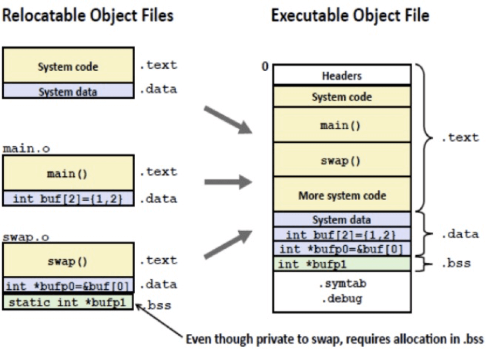

#### 一、可重定位文件

```
//main.c                    //x.c

extern void foo(void);      |   #include <stdio.h>
                            |
int main(void)              |   void foo()
{                           |   {
    foo();                  |       printf("foo\n");
    return 0;               |   }
}                           |
```

```
> objdump -d main.o
00000000 <main>:
   0:	55                   	push   %ebp
   1:	89 e5                	mov    %esp,%ebp
   3:	83 e4 f0             	and    $0xfffffff0,%esp
   6:	e8 fc ff ff ff       	call   7 <main+0x7>
   b:	b8 00 00 00 00       	mov    $0x0,%eax
  10:	c9                   	leave
  11:	c3                   	ret
```

在编译和汇编阶段，[main.c -> main.o] 汇编器无法确定外部定义的函数和全局变量的地址，所以它只能使用一个假地址占位，并产生一条额外的记录，让后面的链接器使用这条记录帮它完成地址修正。这条记录对于代码段来说放在[.rel.text] ，对于数据段来说放在[.rel.data],它们都是重定位文件的一个section。

对于每一条记录都对应于如下的一个数据结构：
```
typedef struct {
        Elf32_Addr r_offset;
        uint32_t   r_info;
        int32_t    r_addend;
} Elf32_Rela;
```


#### 二、静态链接

1、多个目标文件的合并:

<center>
    
</center>

2、对代码段，数据段以及各符号进行地址分配
3、根据 [relocation entries] 重新计算代码和数据段中的假地址。

#### 三、动态链接

##### 1、静态链接的缺点
+ 静态链接将使一些公用代码如libc库产生冗余，浪费内存和磁盘空间
+ 如果模块化开发，一个模块更新就得重新链接

##### 2、动态链接的概念
相较于静态链接在编译期进行链接操作，将链接过程推迟到运行时进行的过程叫动态链接。

##### 3、动态链接的实现
   3.1 地址无关代码
    由于在运行时，代码段是共享的，只能读不能写，所以需要将指令中那些需要修改的部分分离出来，跟数据部分放在一起，这样指令部分就可以保持不变，而数据部分可以在每一个进程中拥有一个副本。

   3.2 全局偏移表（Global Offset Table）
    当链接过程发生在运行期时，外部的符号调用只有在运行时装载模块后才能确定模块被装载的地址，以及模块内符号的确切地址。所以ELF提供了一个全局偏移表（GOT）来记录这些外部模块的符号引用。当模块被装载时，会更新此表的内容。

#### 四、参考文献
1.[Linking](https://people.cs.pitt.edu/~xianeizhang/notes/Linking.html#symbol)
2.[understanding-relocation-elf](https://stac47.github.io/c/relocation/elf/tutorial/2018/03/01/understanding-relocation-elf.html)
3.[ELF Binaries and Relocation Entries](http://stffrdhrn.github.io/hardware/embedded/openrisc/2019/11/29/relocs.html)
4.[static-linking-dynamic-linking](http://chuquan.me/2018/06/03/linking-static-linking-dynamic-linking/)
5.[ELF函数重定位问题](https://blog.csdn.net/ayu_ag/article/details/78655300)


