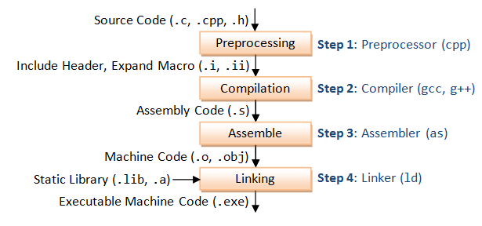
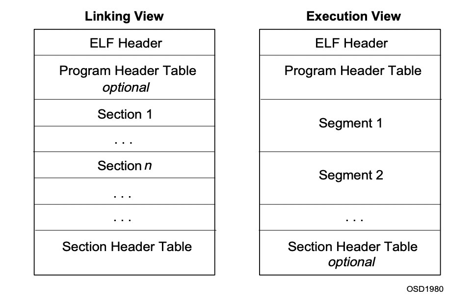
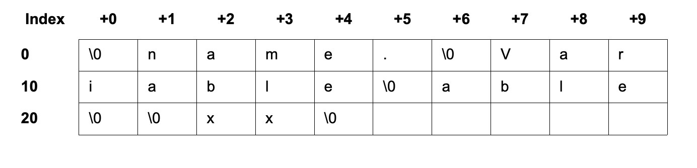

#### 一、概述
代码是解决问题的工具。当通过编码方式解决一个问题时，通常有如下步骤：
+ 定义问题
+ 设计解决方案
+ 编码实现方案
+ 测试程序

编码实现通常是我们利用计算机高级语言书写的，符合一定逻辑的程序代码，这种含逻辑的代码计算机是无法理解的，它能理解的只是一条条由0和1组成的指令即机器语言。所以这就涉及从高级语言到机器语言的翻译和转换过程，处理这个过程的程序叫编译器。

编译器这个程序，很庞大很复杂，为了让它简洁，好控制，我们把它拆成四个部分：
+ 预处理器
+ 编译器
+ 汇编器
+ 链接器

每一个阶段基本上都是在为下一个阶段做准备，它的过程如下图所示：

<center>
    
</center>

预处理器（Preprocessor）处理代码的过程叫预处理阶段，它所做的工作包括：
+ \#define宏定义展开
+ 处理条件编译指令
+ 处理\#include指令
+ 删除注释
+ 添加行号
+ 保留\#pragma指令

编译器（Compiler）处理代码的过程叫编译，它主要是将上一步的产物转换成汇编代码，它的工作内容包括：
+ 词法分析
+ 语法分析
+ 语义分析
+ 优化

汇编器（Assembler）处理代码的过程叫汇编过程，它主要将汇编代码转换成二进制的机器码
+ 汇编码到机器码的翻译

链接器（Linker）处理代码的过程叫链接过程，多个文件合并成一个文件
+ 空间与地址分配-相同部分合并
+ 符号解析和重定位-合并后位置（偏移量）调整


综上可知，目标文件是程序未链接前的一个中间文件。目标文件内容的存储方式符合ELF文件标准，所以他是一种特殊的ELF文件。

#### 二、文件结构解析

目标文件其实是ELF文件的一种，常见的ELF文件还有.so和.oat文件等。ELF文件存在两种观察角度，分别是编译角度和运行角度。编译角度是指，在代码编译阶段的存储格式。运行角度是指，文件被加载进内存时的存储当时。
两个角度看到的结构略有差异。如图：

<center>
    
</center>

从图中可以得到这样一些信息：Program Header Table对于编译视图是可选的，因为它只在程序被加载进内存时使用到。Section Header Table对于执行视图是可选的。
编译视图是以section为组织单位，执行视图是以segment为组织单位（多个section会被映射到同一个segment），下面介绍一些重要的结构。

##### ELF Header-文件的总体结构

```
#define EI_NIDENT 16
typedef struct {
    unsigned char e_ident[EI_NIDENT];
    Elf32_Half e_type;               /* 此elf文件的类型见下表  */
    Elf32_Half e_machine;            /* CPU平台架构  */
    Elf32_Word e_version;            /* 此文件的版本  */
    Elf32_Addr e_entry;              /* 加载完该程序后的执行入口  */
    Elf32_Off e_phoff;               /* program header table在文件中的偏移量  */
    Elf32_Off e_shoff;               /* section header table在此文件中的偏移量 */
    Elf32_Word e_flags;              /* processor-specific flags associated with the file */
    Elf32_Half e_ehsize;             /* the ELF header's size in bytes. */
    Elf32_Half e_phentsize;          /* program-header-table数组中一个元素的大小 */
    Elf32_Half e_phnum;              /* program-header-table数组元素的个数 */
    Elf32_Half e_shentsize;          /* section header table数组中一个元素的大小 */
    Elf32_Half e_shnum;              /* section header table包含的元素个数 */
    Elf32_Half e_shstrndx;           /* the section header table index of the entry associated with the section name string table. */
 } Elf32_Ehdr;
```

| 文件类型 | 类型描述 |
| ----| ---- |
| ET_NONE | 未知类型。这个标记表明文件类型不确定，或者还未定义。 |
| ET_REL | 重定位文件。 ELF 类型标记为 relocatable 意味着该文件被标记为了一段可重定位的代码，有时也称为目标文件。可重定位 目标文件通常是还未被链接到可执行程序的一段位置独立的代码 （position independent code）。 在编译完代码之后通常可以看到一 个.o 格式的文件， 这种文件包含了创建可执行文件所需要的代码 和数据。 |
| ET_EXEC | 可执行文件。ELF 类型为 executable，表明这个文件被标 记为可执行文件。这种类型的文件也称为程序，是一个进程开始执 行的入口。 |
| ET_DYN | 共享目标文件。ELF 类型为 dynamic，意味着该文件被标记 为了一个动态的可链接的目标文件，也称为共享库。这类共享库会在 程序运行时被装载并链接到程序的进程镜像中。 |
| ET_CORE | 核心文件。在程序崩溃或者进程传递了一个 SIGSEGV 信 号（分段违规）时，会在核心文件中记录整个进程的镜像信息。可以 使用 GDB 读取这类文件来辅助调试并查找程序崩溃的原因。 | 

> file /bin/bash     //executable
> file /xxx/xx.so   //shared object

##### Program Header Table
程序装载时，根据此结构的信息对文件进行分段（segment）。描述了磁盘上可执行文件的内存布局以及如何映射到内存中。

```
typedef struct {
   uint32_t   p_type;   /* 此元素描述的是哪种segment，以及如何解析  */
   Elf32_Off  p_offset; /* segment首字节在文件中的偏移值  */
   Elf32_Addr p_vaddr;  /* 应该加载到内存中的哪个虚拟地址中  */
   Elf32_Addr p_paddr;  /* 相关的物理地址，BSD中为0  */
   uint32_t   p_filesz; /* 文件的字节数  */
   uint32_t   p_memsz;  /* 加载到内存中的字节数  */
   uint32_t   p_flags;  /* segment类型标志位  */
   uint32_t   p_align;  /* 内存对齐  */
} Elf32_Phdr;
```

| p_flags | 描述 |
| ----| ---- |
| PF_X | An executable segment. |
| PF_W | A writable segment. |
| PF_R | A readable segment. |

##### Section Header Table

用于定位文件中所有的section，主要用于链接和调试，没有Section Header Table程序仍然可以正常运行，因为它没有对内存布局进行描述，它是一个元素为Elf32_Shdr的数组结构。
```
typedef struct
{
	Elf32_Word sh_name;      /* Section name (string tbl index)   */
	Elf32_Word sh_type;      /* Section type                      */
	Elf32_Word sh_flags;     /* Section flags                     */
	Elf32_Addr sh_addr;      /* Section virtual addr at execution */
	Elf32_Off sh_offset;     /* Section file offset               */
	Elf32_Word sh_size;      /* Section size in bytes             */
	Elf32_Word sh_link;      /* Link to another section           */
	Elf32_Word sh_info;      /* Additional section information    */
	Elf32_Word sh_addralign; /* Section alignment                 */
	Elf32_Word sh_entsize;   /* Entry size if section holds table */
} Elf32_Shdr;
```

| Section type | 描述 |
| ----| ---- |
| SHT_NULL | This value marks the section header as inactive. It does not have an associated section.  Other members of the section header have undefined values. |
| SHT_PROGBITS | This section holds information defined by the program, whose format and meaning are determined solely by the program. |
| SHT_SYMTAB | This section holds a symbol table.  Typically, SHT_SYMTAB provides symbols for link editing, though it may also be used for dynamic linking.  As a complete symbol table, it may contain many symbols unnecessary for dynamic linking.  An object file can also contain a SHT_DYNSYM section. |
| SHT_STRTAB | This section holds a string table.  An object file may have multiple string table sections. |
| SHT_RELA | This section holds relocation entries with explicit addends, such as type Elf32_Rela for the 32-bit class of object files.  An object may have multiple relocation sections. |
| SHT_HASH | This section holds a symbol hash table.  An object participating in dynamic linking must contain a symbol hash table.  An object file may have only one hash table. |
| SHT_DYNAMIC | This section holds information for dynamic linking. An object file may have only one dynamic section. |
| SHT_NOTE | This section holds notes (ElfN_Nhdr). |
| SHT_NOBITS | A section of this type occupies no space in the  file but otherwise resembles SHT_PROGBITS. Although this section contains no bytes, the sh_offset member contains the conceptual file offset. |
| SHT_REL | This section holds relocation offsets without explicit addends, such as type Elf32_Rel for the 32-bit class of object files.  An object file may have multiple relocation sections. |
| SHT_SHLIB | This section is reserved but has unspecified semantics. |
| SHT_DYNSYM | This section holds a minimal set of dynamic linking symbols.  An object file can also contain a SHT_SYMTAB section. |
| SHT_LOPROC, SHT_HIPROC | Values in the inclusive range [SHT_LOPROC, SHT_HIPROC] are reserved for processor-specific semantics. |
| SHT_LOUSER | This value specifies the lower bound of the range of indices reserved for application programs. |
| SHT_HIUSER | This value specifies the upper bound of the range of indices reserved for application programs. Section types between SHT_LOUSER and SHT_HIUSER may be used by the application, without conflicting with current or future system-defined section types. |


##### 字符串表和符号表（String and symbol tables）
存放scetion的名字，以及符号信息。其他结构通过index访问此结构中的字符串信息。符号表保存了用于定位符号引用的信息。它是以下结构的数组：

<center>
    
</center>

```
typedef struct {
       uint32_t      st_name;
       Elf32_Addr    st_value;
       uint32_t      st_size;
       unsigned char st_info;
       unsigned char st_other;
       uint16_t      st_shndx;
} Elf32_Sym;
```


##### Relocation entries (Rel & Rela)
重定位是连接符号引用（函数的名字）和符号定义（函数的定义、函数的实现）的过程。重定位文件必须包含如何修改section内容的信息，来让执行文件或共享目标文件正确的调用外部函数。

```
typedef struct {
        Elf32_Addr      r_offset;
        Elf32_Word      r_info;
} Elf32_Rel;
 
typedef struct {
        Elf32_Addr      r_offset;
        Elf32_Word      r_info;
        Elf32_Sword     r_addend;
} Elf32_Rela;
```
r_offset：
对于重定位文件来说，此值表示从section的开始到被修改值在section中的偏移量。
对于执行文件和共享库文件来说，此值表示需要被重定位的虚拟地址。

r_info：
符号表的index和重定位的类型。

r_addend：
用于计算重定位字段的值。

##### Dynamic tags（Dyn）
`.dynamic`这个section存储一些包含动态链接信息的结构
```
typedef struct {
        Elf32_Sword    d_tag;
        union {
            Elf32_Word d_val;
            Elf32_Addr d_ptr;
        } d_un;
 } Elf32_Dyn;
           
extern Elf64_Dyn _DYNAMIC[];
```

#### 三、参考链接

[Linux manual page](https://www.man7.org/linux/man-pages/man5/elf.5.html)
[The structure of an ARM ELF image](https://www.codetd.com/article/489055)
[Compiling, Linking and Building](https://www3.ntu.edu.sg/home/ehchua/programming/cpp/gcc_make.html)
