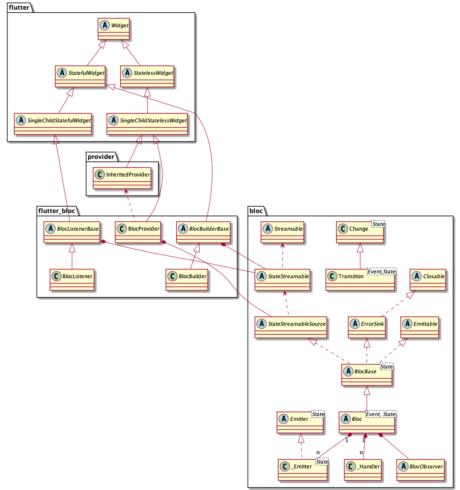
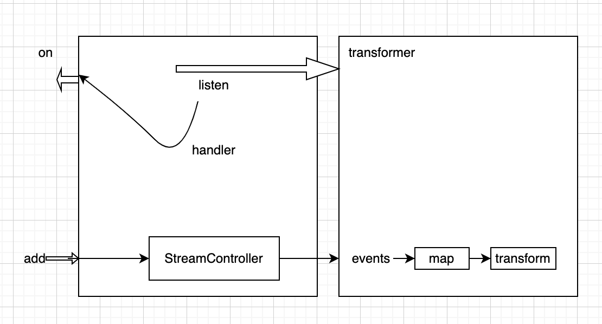

----------

#### 一、概述
Bloc = Business Logic Component

<center>
    
</center>


#### 二、结构

BloC本身是一个独立的package、flutter-bloc基于BloC和Provider实现，其结构如下图所示：

<center>
    
</center>

#### 三、 实现

##### 3.1 BloC是基于dart的Stream API实现的发布订阅模式。

+ 通过on方法订阅事件并提供处理函数，收到Event再将Event转换成State返回给Bloc
+ 通过add方法发布事件

```dart
abstract class Bloc<Event, State> extends BlocBase<State>
    implements BlocEventSink<Event> {
     //所有的订阅者
     final _subscriptions = <StreamSubscription<dynamic>>[];
     
     final _eventController = StreamController<Event>.broadcast();
     
     //添加订阅者
     void on<E extends Event>(
       EventHandler<E, State> handler, {
       EventTransformer<E>? transformer,
     }) {
        //这里开始了listen
        final subscription = xxx.listen(null);
        _subscriptions.add(subscription);
     }
     
     @override
     void add(Event event) {
       try {
         onEvent(event);
         _eventController.add(event);
       } catch (error, stackTrace) {
         onError(error, stackTrace);
         rethrow;
       }
     }
     
}
```

<center>
    
</center>


##### 3.1 事件和状态之间的转换

+ 转换逻辑有业务层通过on()注入
+ 内部的核心是_Emitter以及 *_eventController* 和 *_stateController*

```dart
 (dynamic event) {
        void onEmit(State state) {
          if (isClosed) return;
          if (this.state == state && _emitted) return;
          onTransition(Transition(
            currentState: this.state,
            event: event as E,
            nextState: state,
          ));
          emit(state);
        }

        final emitter = _Emitter(onEmit);
        final controller = StreamController<E>.broadcast(
          sync: true,
          onCancel: emitter.cancel,
        );

        void handleEvent() async {
          void onDone() {
            emitter.complete();
            _emitters.remove(emitter);
            if (!controller.isClosed) controller.close();
          }

          try {
            _emitters.add(emitter);
            //交给外部实现转换事件和状态
            await handler(event as E, emitter);
          } catch (error, stackTrace) {
            onError(error, stackTrace);
            rethrow;
          } finally {
            onDone();
          }
        }

        handleEvent();
        return controller.stream;
      }
```


#### 四、参考

主要参考和debug了bloc仓库里面examples中login的例子：
[这里](https://github.com/felangel/bloc/tree/master/examples/flutter_login)