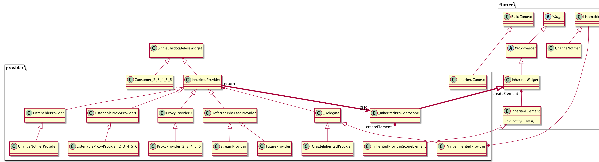

----------

#### 一、简介

官方提供的一个简单的状态管理库。

关键点：
+ 提取状态:状态变量和UI分离
+ 访问状态:将UI和状态建立联系
+ 使用状态:读取状态变量


<center>
    
</center>


#### 二、Provider的基本使用

```dart
///这是状态
class Person with ChangeNotifier {
  String name = "ChangeNotifierProvider";

  void changName({required String newName}) {
    name = newName;
    notifyListeners();//1
  }
}

class MainApp extends StatelessWidget {
  const MainApp({super.key});

  @override
  Widget build(BuildContext context) {
    return ChangeNotifierProvider<Person>(///状态和UI之间建立联系
      create: (ctx) => Person(),
      child: const MaterialApp(
        home: ChangeNotifierProviderDemo(),
      ),
    );
  }
}

class ChangeNotifierProviderDemo extends StatelessWidget {
  const ChangeNotifierProviderDemo({Key? key}) : super(key: key);

  @override
  Widget build(BuildContext context) {
    return Scaffold(
      appBar: AppBar(title: const Text("ChangeNotifierProvider")),
      body: Center(
        child: Column(
          mainAxisAlignment: MainAxisAlignment.spaceEvenly,
          children: [
            Consumer<Person>(///使用状态
              builder: (ctx, person, child) => Text(person.name),
            ),
            Consumer<Person>(
              builder: (ctx, person, child) {
                return ElevatedButton(
                  onPressed: () => person.changName(newName: "ChangeNotifierProvider更新了"),
                  child: const Text("点击更新"),
                );
              },
            ),
          ],
        ),
      ),
    );
  }
}
```


#### 三、Provider的类结构

<center>
    
</center>


3.1 InheritedProvider的子类只是具体功能的实现，基础逻辑封装在InheritedProvider中
3.2 InheritedProvider将职责转嫁给_InheritedProviderScope而_InheritedProviderScope是一个InheritedWidget


#### 四、如何实现监听

1、数据实现了ChangeNotifier，变更后调用notifyListeners(),触发回调。

2、ChangeNotifierProvider继承自ListenableProvider，ListenableProvider构建时开启监听：

```dart
  static VoidCallback _startListening(
    InheritedContext e,
    Listenable? value,
  ) {
    value?.addListener(e.markNeedsNotifyDependents);
    return () => value?.removeListener(e.markNeedsNotifyDependents);
  }
```

class InheritedContext extends BuildContext{
    void markNeedsNotifyDependents();
}

3、markNeedsNotifyDependents是`InheritedContext`中的方法，其实现类是`_InheritedProviderScopeElement`

```dart
@override
  void markNeedsNotifyDependents() {
    if (!_isNotifyDependentsEnabled) {
      return;
    }

    markNeedsBuild();
    _shouldNotifyDependents = true;
  }
```
4、markNeedsBuild是Element的方法：标记需要重新构建

```dart
  void markNeedsBuild() {
      ...  
      if (dirty) {
          return;
        }
      _dirty = true;
      owner!.scheduleBuildFor(this);
  }
```


#### 五、局部更新

Provider的`Selector`提供了缓存Widget的功能，当Widget没有变化时，将直接返回缓存，否则重新build。

```dart
class _Selector0State<T> extends SingleChildState<Selector0<T>> {
  T? value;
  Widget? cache;//这是缓存
  Widget? oldWidget;

  @override
  Widget buildWithChild(BuildContext context, Widget? child) {
    final selected = widget.selector(context);

    final shouldInvalidateCache = oldWidget != widget ||
        (widget._shouldRebuild != null &&
            widget._shouldRebuild!(value as T, selected)) ||
        (widget._shouldRebuild == null &&
            !const DeepCollectionEquality().equals(value, selected));
    if (shouldInvalidateCache) {//需要重新构建
      value = selected;
      oldWidget = widget;
      cache = widget.builder(
        context,
        selected,
        child,
      );
    }
    return cache!;
  }

  @override
  void debugFillProperties(DiagnosticPropertiesBuilder properties) {
    super.debugFillProperties(properties);
    properties.add(DiagnosticsProperty<T>('value', value));
  }
}
```


#### 六、参考
https://juejin.cn/post/7067356022272163847#heading-16