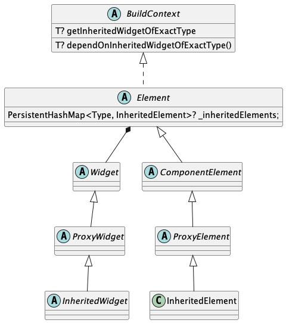
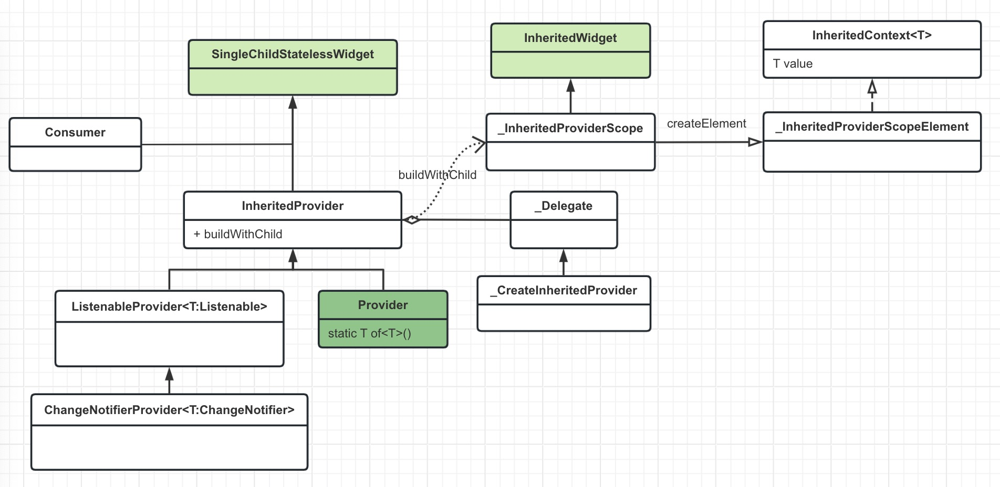

----------

#### 简介

官方提供的一个简单的状态管理库。

关键点：
+ 提取状态:状态变量和UI分离
+ 访问状态:将UI和状态建立联系
+ 使用状态:读取状态变量

<center>
    
</center>

#### 前置知识

1、InheritedWidget

<center>
    
</center>

关键点：
+ Element持有Widget对象
+ Element也是一个BuildContext对象
+ Element里面持有所有的`InheritedElement`

所以：通过BuildContext对象可以拿到所需的Widget对象，然后访问里面的数据。

父节点存放数据
```dart
class InheritedShareWidget extends InheritedWidget {
  final int data;//用于共享的数据
  InheritedShareWidget({this.data, Widget child}) : super(child: child);

  //定义便捷方法，方便子控件获取共享数据
  static InheritedShareWidget of(BuildContext context) {
  
    ///当子控件依赖使用了我们的数据源时，数据变动会触发子控件中的 didChangeDependencies 方法
    return context.dependOnInheritedWidgetOfExactType<InheritedShareWidget>();

    ///（前提：子控件使用了数据源）子控件中的 didChangeDependencies 方法不会被触发
    // return context.getElementForInheritedWidgetOfExactType<InheritedShareWidget>().widget;
  }

  @override
  bool updateShouldNotify(covariant InheritedShareWidget oldWidget) {
    return oldWidget.data != this.data;//返回true时，才会通知子控件
  }
}

```
子节点获取数据：
```dart
class TestShareChildWidget extends StatefulWidget {
  const TestShareChildWidget({Key key}) : super(key: key);
  @override
  _TestShareChildWidgetState createState() => _TestShareChildWidgetState();
}

class _TestShareChildWidgetState extends State<TestShareChildWidget> {
  @override
  void didChangeDependencies() {
    ///如build 方法中没有使用 InheritedShareWidget 的数据，那么它的didChangeDependencies()将不会被调用
    super.didChangeDependencies();
    print("enter didChangeDependencies");
  }

  @override
  Widget build(BuildContext context) {
    print("enter child build");
    //获取Inherited的共享数据：
    final data = InheritedShareWidget.of(context).data.toString();
    return Text(data);
  }
}
```
父子节点嵌套：
```dart
class _TestInheritedWidgetState extends State<TestInheritedWidget> {
  int count = 0;

  @override
  Widget build(BuildContext context) {
    return Center(
      child: InheritedShareWidget(
        data: count,
        child: Column(
          mainAxisAlignment: MainAxisAlignment.center,
          children: [
            TestShareChildWidget(),
            RaisedButton(
                child: Text('add'),
                onPressed: () {
                  setState(() {
                    ++count;
                  });
                })
          ],),),);}}
```

2、InheritedProvider

<center>
    
</center>

关键点：
+ 通过`InheritedProvider`及其子类（如：ChangeNotifierProvider）来包裹其他Widget（child），其实是将child放入了`_InheritedProviderScope`
+ `_InheritedProviderScope`是一个`InheritedWidget`所以，`InheritedProvider`及其子类将会持有child对象，及其数据。


#### Provider的基本使用

```dart
///这是状态
class Person with ChangeNotifier {
  String name = "ChangeNotifierProvider";

  void changName({required String newName}) {
    name = newName;
    notifyListeners();//1
  }
}
```
```dart
class MainApp extends StatelessWidget {
  const MainApp({super.key});

  @override
  Widget build(BuildContext context) {
    return ChangeNotifierProvider<Person>(///状态和UI之间建立联系
      create: (ctx) => Person(),
      child: const MaterialApp(
        home: ChangeNotifierProviderDemo(),
      ),
    );
  }
}
```
```dart
class ChangeNotifierProviderDemo extends StatelessWidget {
  const ChangeNotifierProviderDemo({Key? key}) : super(key: key);

  @override
  Widget build(BuildContext context) {
    return Scaffold(
      appBar: AppBar(title: const Text("ChangeNotifierProvider")),
      body: Center(
        child: Column(
          mainAxisAlignment: MainAxisAlignment.spaceEvenly,
          children: [
            Consumer<Person>(///使用状态
              builder: (ctx, person, child) => Text(person.name),
            ),
            Consumer<Person>(
              builder: (ctx, person, child) {
                return ElevatedButton(
                  onPressed: () => person.changName(newName: "ChangeNotifierProvider更新了"),
                  child: const Text("点击更新"),
                );},),],),),);}
}
```


#### Provider的类结构

<center>
    
</center>


3.1 InheritedProvider的子类只是具体功能的实现，基础逻辑封装在InheritedProvider中
3.2 InheritedProvider将职责转嫁给_InheritedProviderScope而_InheritedProviderScope是一个InheritedWidget


#### 如何实现监听

1、数据实现了ChangeNotifier，变更后调用notifyListeners(),触发回调。

2、ChangeNotifierProvider继承自ListenableProvider，ListenableProvider构建时开启监听：

```dart
  static VoidCallback _startListening(
    InheritedContext e,
    Listenable? value,
  ) {
    value?.addListener(e.markNeedsNotifyDependents);
    return () => value?.removeListener(e.markNeedsNotifyDependents);
  }
```

class InheritedContext extends BuildContext{
    void markNeedsNotifyDependents();
}

3、markNeedsNotifyDependents是`InheritedContext`中的方法，其实现类是`_InheritedProviderScopeElement`

```dart
@override
  void markNeedsNotifyDependents() {
    if (!_isNotifyDependentsEnabled) {
      return;
    }

    markNeedsBuild();
    _shouldNotifyDependents = true;
  }
```
4、markNeedsBuild是Element的方法：标记需要重新构建

```dart
  void markNeedsBuild() {
      ...  
      if (dirty) {
          return;
        }
      _dirty = true;
      owner!.scheduleBuildFor(this);
  }
```


#### 局部更新

Provider的`Selector`提供了缓存Widget的功能，当Widget没有变化时，将直接返回缓存，否则重新build。

```dart
class _Selector0State<T> extends SingleChildState<Selector0<T>> {
  T? value;
  Widget? cache;//这是缓存
  Widget? oldWidget;

  @override
  Widget buildWithChild(BuildContext context, Widget? child) {
    final selected = widget.selector(context);

    final shouldInvalidateCache = oldWidget != widget ||
        (widget._shouldRebuild != null &&
            widget._shouldRebuild!(value as T, selected)) ||
        (widget._shouldRebuild == null &&
            !const DeepCollectionEquality().equals(value, selected));
    if (shouldInvalidateCache) {//需要重新构建
      value = selected;
      oldWidget = widget;
      cache = widget.builder(
        context,
        selected,
        child,
      );
    }
    return cache!;
  }

  @override
  void debugFillProperties(DiagnosticPropertiesBuilder properties) {
    super.debugFillProperties(properties);
    properties.add(DiagnosticsProperty<T>('value', value));
  }
}
```


#### 参考
https://juejin.cn/post/7067356022272163847#heading-16