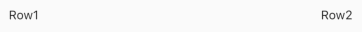
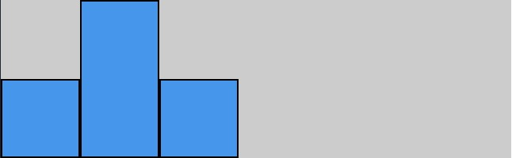
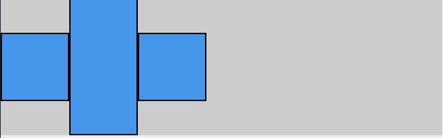
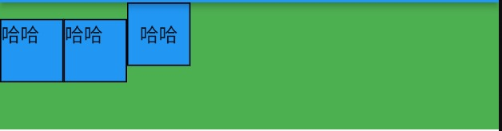

#### Row和Column分别在横向和纵向对子Widget进行布局。
+ 对于Row来讲，横向是主轴，纵向是交叉轴。
+ 对于Column来讲，横向是交叉轴，纵向是主轴。

针对主轴和交叉轴，不同大小的子Widget该如何对齐呢？Flutter提供了下列属性：

####  MainAxisAlignment：主轴对齐方式
| 属性值 | 解释 | 图示 |
| -- | -- | -- |
| start | 靠近主轴的开始 | 

 |
| end | 靠近主轴的末尾 | 

 |
| center | 靠近主轴中间 | 

 |
| spaceBetween | 剩余空间在孩子中间平分 | 

 |
| spaceAround | 剩余空间围绕孩子平分 | 

 |
| spaceEvenly | 剩余空间在孩子之间均等分配 | 

 |

####  CrossAxisAlignment:交叉轴对齐方式
| 属性值 | 解释 | 图示 |
| -- | -- | -- |
| start | 左对齐(Column)或上对齐(Row) | 

 |
| end | 右对齐(Column)或下对齐(Row) | 

 |
| center | 中间对齐 | 

 |
| stretch | 拉伸 | 

 |
| baseline | 基线对齐,需要配合textBaseline属性使用 | 

 |