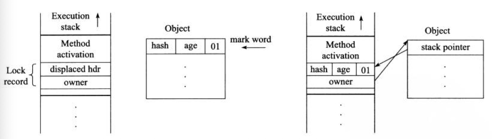

#### 一、概述
synchronized作为Java内建的关键字和锁机制，理解和使用它是必要的也是有难度的。个人认为深入理解此关键字在于以下几个方面：
+ 基础层面：正确理解对象锁和类锁，并熟练使用
+ 能力提升：
    - 了解对象的内存布局，观察锁如何影响对象的内存布局
    - 了解锁优化，锁升级及其过程
+ 更上一层楼：OpenJDK源码走读

本文只是记录和翻译了一些英文文档的内容，作为笔记以后翻阅。详细内容可看原文。

#### 二、对象锁和类锁

1.1 对象锁：修饰代码块和实例方法

```java
static class ObjectLock {
        public void test1() {
            synchronized (this) {//此代码块锁住当前对象
                int i = 5;
                while (i-- > 0) {
                    System.out.println(Thread.currentThread().getName() + " : " + i);
                    try {
                        Thread.sleep(500);
                    } catch (InterruptedException ie) {
                    }
                }
            }
        }

        public synchronized void test2() {
            int i = 5;
            while (i-- > 0) {
                System.out.println(Thread.currentThread().getName() + " : " + i);
                try {
                    Thread.sleep(500);
                } catch (InterruptedException ie) {
                }
            }
        }
}
```


1.2 类锁:修饰代码块和静态方法
```java
 static class ClazzLock {
        public void test1() {
            synchronized (ClazzLock.class) {//此代码块锁住class类
                int i = 5;
                while (i-- > 0) {
                    System.out.println(Thread.currentThread().getName() + " : " + i);
                    try {
                        Thread.sleep(500);
                    } catch (InterruptedException ie) {
                    }
                }
            }
        }

        /**
         * 静态方法属于类
         */
        public static synchronized void test2() {
            int i = 5;
            while (i-- > 0) {
                System.out.println(Thread.currentThread().getName() + " : " + i);
                try {
                    Thread.sleep(500);
                } catch (InterruptedException ie) {
                }
            }
        }
}
```

#### 三、锁优化
依据一：数据显示，许多锁有局部性特征，也就是说很多锁的锁定和释放都发生在特定的线程上。
依据二：数据显示，大部分Java对象不存在竞争。

+ 适应性自旋-Adaptive Spinning
+ 锁消除-Lock Elimination
+ 锁粗化-Lock Coarsening
+ 轻量级锁-Lightweight Locking
+ 偏向锁-Biased Locking

##### 3.1 偏向锁 

当我们开发了一个多线程环境下的模块时，其他人可能把它用在单线程环境下，此时加锁逻辑就是多余的。即使使用轻量级锁，每次获取锁都执行CAS原子指令也是一种性能损耗。使用偏向锁，线程首次获取锁时记录偏向于它自己,当有其他线程获取锁时，偏向锁要撤销，使用其他锁机制，如轻量级锁。

lock-field中有一个bit用于记录是否偏向状态，初始状态下是处于偏向锁状态，但没有设置偏向的线程ID。当线程首次获取锁时，发现没有指定偏向的线程，则使用CAS设置偏向线程，来避免竞态条件。


##### 3.2 轻量级锁（Thin Lock）

相对于每次对象锁定都获取monitor结构的重量级锁而言，轻量级锁只是使用CAS原子指令修改lock-field（锁信息字段），因此轻量级锁不支持wait和notify。当发生锁竞争时，轻量级锁膨胀，同时分配monitor结构，lock-field更新成monitor的指针。

Java的锁是可重入的，所以需要记录当前锁的重入次数和锁的持有者。
+ 记录方式一：
最直接的方式是把lock-field分成两部分，一个记录锁的持有者，一个记录锁重入次数。由于lock-field字段长度固定，所以重入次数被限制了。重入次数达到上限只能升级为重量级锁。


+ 记录方式二：
当线程需要获取锁时，在获取锁的线程栈中保存lock-records记录。线程获取的所有锁记录都将保存在这个集合中，它的顺序和获取锁的顺序一致。

轻量级锁的变种和提升包含 _tasuki-lock_ 和 _meta-lock_ 其算法思想是一致的，差异在于实现细节，


1、轻量级锁的加锁过程

在代码进入同步块的时，如果同步对象锁状态为无锁（锁标志位为“01”，偏向锁位为“0”）虚拟机首先将在当前线程的栈帧中建立一个名为锁记录（Lock Record）的空间，用于存储锁对象目前的Mark Word的拷贝（官方称之为 Displaced Mark Word）。然后，虚拟机将使用CAS操作尝试将对象的Mark Word更新为指向Lock Record的指针，并将Lock record里的owner指针指向object mark word。如果这个更新动作成功了，那么这个线程就拥有了该对象的锁，并且对象Mark Word的锁标志位设置为“00”，即表示此对象处于轻量级锁定状态。

如果这个更新操作失败了，虚拟机首先会检查对象的Mark Word是否指向当前线程的栈帧，如果是就说明当前线程已经拥有了这个对象的锁，那就可以直接进入同步块继续执行。
否则说明多个线程竞争锁，轻量级锁就要膨胀为重量级锁，锁标志的状态值变为“10”，Mark Word中存储的就是指向重量级锁（互斥量）的指针，后面等待锁的线程也要进入阻塞状态。 
而当前线程便尝试使用自旋来获取锁，自旋就是为了不让线程阻塞，而采用循环去获取锁的过程。

 
<center>
    
</center>

                     图2.1 轻量级锁CAS操作前/后堆栈与对象的状态

2、轻量级锁的解锁过程：

（1）通过CAS操作尝试把线程中复制的Displaced Mark Word对象替换当前的Mark Word。

（2）如果替换成功，整个同步过程就完成了。

（3）如果替换失败，说明有其他线程尝试过获取该锁（此时锁已膨胀），那就要在释放锁的同时，唤醒被挂起的线程。


##### 3.3 锁消除
锁消除即删除不必要的加锁操作。根据代码逃逸技术，如果判断到一段代码中，堆上的数据不会逃逸出当前线程，那么可以认为这段代码是线程安全的，不必要加锁。

```java
public class Test extends Thread{
    public static void main(String[] args) {
        contactString("aa", "bb", "cc");
    }
    public static String contactString(String s1, String s2, String s3) {
        return new StringBuffer().append(s1).append(s2).append(s3).toString();
    }
}
```

虽然StringBuffer的append是一个同步方法，但是这段程序中的StringBuffer属于一个局部变量，并且不会从该方法中逃逸出去，所以其实这过程是线程安全的，可以将锁消除。


##### 3.4 锁粗化
虚拟机对连续的加锁操作（synchronized append）进行范围扩展（粗化）到整个操作序列的外部。
```java
public String concatString(String s1,String s2, String s3){
    StringBuffer sb = new StringBUffer();
    sb.append(s1);
    sb.append(s2);
    sb.append(s3);
    return sb.toString();
}
```

#### 四、参考资料
1.Evaluating and improving biased locking in the HotSpot virtual machine
2.[Java并发编程：Synchronized底层优化（偏向锁、轻量级锁）](https://www.cnblogs.com/paddix/p/5405678.html)
3.[锁：锁优化（synchronized 锁升级过程、锁消除、锁粗化）](https://www.cnblogs.com/zhai1997/p/13546652.html)
4.[Synchronization](https://wiki.openjdk.java.net/display/HotSpot/Synchronization)
