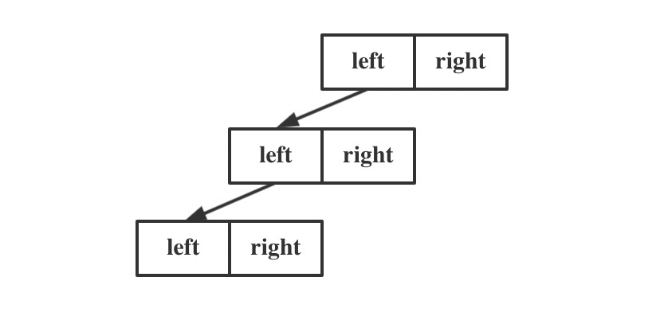
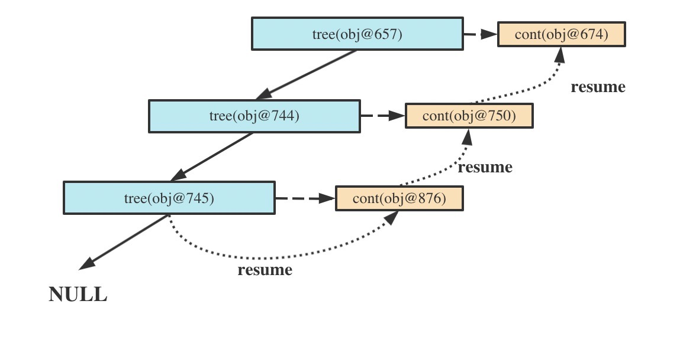

&ensp;&ensp;&ensp;&ensp;协程一般用于异步编程。在解决异步编程问题方面，Kotlin编译器在对协程的设计和实现是通用的。我们可以借助协程优雅的解决深度递归问题。

#### 一、问题描述  
定义以下二叉树的结点，并构造一棵只含十万个左结点的树，进行深度遍历，求树的深度：  
<center>
    
</center>

```kotlin
//结点定义
class Tree(val left: Tree?, val right: Tree?)

//构造二叉树：以叶子结点开始，重复构造父结点，并把当前结点作为父结点的左子树
val n = 100_000
val deepTree = generateSequence(Tree(null, null)) { prev ->
    Tree(prev, null) 
}.take(n).last()

```
#### 二、解决方案
##### 2.1 解决方案一：
```kotlin
fun depth(t: Tree?): Int =
    if (t == null) 0 else maxOf(
        depth(t.left), // recursive call one
        depth(t.right) // recursive call two
    ) + 1
```

分析：  
对树进行递归是最简洁直接的解决方案。而递归将保存函数的调用栈用于后续状态恢复，线程的调用栈是有大小限制的，此处将抛出`Exception in thread "main" java.lang.StackOverflowError`错误。


##### 2.2 解决方案二：
```kotlin
  fun depth(t: Tree?): Int {
        if (t == null) return 0
        class Frame(val node: Tree, var state: Int = 0, var depth: Int = 1)
        val stack = ArrayList<Frame>()
        val root = Frame(t)
        stack.add(root)
        while (stack.isNotEmpty()) {
            val frame = stack.last()
            when (frame.state++) {
                0 -> frame.node.left?.let { l -> stack.add(Frame(l)) }
                1 -> frame.node.right?.let { r -> stack.add(Frame(r)) }
                2 -> {
                    stack.removeLast()
                    stack.lastOrNull()?.let { p -> 
                        p.depth = maxOf(p.depth, frame.depth + 1) 
                    }
                }
            }
        }
        return root.depth
    }
```
分析：  
基于解决方案一，我们考虑将调用栈状态的保存转移到内存空间更大的堆区，并加入了状态机和`while`循环。在此例中，程序开始时将全部走状态0，将所有的左节点加入stack。然后全部走状态2(因为没有右结点)，由下到上计算每一个结点的深度。最后返回根节点的深度。

##### 2.3 解决方案三：
```kotlin
val depth = DeepRecursiveFunction<Tree?, Int> { t ->
        if (t == null) 0 else maxOf(
            callRecursive(t.left),
            callRecursive(t.right)
        ) + 1
    }
```

分析：  
方案二中的状态机就是Kotlin挂起函数的实现原理。所以我们也可以利用Kotlin的挂起函数实现深度遍历。那么方案三是如何实现的呢？我们分析三个方面：  
+ 如何调用
+ 如何进入循环
+ 如何保存状态

2.3.1 调用  
`DeepRecursiveFunction`类声明了`invoke`操作符，调用`depth`函数就是调用下面👇🏻的操作符。

```kotlin
@SinceKotlin("1.4")
@ExperimentalStdlibApi
public operator fun <T, R> DeepRecursiveFunction<T, R>.invoke(value: T): R =
    DeepRecursiveScopeImpl<T, R>(block, value).runCallLoop()
```

2.3.2 循环  
调用`DeepRecursiveFunction`后直接进入`runCallLoop()`循环，result的默认值为UNDEFINED_RESULT，所以会启动我们的递归业务逻辑

```kotlin
 @Suppress("UNCHECKED_CAST")
    fun runCallLoop(): R {
        while (true) {
            // Note: cont is set to null in DeepRecursiveScopeImpl.resumeWith when the whole computation completes
            val result = this.result
            val cont = this.cont
                ?: return (result as Result<R>).getOrThrow() // done -- final result
            // The order of comparison is important here for that case of rogue class with broken equals
            if (UNDEFINED_RESULT == result) {
                // call "function" with "value" using "cont" as completion
                val r = try {
                    // This is block.startCoroutine(this, value, cont)
                    function.startCoroutineUninterceptedOrReturn(this, value, cont)
                } catch (e: Throwable) {
                    cont.resumeWithException(e)
                    continue
                }
                // If the function returns without suspension -- calls its continuation immediately
                if (r !== COROUTINE_SUSPENDED)
                    cont.resume(r as R)
            } else {
                // we returned from a crossFunctionCompletion trampoline -- call resume here
                this.result = UNDEFINED_RESULT // reset result back
                cont.resumeWith(result)
            }
        }
    }
```


2.3.3 状态保存  
每次调用`callRecursive`时将保存当前的值和cont（continuation），注意这里cont对象每次都不是同一个对象。当进行挂起恢复时，拿到旧的continuation进行回调。

<center>
    
</center>

```kotlin
suspend fun callRecursive(value: T): R = 
    suspendCoroutineUninterceptedOrReturn { cont ->
        this.cont = cont
        this.value = value
        COROUTINE_SUSPENDED
    }
```


#### 参考：  
[Deep recursion with coroutines](https://elizarov.medium.com/deep-recursion-with-coroutines-7c53e15993e3)