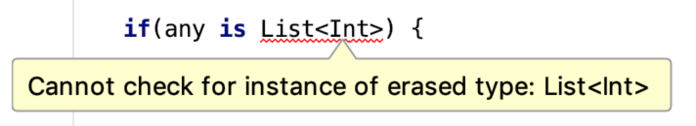

#### 一、概述

你可能注意到了几乎所有的Kotlin标准库里面的高阶函数都是inline类型的。
```kotlin
public inline fun repeat(times: Int, action: (Int) -> Unit) {
    for (index in 0 until times) {
        action(index)
    }
}

public inline fun <T, R> Iterable<T>.map(
    transform: (T) -> R
): List<R> {
    return mapTo(
        ArrayList<R>(collectionSizeOrDefault(10)),
        transform
    )
}

public inline fun <T> Iterable<T>.filter(
    predicate: (T) -> Boolean
): List<T> {
    return filterTo(ArrayList<T>(), predicate)
}
```

这些函数的调用在编译时会被展开到调用处。如下所示:`repeat`函数会被它本身的函数体替换掉。

```kotlin
repeat(10) {
    print(it)
}
//↓ ↓ ↓ ↓ ↓ ↓ ↓ ↓ ↓ ↓ ↓ ↓
for (index in 0 until 10) {
    print(index)
}
```

一般的函数调用通常是：跳进函数体，执行代码，然后跳出函数体，回到调用点。而用函数体替换函数调用是一种完全不同的方式，这种方式有以下一些优点：
+ 类型参数具体化
+ 参数包含函数的方法内联后执行更快
+ 不允许非本地的return语句

使用inline标识符也会有一些缺点，下面👇🏻我们一起来看一下它的优缺点：

##### 一、类型参数具体化：

早期的Java版本不支持泛型，在2004年的J2SE-5.0才支持。由于泛型会在编译期间被擦除，所以在字节码层面是不存在的。例如：`List<Int>` 编译后成为 `List` ，所以我们只需要检查一个对象是否是List实例，而不用检查它是否是一个`List<Int>`：

```kotlin
any is List<Int> // Error
any is List<*> // OK
```

<center>
    
</center>

由于这个原因，我们不能操作类型参数：

```kotlin
fun <T> printTypeName() {
    print(T::class.simpleName) // ERROR
}
```
通过内联函数我们可以突破这种限制。由于函数调用被函数体替换，通过使用`reified`修饰符，泛型被真实的类型参数替换。

```kotlin
inline fun <reified T> printTypeName() {
    print(T::class.simpleName)
}

// Usage
printTypeName<Int>()    //→print(Int::class.simpleName) // Int
printTypeName<Char>()   //→print(Char::class.simpleName)// Char
printTypeName<String>() //→print(String::class.simpleName)// String
```

`reified`是一个非常有用的修饰符，例如标准库里面的`filterIsInstance`用来过滤某一种类型的元素。

```kotlin
class Worker
class Manager

val employees: List<Any> =
    listOf(Worker(), Manager(), Worker())

val workers: List<Worker> =
    employees.filterIsInstance<Worker>()
```

它经常被用在我们自己写的代码库或工具类中。下面的例子是使用Gson库实现的通用函数，它能帮助我们简化依赖注入和模块申明。

```kotlin
inline fun <reified T : Any> String.fromJsonOrNull(): T? =
    try {
        gson.fromJson(json, T::class.java)
    } catch (e: JsonSyntaxException) {
        null
    }

// usage
val user: User? = userAsText.fromJsonOrNull()

// Koin module declaration
val myModule = module {
    single { Controller(get()) } // get is reified
    single { BusinessService() } // get is reified
}

// Koin injection
val service: BusinessService by inject()
// inject is reified
```

##### 二、函数类型的参数内联后执行更快

更确切的讲，短小的函数内联会更快，它无需跳转执行和跟踪调用栈。这也是为什么标准库里面很多小函数都是inline类型的原因。
```kotlin
inline fun print(message: Any?) {
    System.out.print(message)
}
```
当方法没有函数类型的参数时，没必要内联且IntelliJ会给出以下提示⚠️：
<center>
    
</center>


要理解其中的原因，我们首先需要理解将函数作为对象进行操作的问题是什么。这些类型的对象(使用函数字面量创建)需要以某种方式保存。在Kotlin/JVM上，需要使用JVM匿名类或普通类创建一些对象。因此，下面的lambda表达式:

```kotlin
val lambda: () -> Unit = {
    // code
}
```

将会被编译为一个类。或JVM匿名类。

```java
// Java
Function0<Unit> lambda = new Function0<Unit>() {
    public Unit invoke() {
        // code
    }
};
```
或者被编译成一个普通的类，被定义在一个单独的文件中。
```java
// Java
// Additional class in separate file
public class Test$lambda implements Function0 < Unit > {
    public Unit invoke() {
        // code
    }
};

// Usage
Function0 lambda = new Test$lambda();
```

这两种方式没有特别大的区别。

我们注意到，这个函数类型被转换成Function0类型。在Kotlin中，无参类型会被编译器转换成Function0，同理单参数，两参数转换成Function1, Function2,Function3等

+ ()->Unit 编译成 Function0<Unit>
+ ()->Int 编译成 Function0<Int>
+ (Int)->Int 编译成 Function1<Int, Int>
+ (Int, Int)->Int 编译成 Function2<Int, Int, Int>

这些所有的接口都是Kotlin编译器生成的。你不能在Kotlin里显示的使用他们，因为它们是按需生成的，而应该使用函数类型。知道函数类型只是接口为你开启了很多的可能性。比如：
```kotlin
class OnClickListener : () -> Unit {
    override fun invoke() {
        // ...
    }
}
```

正如在*高效Kotlin-47*中所述：避免不必要的对象创建，把函数体包装成对象拖慢代码。这就是为什么下面的代码中，第一个更快。
```kotlin
inline fun repeat(times: Int, action: (Int) -> Unit) {
    for (index in 0 until times) {
        action(index)
    }
}

fun repeatNoinline(times: Int, action: (Int) -> Unit) {
    for (index in 0 until times) {
        action(index)
    }
}
```

这种差异是显而易见的，但在现实生活中的例子中很少有显著差异。我们把测试用例设计一下，放大这种差异：

```kotlin
@Benchmark
fun nothingInline(blackhole: Blackhole) {
    repeat(100_000_000) {
        blackhole.consume(it)
    }
}

@Benchmark
fun nothingNoninline(blackhole: Blackhole) {
    noinlineRepeat(100_000_000) {
        blackhole.consume(it)
    }
}
```

第一个在我们电脑平均运行189ms。第二个平均447ms。这种差距体现在：第一个例子迭代调用空函数。第二个例子迭代调用对象，这个对象调用一个空函数。这里使用了额外的对象。

看一个更典型的例子。我们有5000个产品，计算我们购买物品的价格：
```kotlin
users.filter { it.bought }.sumByDouble { it.price }
```

在我的机器上平均耗时38ms。如果filter和sumByDouble不内联耗时多少呢？平均42ms！看起来不多，但每次调用也有10%的差异。

内联和非内联函数最大的区别在于，当我们在函数字面量里捕获变量时。变量被使用时需要被包装成对象。例如：
```kotlin
var l = 1L
noinlineRepeat(100_000_000) {
    l += it
}
```

一个本地变量不能直接在非内联lambda中使用。这就是为什么要被包装成引用对象：
```kotlin
val a = Ref.LongRef()
a.element = 1L
noinlineRepeat(100_000_000) {
    a.element = a.element + it
}
```

区别很大是因为，通常这个对象会被使用很多次，上面代码中的a变量使用了两次。因此，额外的对象调用2*100_000_000。再看一下这个例子👇🏻：
```kotlin
@Benchmark
// On average 30 ms
fun nothingInline(blackhole: Blackhole) {
    var l = 0L
    repeat(100_000_000) {
        l += it
    }
    blackhole.consume(l)
}

@Benchmark
// On average 274 ms
fun nothingNoninline(blackhole: Blackhole) {
    var l = 0L
    noinlineRepeat(100_000_000) {
        l += it
    }
    blackhole.consume(l)
}
```
第一个在我电脑运行30ms，第二个274ms。差距的原因是，函数是一个对象，本地变量需要被包装。小的影响累计放大了。大多数情况下，我们不知道有函数类型参数的方法被如何使用，当我们定义这种函数时，最好内联一下。这也是标准库经常这么写的原因。

##### 三、不允许非本地返回

前面定义的`repeatNoninline`像是一个控制结构，拿它和if语句或for循环对比一下。
```kotlin
if (value != null) {
    print(value)
}

for (i in 1..10) {
    print(i)
}

repeatNoninline(10) {
    print(it)
}
```

明显的区别是，内部不能返回
```kotlin
fun main() {
    repeatNoinline(10) {
        print(it)
        return // ERROR: Not allowed
    }
}
```

这是函数字面量编译的结果。当我们的代码处于另外一个类时，不能从main函数返回。但是，当使用内联时，就没限制。

```kotlin
fun main() {
    repeat(10) {
        print(it)
        return // OK
    }
}
```
得益于此，函数可以看起来更像控制结构：
```kotlin
fun getSomeMoney(): Money? {
    repeat(100) {
        val money = searchForMoney()
        if (money != null) return money
    }
    return null
}
```


##### 四、内联修饰符的缺陷

inline很有用，但不应该随处使用。有些情况下不建议使用。再来看看最重要的限制。

+ 内联函数不能递归，否则调用展开将无限循环。周期性循环尤其危险，因为Intellij不报错：

```kotlin
inline fun a() {
    b()
}
inline fun b() {
    c()
}
inline fun c() {
    a()
}
```

+ 内联函数不能使用可见性约束的元素

在`public inline fun`中不能使用private 、internal修饰的函数或属性

```kotlin
internal inline fun read() {
    val reader = Reader() // Error
    // ...
}

private class Reader {
    // ...
}
```

这也是为什么它不能用于隐藏实现，并且很少在类中使用。

+ 内联函数使代码膨胀

定义一个打印3的函数：
```kotlin
inline fun printThree() {
    print(3)
}
```
调用三次：
```kotlin
inline fun threePrintThree() {
    printThree()
    printThree()
    printThree()
}
```
又定义下面函数：
```kotlin
inline fun threeThreePrintThree() {
    threePrintThree()
    threePrintThree()
    threePrintThree()
}

inline fun threeThreeThreePrintThree() {
    threeThreePrintThree()
    threeThreePrintThree()
    threeThreePrintThree()
}
```
看一下它们的编译结果，前两个还能看：
```kotlin
inline fun printThree() {
    print(3)
}

inline fun threePrintThree() {
    print(3)
    print(3)
    print(3)
}
```

后两个：
```kotlin
inline fun threeThreePrintThree() {
    print(3)
    print(3)
    print(3)
    print(3)
    print(3)
    print(3)
    print(3)
    print(3)
    print(3)
}

inline fun threeThreeThreePrintThree() {
    print(3)
    print(3)
    print(3)    
 ...
    print(3)
    print(3)
    print(3)
    print(3)
}
```
这个例子展示了内联函数的弊端：过度使用时代码膨胀严重。

##### 五、crossinline 和noinline
有时候我们想内联一个函数，由于某些原因，不能内联全部的函数类型参数。这种情况下我们使用下面的修饰符：

crossinline：用于内联函数的参数，表示此参数内联范围扩大。对内联函数内部的lambda生效：
```kotlin
inline fun hello(postAction:()->Unit){
    println("Hello")
    runOnUiThread { 
        postAction()
     }
}
```

noinline：用于内联函数的参数，表示此参数不能被内联。可以局部性关闭内联。


```kotlin
inline fun requestNewToken(
    hasToken: Boolean,
    crossinline onRefresh: () -> Unit,
    noinline onGenerate: () -> Unit
) {
    if (hasToken) {
        httpCall("get-token", onGenerate) // We must use 
        // noinline to pass function as an argument to a
        // function that is not inlined
    } else {
        httpCall("refresh-token") {
            onRefresh() // We must use crossinline to 
            // inline function in a context where 
            // non-local return is not allowed
            onGenerate()
        }
    }
}

fun httpCall(url: String, callback: () -> Unit) {
    /*...*/
}
```

能记住这两个修饰符最好，记不住也没事，IntelliJ会有提示：

##### 六、总结：
使用inline的主要场景是：
+ 经常被使用的函数
+ 具体化的类型参数，像：`filterIsInstance`
+ 定义带有函数类型的参数的顶层函数。尤其是辅助函数，如集合处理（map、filter）、作用域函数（also、apply、let）、顶层工具函数（repeat、run、with）


我们很少用inline定义API，注意内联函数调用内联函数的情景。记住代码膨胀。


参考：  
[Effective Kotlin Item 48: Use inline modifier for functions with parameters of functional types](https://kt.academy/article/ek-inline-functions)