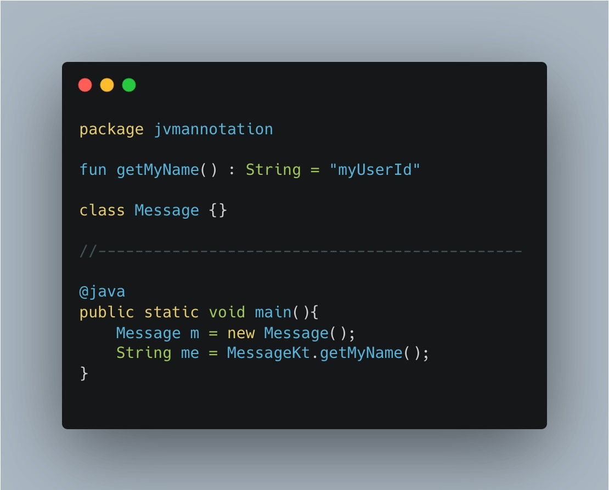
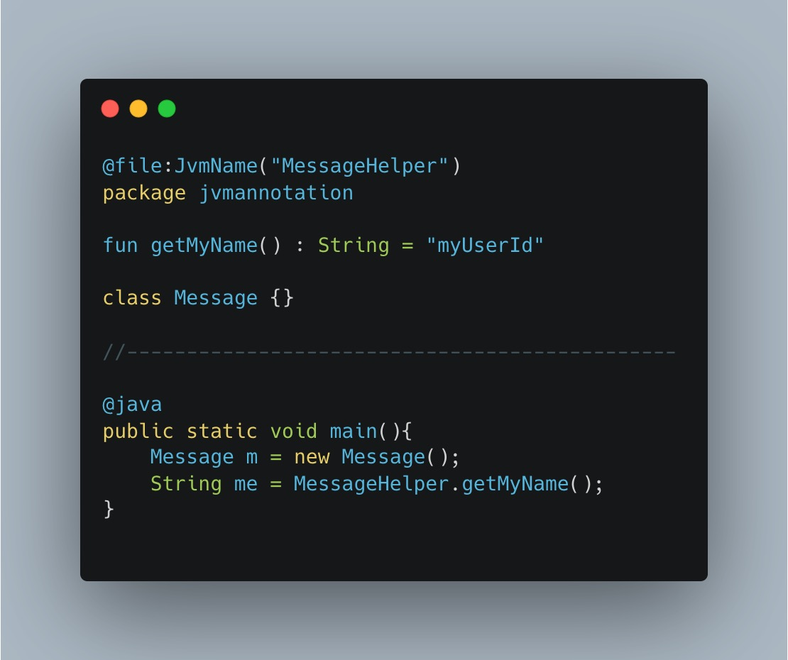
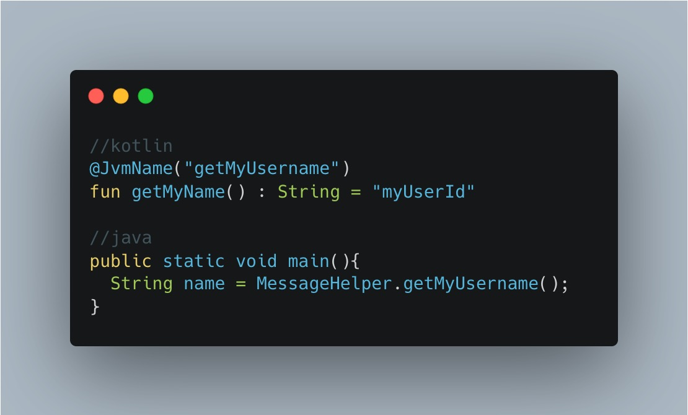
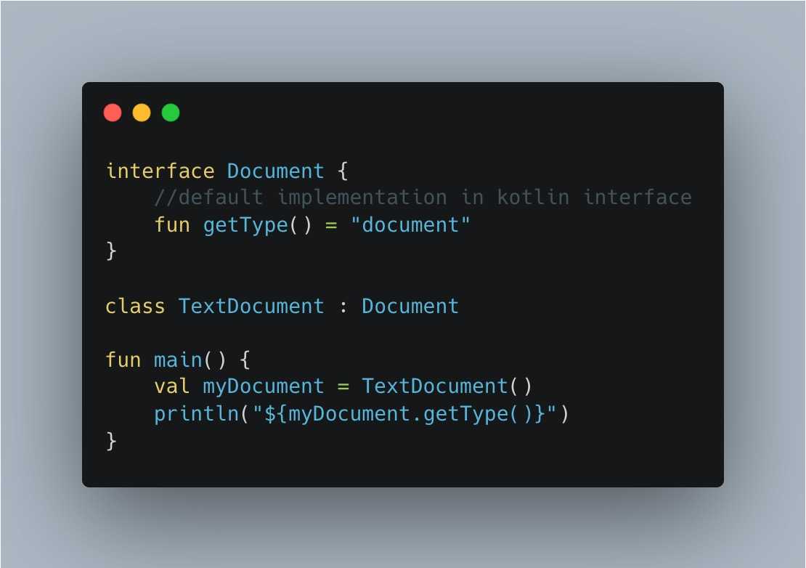
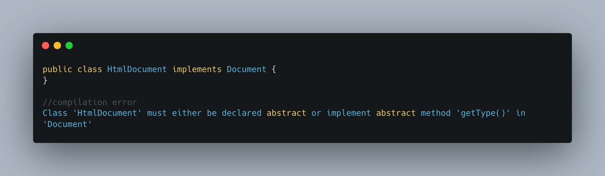
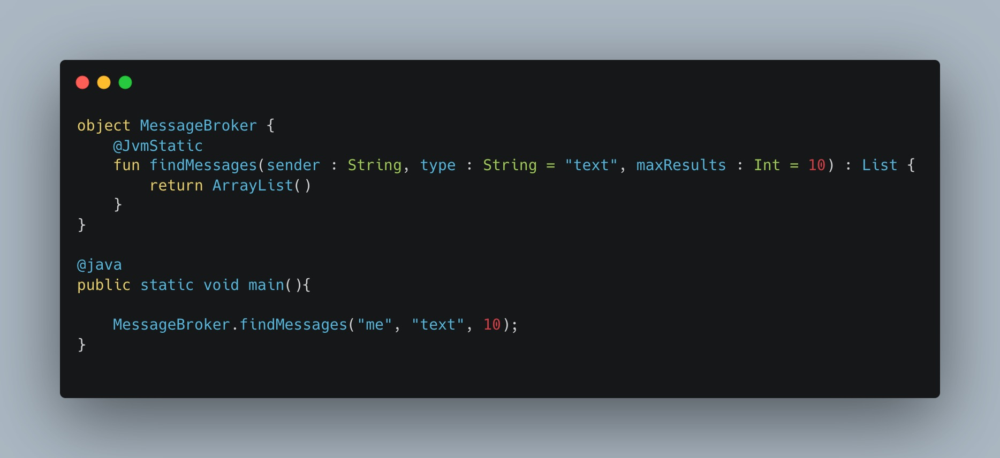
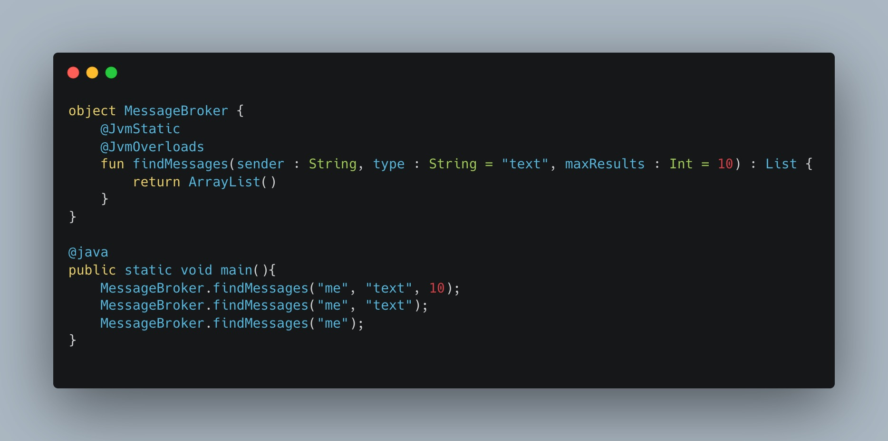
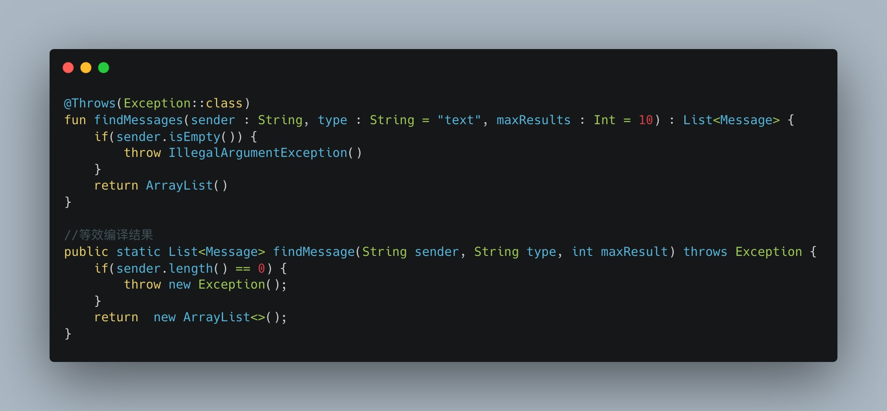
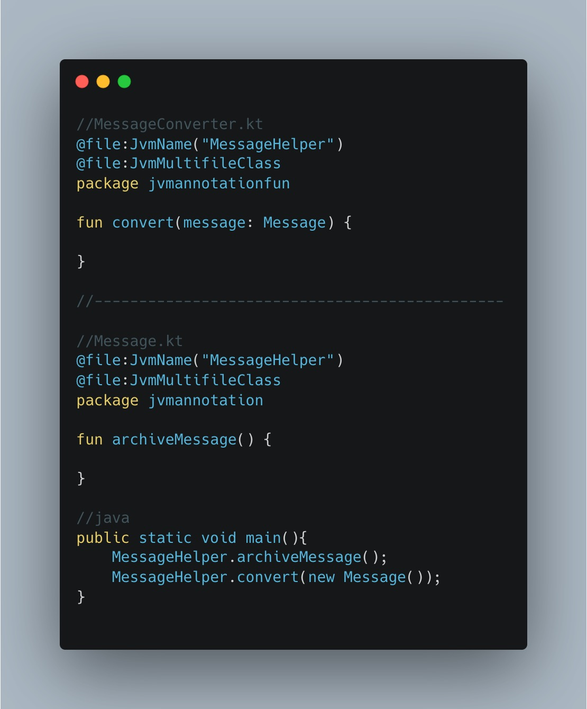
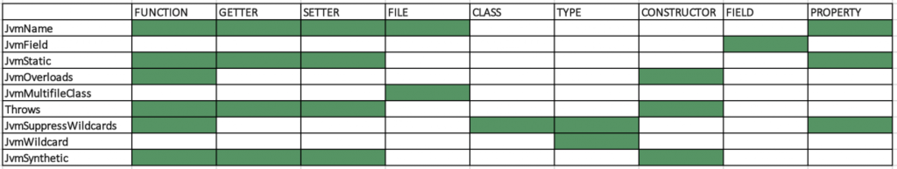

Kotlin提供了一些注解可以帮助开发者更好地兼容Java。下面探索一下Kotlin中JVM注解的使用，以及在Java中使用Kotlin类时注解对我们的影响。

####  1、@JvmName
用于文件、函数、属性、getter和setter。

#####  1.1 给文件添加@JvmName注解
默认情况下，一个Kotlin文件中的**function**和**properties**会被编译成*filenameKt.class*，其中的**class**会被编译成classname.class:
<table>
    <tr>
        <td></td>
        <td></td>
    </tr>
</table>

##### 1.2 给函数名添加@JvmName注解

<center>
    
</center>

##### 1.3 给getter和setting添加@JvmName
```kotlin

@get:JvmName("getContent")
@set:JvmName("setContent")
var text = ""

```

####  2、@JvmDefault

和Java8一样，Kotlin的接口也支持默认方法实现。即使针对Java7及以下版本，他也能正常编译，因为Kotlin使用静态内部类实现默认方法。

<center>
    
</center>

当在Java中实现此接口时，需要复写对应的方法，否则将报错。
<center>
    
</center>

如果我们希望它在Java8中不报错，可以使用@JvmDefault注解标识方法：
```kotlin
interface Document {
    @JvmDefault
    fun getType() = "document"
}
```

####  3、@JvmStatic

针对`object class` 或`companion
object`使用此注解,可以避免Java访问时的INSTANCE调用


<table>
    <tr>
        <td></td>
        <td></td>
    </tr>
</table>

####  4、@JvmOverloads

Kotlin的默认参数可以帮助我们减少函数重载，简化方法调用参数。在Java中调用含默认参数的Kotlin函数时，需要提供全部参数。

<table>
    <tr>
        <td></td>
        <td></td>
    </tr>
</table>

#### 5、@Throws
Kotlin没有受检测异常，try-catch是非必须的。如果希望在Java调用中检测到异常，可以使用@Throws注解

<center>
    
</center>

#### 6、@JvmWildcard & @JvmSuppressWildcard
略

#### 7、@JvmMultifileClass
当在多个文件中定义的顶层函数或属性想要合并到一个编译的class中时，可以使用此注解。

<center>
    
</center>


#### 8、@JvmPackageName
和@JvmName一样，此注解可以修改包名，但是他被标记为internal，只能在kotlin库内部使用，这里不做过多介绍。

#### 9、注解一览

<center>
    
</center>

#### [参考]
[1.Guide to JVM Platform Annotations in Kotlin](https://www.baeldung.com/kotlin/jvm-annotations)
