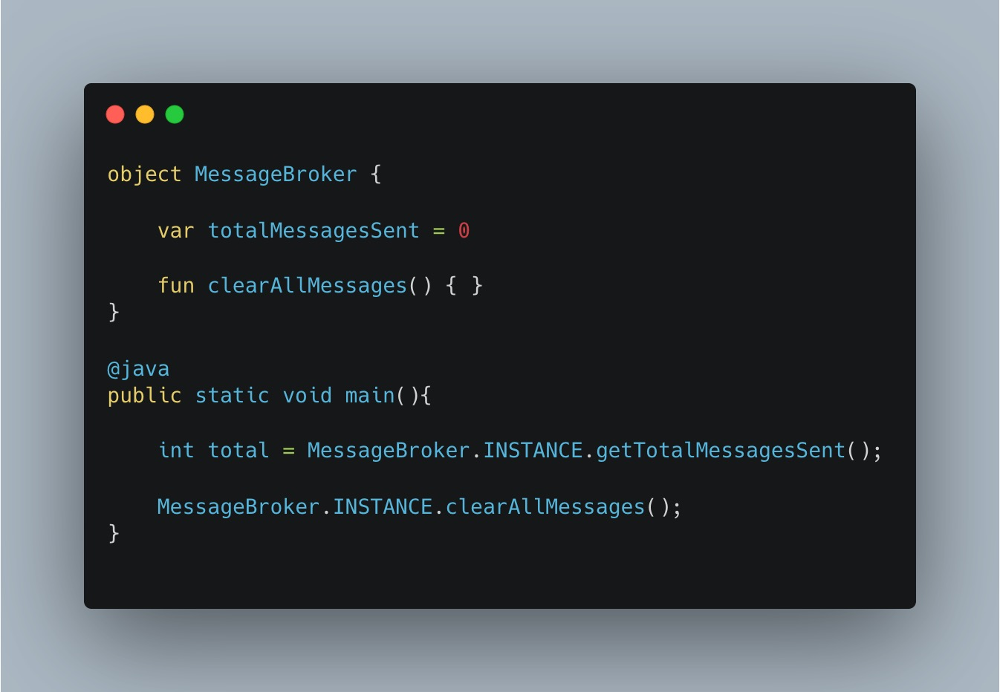
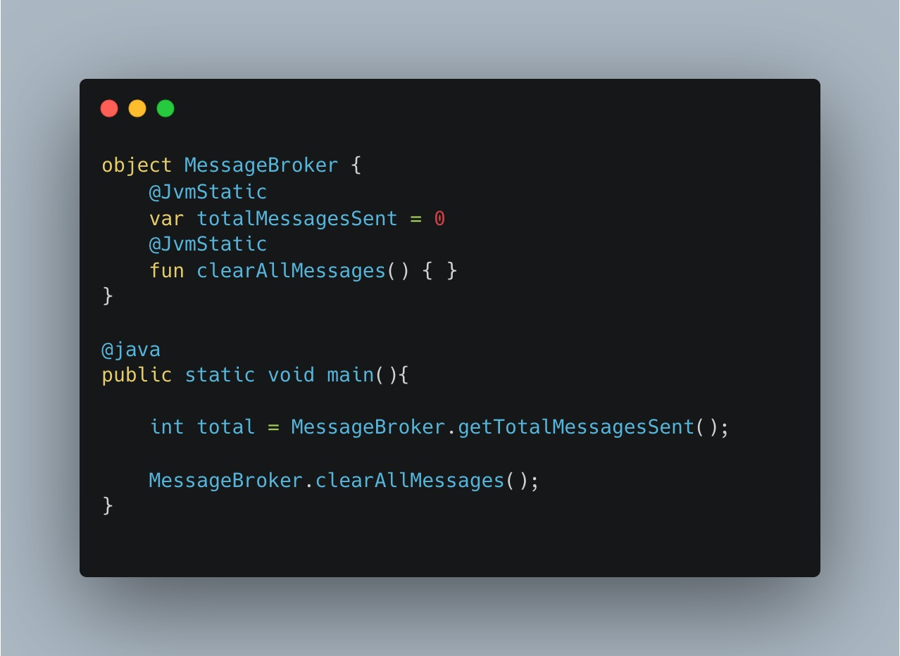
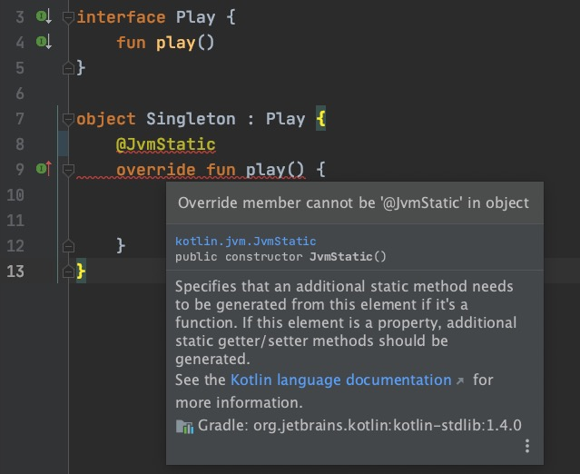

#### 一、问题
   为了方便Java代码调用Kotlin的object类，我们通常会对object类的方法添加`@JvmStatic`注解。

<table>
    <tr>
        <td></td>
        <td></td>
    </tr>
</table>

然而、当object类实现某个接口时，对应的方法却不能添加@JvmStatic注解。

<center>
    
</center>


#### 二、解决
    要想解决上述问题，只需要将object类的实现做一些转换：
```kotlin

interface Play2 {
    fun play()
}

class Singleton2 {

    private companion object : Play2 {
        @JvmStatic
        override fun play() {
        }
    }
}
```

#### 三、思考
>为什么第一种方式会报错，而第二种方式没问题呢？

通过反编译查看Java代码我们发现：object类的方法会被直接编译成Java的static方法
```kotlin
public final class Singleton implements Play {
   public static final Singleton INSTANCE;

   @JvmStatic
   public static void play() {
   }

   private Singleton() {
   }

   static {
      Singleton var0 = new Singleton();
      INSTANCE = var0;
   }
}
```

而companion object则会被编译成**静态内部类**：
```kotlin
public final class Singleton2 {
   /** @deprecated */
   @Deprecated
   public static final Singleton2.Companion Companion = new Singleton2.Companion((DefaultConstructorMarker)null);

   @JvmStatic
   public static void play() {
      Companion.play();
   }
   
   private static final class Companion implements Play2 {
      @JvmStatic
      public void play() {
      }

      private Companion() {
      }

      // $FF: synthetic method
      public Companion(DefaultConstructorMarker $constructor_marker) {
         this();
      }
   }
}

```

由于static方法是不能重写（override）的，所以同一个关键字不能作用于一个函数。而通过静态内部类的方式，在类的层次增加静态能力，从而消除了方法的static关键字。


#### 参考
[issue-KT-21342](https://youtrack.jetbrains.com/issue/KT-21342)