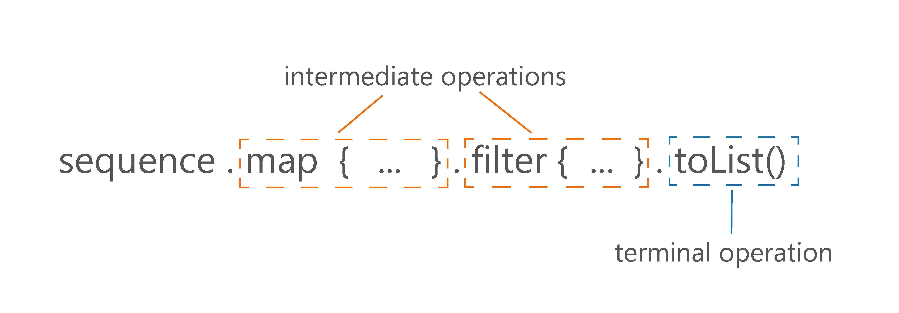
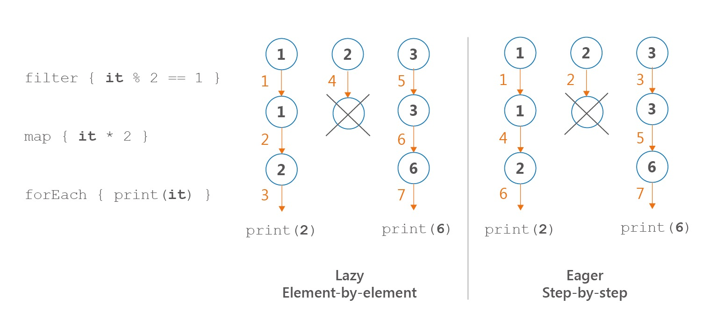
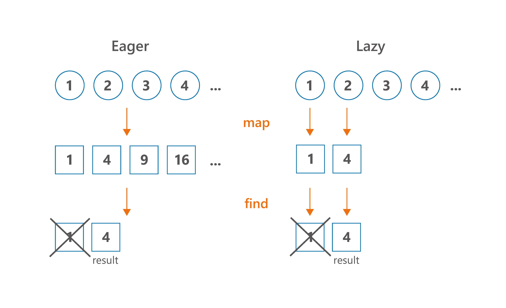
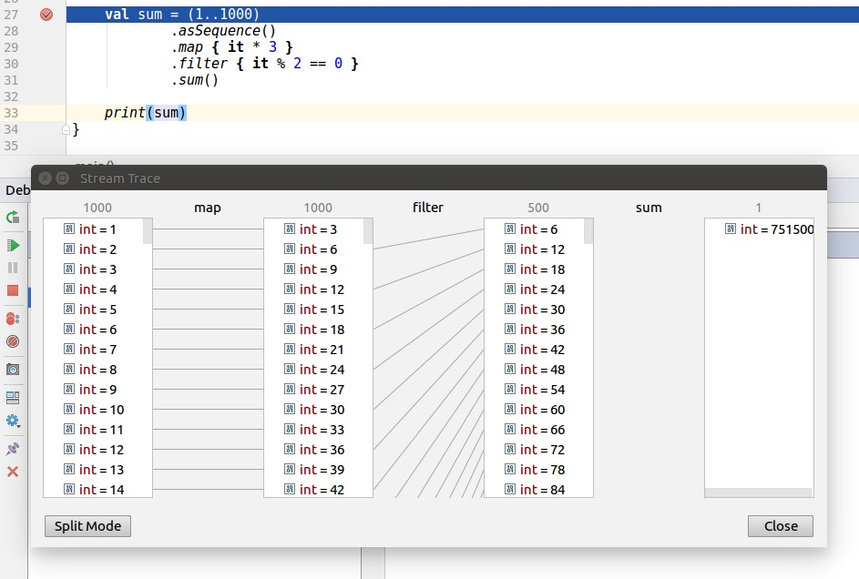

#### 一、概述

你可能对 `Iterable` 和 `Sequence` 傻傻分不清。看一下他们的代码：
```kotlin
interface Iterable<out T> {
    operator fun iterator(): Iterator<T>
}

interface Sequence<out T> {
    operator fun iterator(): Iterator<T>
}
```


好像只有名字不一样-_-||，但他们却有着本质的区别。`Sequence`属于懒加载，中间操作符不会触发计算，仅仅是对前一个Sequence的装饰，只有在遇到toList()或count()这些终止操作符时才会执行真正的计算工作。而Iterable每一步都返回一个新的集合。

```kotlin
public inline fun <T> Iterable<T>.filter(
    predicate: (T) -> Boolean
): List<T> {
    return filterTo(ArrayList<T>(), predicate)
}

public fun <T> Sequence<T>.filter(
    predicate: (T) -> Boolean
): Sequence<T> {
    return FilteringSequence(this, true, predicate)
}
```

下图中filter操作符不做任何计算操作，只是返回一个装饰器对象，在遇到toList()操作符才执行计算。

<center>
    
</center>

```kotlin
val seq = sequenceOf(1, 2, 3)
val filtered = seq.filter { print("f$it "); it % 2 == 1 }
println(filtered)  // FilteringSequence@...

val asList = filtered.toList()
// f1 f2 f3
println(asList) // [1, 3]

val list = listOf(1, 2, 3)
val listFiltered = list
    .filter { print("f$it "); it % 2 == 1 }
// f1 f2 f3
println(listFiltered) // [1, 3]
```

#### 二、优势

Sequence的惰性执行有以下几个优点：
+ 保证操作的顺序性
+ 保证操作执行次数最少化
+ 他们可以是无限的
+ 无需每一步创建新的集合

下面依次讨论一下这些优点

##### 一、顺序性很重要

使用sequence处理数据时，取第一个**数据**对其执行所有操作符，取第二、三...个**数据**依次执行所有操作符。这是一种元素接元素的处理方式。
使用Iterable处理数据时，取第一个**操作符**执行所有数据，取第二、三...个**操作符**依次执行所有数据。这是一种步骤接步骤的处理方式。

```kotlin
sequenceOf(1, 2, 3)
    .filter { print("F$it, "); it % 2 == 1 }
    .map { print("M$it, "); it * 2 }
    .forEach { print("E$it, ") }
// Prints: F1, M1, E2, F2, F3, M3, E6, 

listOf(1, 2, 3)
    .filter { print("F$it, "); it % 2 == 1 }
    .map { print("M$it, "); it * 2 }
    .forEach { print("E$it, ") }
// Prints: F1, F2, F3, M1, M3, E2, E6,
```

<center>
    
</center>

如果我们不用集合处理函数，而是用循环和条件语句，这和sequence一样，也是一种元素接元素的处理方式。这也为我们提供了一种编译器底层优化的思路：sequence操作可以被优化成循环和条件。

```kotlin
for (e in listOf(1, 2, 3)) {
    print("F$e, ")
    if (e % 2 == 1) {
        print("M$e, ")
        val mapped = e * 2
        print("E$mapped, ")
    }
}
// Prints: F1, M1, E2, F2, F3, M3, E6,
```


##### 二、Sequence执行最少的操作

我们没必要每一步都处理整个集合。假如我们有一百万个数据，我们只需要前十个，没必要处理十个之后的数据。所以sequence可以执行最少的操作。


<center>
    
</center>

看下面的例子：

```kotlin
(1..10).asSequence()
    .filter { print("F$it, "); it % 2 == 1 }
    .map { print("M$it, "); it * 2 }
    .find { it > 5 }
// Prints: F1, M1, F2, F3, M3,

(1..10)
    .filter { print("F$it, "); it % 2 == 1 }
    .map { print("M$it, "); it * 2 }
    .find { it > 5 }
// Prints: F1, F2, F3, F4, F5, F6, F7, F8, F9, F10, 
// M1, M3, M5, M7, M9,
```

这个例子中，有很多个操作符，最后的终止操作符不需要处理所有的数据，因此sequence性能更好。类似的操作符还有：`first`, `find`, `take`, `any`, `all`, `none` 或 `indexOf`。


##### 三、Sequence可以永无止境

由于Sequence按需处理，我们可以定义无限序列。一种常用的方式是使用sequence生成器 `generateSequence` 或 `sequence` 。

`generateSequence`需要传如第一个值，以及如何产生下一个值：

```kotlin
generateSequence(1) { it + 1 }
    .map { it * 2 }
    .take(10)
    .forEach { print("$it, ") }
// Prints: 2, 4, 6, 8, 10, 12, 14, 16, 18, 20,
```

`sequence` 则使用挂起函数按需生成数据。只要我们需要数据他就执行，一直到调用yield方法。然后挂起直到下次再向他请求数据。下面是一个无限生成斐波那契数列的例子：

```kotlin
import java.math.BigDecimal

val fibonacci: Sequence<BigDecimal> = sequence {
    var current = 1.toBigDecimal()
    var prev = 1.toBigDecimal()
    yield(prev)
    while (true) {
        yield(current)
        val temp = prev
        prev = current
        current += temp
    }
}

fun main() {
    print(fibonacci.take(10).toList())
    // [1, 1, 2, 3, 5, 8, 13, 21, 34, 55]
}
```

需要注意的是，使用无限序列需要限制元素的数量，否则将无限的运行下去。

```kotlin
print(fibonacci.toList()) // Runs forever
```

为了不让它无限循环的运行，我们可以使用`take`限制元素数量，或者使用first、find、indexOf等。在不限制数量的情况下，不要使用any、all、none。


##### 四、sequence每一步不产生新集合

标准的集合处理函数每一步都返回新的集合，当我们处理大量数据时会分配很多临时内存。

```kotlin
numbers
    .filter { it % 10 == 0 } // 1 collection here
    .map { it * 2 } // 1 collection here
    .sum()
// In total, 2 collections created under the hood

numbers
    .asSequence()
    .filter { it % 10 == 0 }
    .map { it * 2 }
    .sum()
// No collections created
```

一个极端又常见的例子：文件读取。文件可能是几个G，每执行一个操作符都分配这么多内存是一种极大的浪费。下面例子是读取大小1.53G的芝加哥犯罪记录中包含毒品交易信息的记录数量，其中readLines 返回 List<String>。

```kotlin
// BAD SOLUTION, DO NOT USE COLLECTIONS FOR 
// POSSIBLY BIG FILES
File("ChicagoCrimes.csv")
    .readLines()
    .drop(1) // Drop descriptions of the columns
    .mapNotNull { it.split(",").getOrNull(6) }
    // Find description
    .filter { "CANNABIS" in it }
    .count()
    .let(::println)
```
这段程序在我电脑上的运行结果是：
```shell script
OutOfMemoryError.n> Exception in thread "main" java.lang.OutOfMemoryError: Java heap space
```

我们创建了一个集合，中间三个操作符产生集合，一个四个集合。其中三个包含文件的主要主要数据记录，一共消耗4.59G。正确的实现应该使用sequence，我们使用`useLines`函数，每次只操作一行记录。
```kotlin
File("ChicagoCrimes.csv").useLines { lines ->
// The type of `lines` is Sequence<String>
    lines.drop(1) // Drop descriptions of the columns
        .mapNotNull { it.split(",").getOrNull(6) }
        // Find description
        .filter { "CANNABIS" in it }
        .count()
        .let { println(it) } // 318185
}
```

同样运行这段代码，只耗时8.3s。为了比较一下这两种方法的效率，我做了另外一个实验：删除数据中不必要的列以减少文件大小，得到`CrimeData.csv`只有728MB，然后做相同的操作。使用Collection处理函数，耗时13s，使用sequence函数，耗时4.5s。正如实验数据，使用sequence处理大文件不仅节约内存，而且提升性能。

事实上，在每个步骤中，我们创建一个新的集合本身也是一种成本，当我们处理包含大量元素的集合时，这种成本就会显现出来。差别并不大——主要是因为在许多步骤中创建的集合都是用预期的大小初始化的，所以当我们添加元素时，我们只需要将它们放在下一个位置。尽管即使是廉价的集合复制也比完全不复制要昂贵，这也是为什么我们应该更喜欢对具有多个处理步骤的大集合使用Sequence的主要原因。

对于“大集合”是指：很多元素和非常重的集合。它可能是一个包含数万个元素的整数列表。它也可能是一个只有几个字符串的列表，但是每个字符串都很长，所以它们加起来有很多兆字节。这些情况并不常见，但有时也会发生
对于"多个操作"是指：处理集合时使用很多操作符。

如果对比下面两个函数：
```kotlin
fun singleStepListProcessing(): List<Product> {
    return productsList.filter { it.bought }
}

fun singleStepSequenceProcessing(): List<Product> {
    return productsList.asSequence()
        .filter { it.bought }
        .toList()
}
```
你会发现，在性能上区别不大（实际上，简单的list处理更快，因为它的filter函数是内联的）。但是，当你使用多个操作符，先filter再map，在大集合上性能问题就行显现出来。为了看到区别，我们比较一下2个操作符和3个操作符处理5000个数据的情况：

```kotlin
fun twoStepListProcessing(): List<Double> {
    return productsList
        .filter { it.bought }
        .map { it.price }
}

fun twoStepSequenceProcessing(): List<Double> {
    return productsList.asSequence()
        .filter { it.bought }
        .map { it.price }
        .toList()
}

fun threeStepListProcessing(): Double {
    return productsList
        .filter { it.bought }
        .map { it.price }
        .average()
}

fun threeStepSequenceProcessing(): Double {
    return productsList.asSequence()
        .filter { it.bought }
        .map { it.price }
        .average()
}
```

下面是在MacBook Pro(Retina, 15-inch, Late 2013)处理5000个元素的平均结果：

```
twoStepListProcessing                        81 095 ns
twoStepSequenceProcessing                    55 685 ns
twoStepListProcessingAndAcumulate            83 307 ns
twoStepSequenceProcessingAndAcumulate         6 928 ns
```

很难预测我们能提升但是性能，根据我的观察，在一个包含多个步骤的典型集合处理中，对于至少几千个元素，我们可以预期大约20-40%的性能提升。


##### 五、sequence什么时候没那么快？
有些情况我们要处理整个集合，sequence并不能给我们带来什么收益。如`sorted`（当前来讲它是唯一一个例子）。sorted的最优实现：积攒Sequence并放入List，然后使用Java的sort函数。缺点是，与`Collection.sort`相比，积攒过程会消耗额外的时间。

Sequence是否应该支持`sorted`函数是有争议的，因为当一个序列的方法需要所有元素才能完成计算时，后续操作只是部分延迟，并且它不支持无限序列。之所以添加sorted操作只是因为它很常用，好用。Kotlin开发者需要了解它的缺陷，尤其是它不能用于无限序列。

```kotlin
generateSequence(0) { it + 1 }.take(10).sorted().toList()
// [0, 1, 2, 3, 4, 5, 6, 7, 8, 9]
generateSequence(0) { it + 1 }.sorted().take(10).toList()
// Infinite time. Does not return.
```

在Collection上使用sorted比在Sequence上更快只是少数特例。当我们只使用很少操作符函数和单个sorted函数时，还是建议使用sequence来处理。

```kotlin
productsList.asSequence()
    .filter { it.bought }
    .map { it.price }
    .sorted()
    .take(10)
    .sum()
```

##### 六、看看Java的Stream操作
Java 8新增了集合处理流的特性，看起来和Kotlin的序列很像。
```java
productsList.asSequence()
    .filter { it.bought }
    .map { it.price }
    .average()

productsList.stream()
    .filter { it.bought }
    .mapToDouble { it.price }
    .average()
    .orElse(0.0)
```
Java 8的Stream也是惰性的在最后一个操作符触发计算。与Kotlin sequence的区别主要是：
+ Kotlin sequence包含更多的处理函数（被定义为拓展函数），使用简单: `toList()` vs `collect(Collectors.toList())`
+ Java stream可以开启并行模式，在多核处理器上会有很大的性能提升。
+ Kotlin sequence可以用于Kotlin/JVM、Kotlin/JS、Kotlin/Native模块中。Java stream只能用于Kotlin/JVM，且JVM版本至少是8

总之，我们不用Java stream并行模式时很难将谁的性能更好，我建议少用Java stream，只有在处理重量级计算问题中使用并行模式可以显著带来收益的情况下使用，其他情况用Kotlin标准函数能带来清晰的代码结构和多平台支持。


##### 七、调试Sequence
Kotlin Sequence和Java Stream都支持debug每一步操作。Java需要使用"Java Stream Debugger"插件，Kotlin则需要"Kotlin Sequence Debugger"插件，现在已经被集成在了Kotlin插件中了。

<center>
    
</center>


#### 三、总结

集合和序列非常相似，都支持相同的处理函数。但他们也有很大的区别。Sequence处理是困难的，因为我们要保持原集合不变，执行相应转换后再放回原集合。Sequence是惰性的，带来很多优点：
+ 保证操作的顺序性
+ 保证操作执行次数最少化
+ 他们可以是无限的
+ 无需每一步创建新的集合

基于这些优点，对于包含多个处理步骤的包含大对象或元素很多的集合来说使用Sequence更好。Sequence也包含调试器，能帮助我们可视化的分析元素处理过程。Sequence不是为了取代传统的集合处理方式，使用前应该分析清楚自己的目的和原因才能带来性能的提升以及更少的内存问题。


