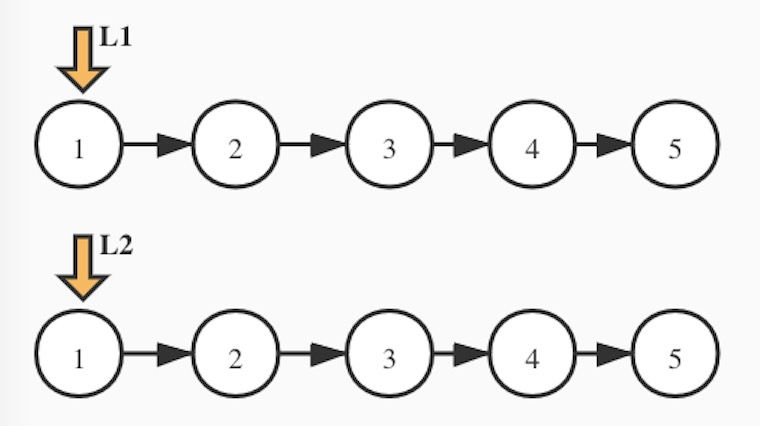
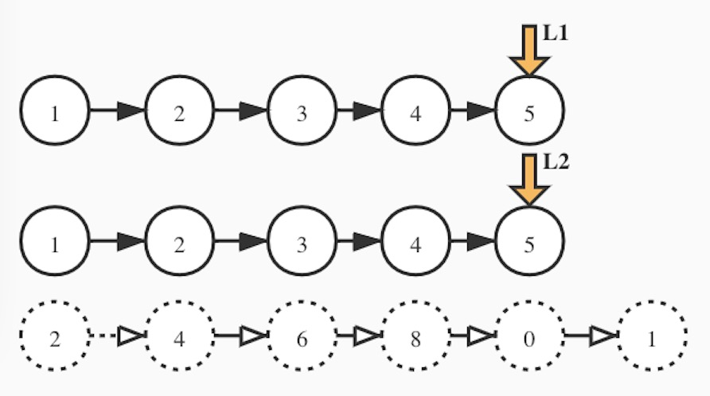
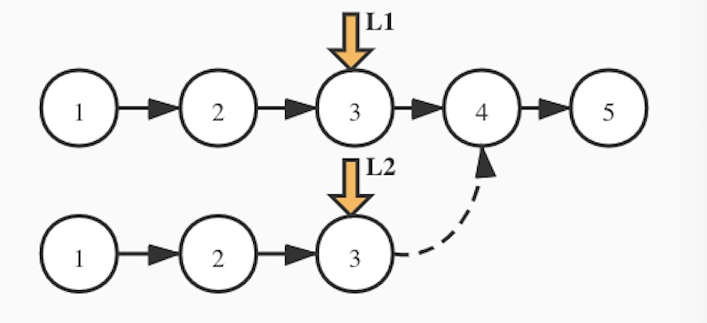
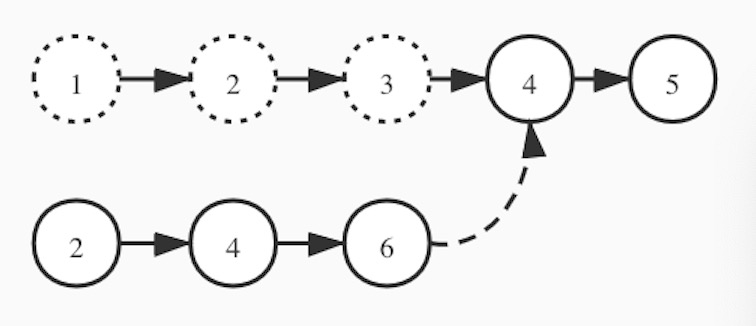

### Leetode-2 两数相加
> 给你两个 非空 的链表，表示两个非负的整数。它们每位数字都是按照 逆序 的方式存储的，并且每个节点只能存储 一位 数字。请你将两个数相加，并以相同形式返回一个表示和的链表。你可以假设除了数字 0 之外，这两个数都不会以 0 开头。
  
<!-- more -->

<center>
    
</center>

<br>

#### 问题分析：


##### 当两个链表长度相等时，我们只需要不断的相加，再移动两个指针，直至链表末尾。   


<center>
    
</center>


##### 当两个链表长度不等时，前半部分走链表相等逻辑，后半部分其实是一个单链表和进位相加的逻辑。  

<center>
    
</center>


<center>
    
</center>


```java

public class Solution {

    /**
     * 两个链表相加
     * 复用一个链表的结点
     *
     * @param l1 第一个链表
     * @param l2 第二个链表
     * @return
     */
    public static ListNode addTwoNumbers(ListNode l1, ListNode l2) {
        boolean carry = false;//进位
        ListNode l1Prev = null, l2Prev = null, result = l1;

        //两个链表都有值，相加直到一个链表末尾
        while (l1 != null && l2 != null) {
            int add = l1.val + l2.val + (carry ? 1 : 0);

            l1.val = add % 10 ;
            carry = add > 9;

            l1Prev = l1;
            l2Prev = l2;
            l1 = l1.next;
            l2 = l2.next;
        }

        //有一个链表已经走到头，
        if (l1 == null && l2 != null) {
            addSingleList(l1Prev, l2, carry);
        }

        if (l1 != null && l2 == null) {
            addSingleList(l2Prev, l1, carry);
        }
        if (l1 == null && l2 == null && carry){
            l1Prev.next = new ListNode(1);
        }
        return result;
    }

    //单链表和进位相加
    private static void addSingleList(ListNode l1, ListNode l2, boolean carry) {
        l1.next = l2;
        while (l2 != null) {
            int add = l2.val + (carry ? 1 : 0);
            l2.val = add % 10;
            carry = add > 9;
            l1 = l2;
            l2 = l2.next;
        }
        if (carry) {
            l1.next = new ListNode(1);
        }
    }

}


```
